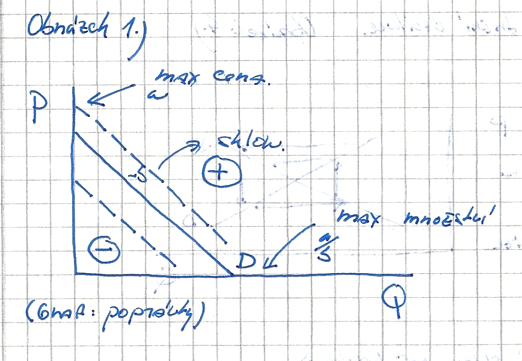
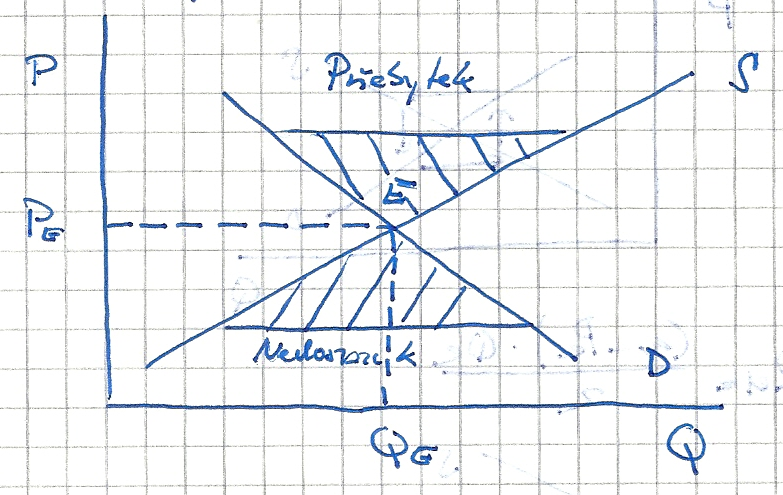
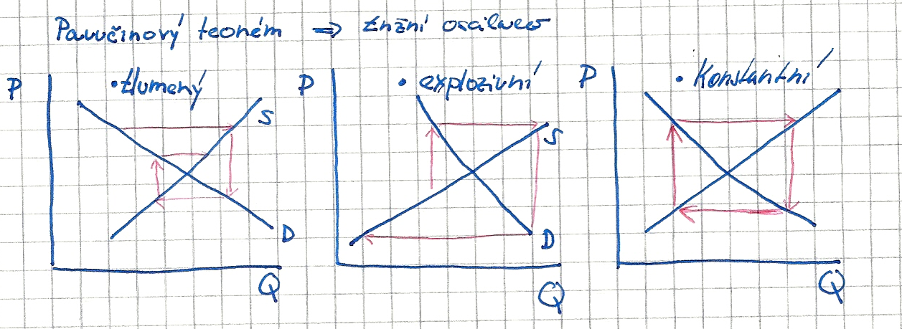
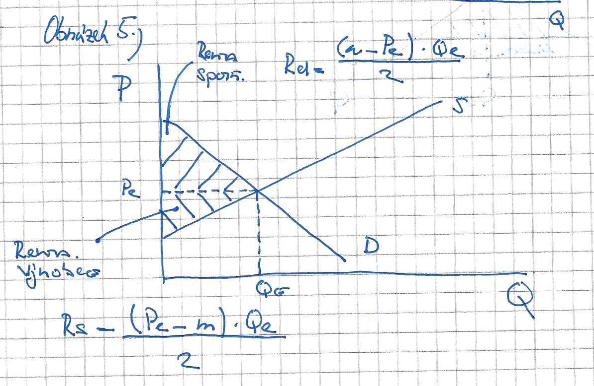
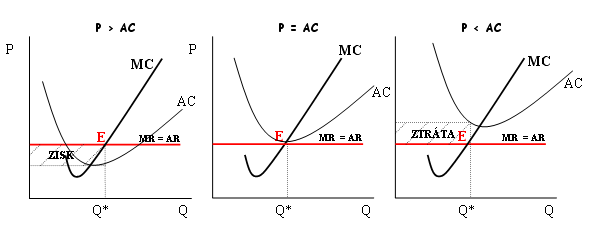
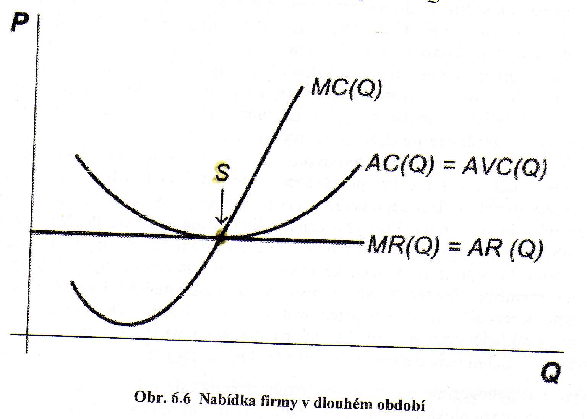
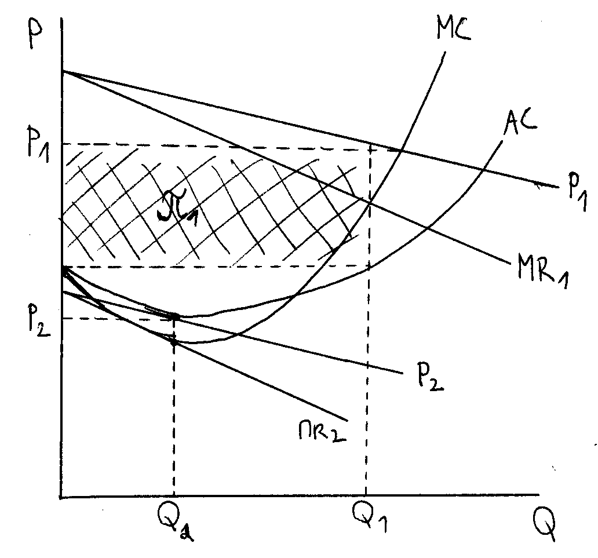
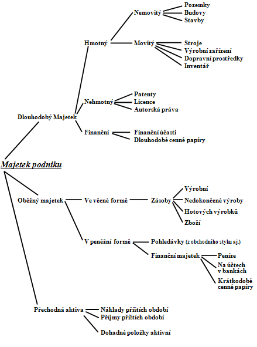
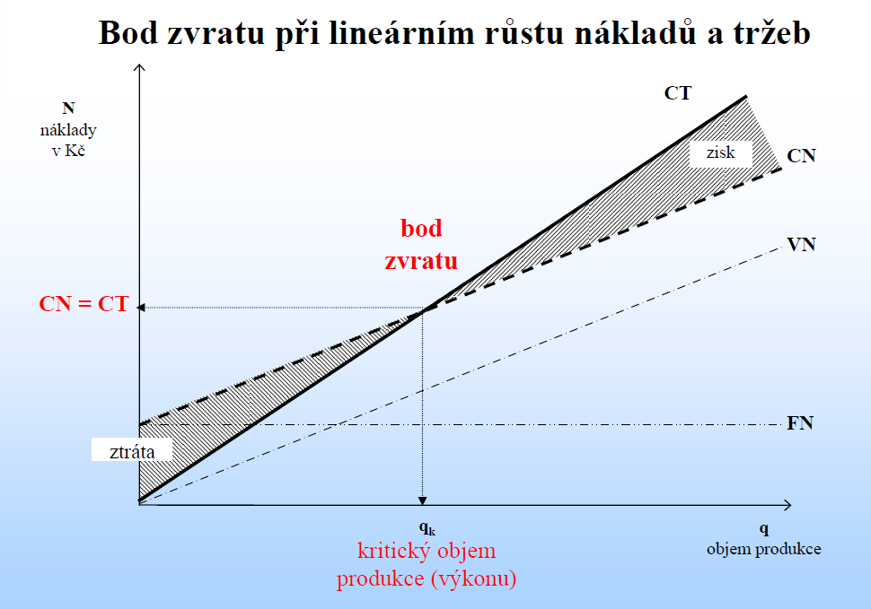

Poptávka, nabídka (základní tvar, funkce, determinanty). Utváření rovnováhy na trhu, rovnovážný bod, tržní oscilace, renta výrobců a spotřebitelů. Elasticita poptávky, nabídky (druhy, co vyjadřuje).
======================================================================================================================================================================================================

Poptávka: Určité množství statku, které je poptávající (kupující) ochoten poptávat (nakoupit) při dané ceně.
============================================================================================================

Rozlišujeme několik typů poptávky:
==================================

-   Individuální: Poptávka jednoho kupujícího po produktu, či službě jednoho
    výrobce.

-   Tržní: Poptávka všech kupujících po určitém statku nebo službě(součet všech
    individuálních poptávek.

-   Agregátní: Poptávka všech lidí v konkrétní zemi po všech možných
    ekonomických statcích.

Základní tvar: 
===============

Pd=a-b\*Q
=========

P….cena, Q…. množství, a…. maximální cena, b…. sklon poptávkové přímky, a/b….
max. množství

**Determinanty:** faktory ovlivňující posun křivky poptávky

-   Rostoucí(+): Roste nominální důchod spotřebitele, zvýší se cena substitutů,
    sníží se cena komplementů, rostou preference spotřebitele, roste počet
    kupujících, módní trendy.

-   Klesající(-): Klesá nominální důchod spotřebitele, sníží se cena substitutů,
    zvýší se cena komplementů, klesají preference spotřebitele, klesá počet
    kupujících, výrobek není módní.

**Posun po křivce**: Dochází k němu, když se mění cena statku a ostatní
determinanty jsou konstantní.

**Nabídka**: Označuje množství výrobku či šlužeb, které jsou výrobci
(prodávající) ochotni nabídnout (prodat) za určitou cenu.

**Rozlišujeme několik typů nabídky:**

-   Individuální: Nabídka jednoho výrobce nabízející určitý produkt nebo službu.

-   Tržní: Nabídka všech výrobců určitého ekonomického statku (součet všech
    individuálních nabídek).

-   Agregátní: Celková nabídka určená objemem výroby všech výrobců v daném
    státě.

Základní tvar: 
===============

[./media/image2.png](./media/image2.png)
========================================

Ps=m+n\*Q

P….cena, Q…. množství, m…. minimální cena, n…. sklon nabídkové přímky

**Determinanty:** faktory ovlivňující posun křivky nabídky

-   Rostoucí(+): Snížení výrobních nákladů, příznivé klimatické podmínky,
    technologický pokrok, počet výrobců se zvýší.

-   Klesající(-): Zvýšení ceny výrobních nákladů, nepříznivé klimatické
    podmínky, zvýší se riziko podnikání, snížení počtu výrobců.

**Posun po křivce**: Dochází k němu, když se mění cena statku a ostatní
determinanty jsou konstantní.

**Utváření rovnováhy na trhu:**

**Přebytek zboží: Qs \> Qd**

**Nedostatek zboží: Qs \< Qd**

**Trh:** Místo, kde se střetává nabídka s poptávkou.

**Tržní rovnováha**: Situace, kdy poptávané množství je totožné s množstvím
nabízeným a zároveň cena poptávajících i nabízejících j při tomto daném množství
shodná.

**Rovnovážný bod (E):** Značí rovnovážný stav, kdy cena a množství nabídky se
rovná ceně a množství poptávky. PE…úroveň rovnovážné ceny, QE…. úroveň
rovnovážného množství.

**Přebytek zboží**: Je-li cena vyšší než cena rovnovážná kupující nemají zájem
nakupovat, výrobci se naopak snaží nabízet větší množství a využít tak velké
ceny(Qs\>Qd). Výrobci musí snížit ceny.

**Nedostatek zboží**: Je-li cena nižší než rovnovážná kupující se snaží kupovat
větší množství, výrobci přestávají mít zájem nabízet své zboží za tak nízkou
cenu.(Qs\<Qd). Výrobci cenu zvyšují.

**Teorém pavučin**: Dynamický model znázorňující dosahování rovnováhy či
prohlubování nerovnováhy na trhu v situaci, kdy na změnu ceny na trhu reaguje
nejprve poptávka a až po určité době nabídka. Výrobci tedy reagují na cenu
předcházejícího období.

**tlumený =** křivka S má větší sklon než křivka D ( *trh směřuje k rovnováze*)

-   **expanzivní=** křivka D má větší sklon než křivka S ( t*rh se vzdaluje od
    rovnováhy*)

-   **konstantní =** Křivka D, Křivka S mají stejný sklon (*trh se nevzdaluje
    ani nepřibližuje k rovnováze*)

**Renta spotřebitelů**: To, co je spotřebitel ochoten zaplatit za statek navíc,
než by zaplatil při ceně rovnovážné.

**Renta výrobce**: To, o kolik je tržní cena vyšší než cena, za kterou je
výrobce ochoten nabídnout svůj výrobek.

**Elasticita (pružnost) poptávky:** Pojem, s jehož pomocí měříme, o kolik se
změní poptávané množství statku, změní-li se jeho cena.

**Druhy:**

-   Elastická poptávka: Ed\>1, 1% změna ceny způsobí změnu ceny statku o vice
    než 1%

-   Dokonale elastická: Ed-\>∞, 1% růst ceny statku způsobí nekonečně velkou
    změnu poptávaného množství

-   Neelastická: Ed\<1, 1% změna ceny statku změní poptávané množství o méně než
    1%

-   Dokonale neelastická: Ed=0, poptávka nereaguje na změny ceny daného statku

**Důchodová elasticita poptávky(Ey)**: O kolik % se změní poptávané množství,
změní-li se nominální důchod spotřebitele o 1%.

**Křížová elasticita poptávky(EC)**: Vyjadřuje procentuální změnu poptávaného
množství určitého ekonomického statku, v závislosti na 1% změně jiného
statku.(substituty-Ec=+ ; komplementy Ec= -).

**Elasticita nabídky**: Popisuje změnu nabízeného množství na trhu, vyjádřenou v
%, a to v závislosti na 1% změně jedné z nabídkových determinant (nejčastěji
cena).

**Faktory ovlivňující pružnost**: Náklady produkce, technologie výroby, časový
faktor, skladování a možnost tvorby zásob.  
**2. Základní a alternativní cíle firmy. Zisk účetní a ekonomický. Rozdíl mezi
krátkým a dlouhým obdobím. Zisk v krátkém a dlouhém období.**

**Alternativní cíle firmy:**

-   maximalizace obratu

-   růst firmy

-   maximalizace důchodu připadajícího na jednoho zaměstnance

-   neziskové firmy

**Hlavní cíle firmy jsou:**

-   maximální zisk a minimální náklady

**další dílčí cíle jsou:**

-   dosažení vysokého podílu na trhu.

-   oslovovat zákazníky novým, dosud neexistujícím výrobkem, produktem

(tak zvané výrobkové vůdcovství)

-   V dlouhém období usiluje podnikatel o takzvaný stabilní zisk

(takzvaný zisk, který pro podnikatele představuje stabilní příjmy)

**Účetní zisk:** Rozdíl mezi celkovými přijmi a explicitními náklady

**Ekonomický zisk:** Rozdíl mezi celkovými přijmi a ekonomickými náklady
(explicitní + implicitní). Nulový ekonomický zisk nás pouze informuje o tom, že
při našem podnikáni realizujeme tentýž účetní zisk, jako v případě přechodu na
jiný trh, který je pro nás druhou nejlepší alternativou. Na základě ekonomického
zisku dochází k ekonomickému rozhodování.

**Explicitní náklady:** jsou náklady, které musí firma reálně vynaložit
v peněžní podobě

**Implicitní náklady:** náklady obětované příležitosti (např. ušlý zisk,
pronájem nemovitosti)

**Krátké období** je takové období, ve kterém je počet firem na trhu fixní.
Naopak v dlouhém období se počet firem na trhu může měnit. (Předpokládáme, že
neexistují vážné bariéry vstupu a výstupu z odvětví.) V dlouhém období má firma
dost času, aby ukončila činnost, nebo aby do odvětví naopak vstoupila.
S problematikou krátkého a dlouhého období těsně souvisí otázka zastavení
činnosti firmy a odchodu z trhu.

**Dlouhodobé období**. – Všechny náklady jsou variabilní, počet firem na trhu se
může měnit, atd. Vzhledem k tomu, že v dlouhém období neexistují fixní náklady,
firma bude na trhu působit pouze v případě, když její celkové příjmy pokryjí
alespoň celkové náklady. V dlouhém období je ekonomický zisk firmy nulový. Pokud
existují významné bariéry vstupu a výstupu z odvětví, pak firma může realizovat
kladný ekonomický zisk i v dlouhém období.

3. Produkční funkce, nákladová funkce (co vyjadřuji, mezní a průměrové veličiny). Podstata maximalizace zisku, maximalizace tržeb. 
===================================================================================================================================

**Produkční funkce**: vyjadřuje maximální výstup, který je firma schopná při
dané specifikaci vstupů za určité dané období a využití dané technologie
vyrobit. Tj. kolik výrobního faktoru musí firma do výroby vložit a kolik
výrobního faktoru to přinese. **Krátké období** je definováno jako doba, ve
které nelze změnit používané množství alespoň jednoho vstupu. V **dlouhém
období** může pak firma měnit množství všech vstupů.

**Nákladová funkce**

Vyjadřuje závislost nákladů na objemu výkonu podniku, tzn. že náklady s měnícím
se množstvím výrobků klesají nebo stoupají. Existují však i náklady nezávislé na
množství výrobků. Náklady členíme z hlediska závislosti na měnícím se objemu na:

-   variabilní náklady (proměnlivé) – jsou závislé na množství výkonů a více či
    méně se úměrně zvyšují nebo snižují s objemem výroby. Patří zde náklady na
    mzdy výrobních dělníků, materiálové náklady.

-   Fixní náklady (stálé) – jsou na množství výkonů zcela nezávislé, nemění se s
    objemem výroby např. nájemné, pronájem zařízení, režijní náklady, odpisy,
    úrokové platby z půjček, platy stálým zaměstnancům atd. Musí se platit, i
    když firma nevyrábí žádný výstup, a nezmění se, mění-li se objem výstupu.
    Zvýší-li se ovšem objem výroby natolik, že je třeba zvýšit kapacitu (např.
    uvést do provozu nová zařízení, stroje, postavit nové dílny apod.), pak se
    změní i fixní náklady, které se potom znovu do dosažení určitého objemu
    výroby nemění. Charakterizují se proto někdy i jako náklady měnící se
    skokem.

**MC – mezní náklady** = znamenají dodatečné náklady, které musí firma vynaložit
k tomu, aby realizovala produkci o jednu jednotku vyšší (čili jak se změní
celkové náklady, jestliže produkce vzroste o jednu jednotku)

**AC – průměrné náklady** = možnosti vynaložených nákladů na jednu jednotku
produkce.

**Podstata maximalizace zisku** = cílem každé firmy je maximalizace zisku, jejíž
jde dosáhnout plněním dvou protichůdných podmínek.

a) maximalizovat celkové tržby ( příjem) z prodeje ekonomických statků.

b) minimalizovat celkové náklady na výrobu ekonomických statků.

Dle ekonomické teorie maximalizuje každá firma svůj zisk, rovnají-li se její
mezní příjmy (MR) a mezní náklady (MC). Pravidlo platí pro každou firmu
maximalizující svůj zisk nezávisle na typu tržní struktury.

MR = MC

**Maximalizace tržeb (obratu):** Firma maximalizující obrat vyrábí vyšší objem
produkce za nižší cenu, než firma maximalizující zisk. Je-li poptávka elastická
obrat s růstem objemu produkce roste, je-li neelastická, obrat klesá.

4. Dokonalá, monopolistická konkurence (podstata, zisk v krátkém a dlouhém období), vysvětlení pojmů oligopol, duopol, monopol, monopson. Úřad pro ochranu hospodářské soutěže (význam činnost).
================================================================================================================================================================================================

**Dokonalá konkurence**

Trh je dokonale konkurenční právě tehdy, když žádná firma není schopna ovlivnit tržní cenu produktu. Firma se tedy rozhoduje pouze o tom, jaké množství vyprodukuje a prodá při ceně která je dána trhem. Tyto předpoklady jsou v reálném světe tak silné, že neexistuje.
=========================================================================================================================================================================================================================================================================

Předpoklady modelu:
===================

-   Produkt, který je firmami na trhu nabízen je zcela stejný – říkáme
    homogenní. To znamená, že se neliší naprosto ničím (ani obalem) a výrobky
    jednotlivých firem jsou stejně dostupné.

-   Subjektů na trhu (nakupujících a prodávajících) je tolik, že žádný nemůže
    ovlivnit tržní cenu. Z toho plyne, že poptávka po produkci jedné firmy je na
    dokonale konkurenčním trhu dokonale elastická (jejím grafem je přímka,
    rovnoběžná s horizontální osou, na kterou vynášíme množství produktu.)

-   Na trhu existuje dokonalá informovanost. Jestliže by jeden výrobce zdražil,
    hned to všichni budou vědět. Vzhledem k tomu, že nikdo netrpí iluzí o
    kvalitě výrobků – nedomnívá se, že nabízející nabízejí různé kvalitní
    výrobky – nebude ochoten platit vyšší cenu.

-   Firmy mohou na trh volně vstupovat a odcházet z něho.

-   Na trhu neexistuje riziko.

**Zisk (ztráta) v dokonalé konkurenci v krátkém období:**

>   Funkce nabídky firmy je tedy totožná s funkcí mezních nákladů. Firma bude
>   v krátkém období pokračovat ve výrobě pouze pokud jsou celkové příjmy větší
>   nebo rovny variabilním nákladům. Funkce mezních nákladů je tedy nabídkou od
>   jejího průsečíku s průměrnými variabilními náklady.

-   Obecným pravidlem maximalizace zisku (nezávislým na typu tržní struktury) je
    rovnost mezních příjmů a mezních nákladů, tj. **MR = MC**

-   Celkový zisk je maximální při prodeji takového výstupu, při němž je mezní
    zisk (tj. změna celkového zisku způsobená jednotkovou změnou výstupu) roven
    nule.

Jestliže celkové příjmy budou větší než celkové náklady, a tedy průměrné příjmy
větší než

průměrné náklady, pak je velikost jednotkového zisku dána rozdílem

AR - AC při výstupu Q\* a celkový zisk je (AR - AC) ⋅ Q\*

**Možnosti tvorby zisku v dokonalé konkurenci v dlouhém období:**

Firma v dlouhém období v podmínkách dokonalé konkurence, realizuje nulový
ekonomický zisk. Z tohoto závěru rovněž plyne odvození nabídkové funkce firmy
v dlouhém období. V dlouhém období je funkce nabídky jedné dokonale konkurenční
firmy tvořena pouze jedním bodem. Je to průsečík průměrných nákladů a mezních
nákladů.

V dokonalé konkurenci je odchylka zisku od zisku normálního možná pouze
krátkodobě a je projevem nerovnováhy.

**Model monopolistické konkurence**

Velká skupina výrobců, kteří nabízejí diferencovaný produkt, jedná se o podobný
výrobek, ale do jisté míry se od sebe liší. Spotřebitel již zvažuje od koho si
výrobek koupí, nehraje roli jen cena, ale i necenová konkurence (kvalita, značka
firmy). Zisků firma dosáhne nejen snížením nákladů, ale i zvýšením ceny.

-   Produkt, který je firmami na trhu nabízen, je diferencovaný – jde o blízké
    substituty.

-   Subjektů na trhu (nakupujících a prodávajících) je větší počet, takže jeden
    výrobce může ovlivnit tržní cenu jen málo.

-   Na trhu existuje dobrá informovanost. Jestliže by jeden výrobce např.
    zdražil, velice rychle by se to mnoho zákazníků dozvědělo.

-   Firmy musejí při vstupu a odchodu z trhu překonávat jen malé bariéry.

-   Na trhu neexistuje riziko.

-   Poptávka po produktu jedné firmy je vysoce elastická.

**Možnosti tvorby zisku v monopolistické konkurenci v krátkém období a dlouhé
období:**

**P1(AR), Q1, MR1, π1** … krátké období

**P2(AR), Q2, MR2** dlouhé období (po vstupu

dalších firem do odvětví)

**Krátké období:**

-   Daná firma přijde s nějakým novým typem výrobku

-   Do odvětví nemohou vstupovat nové firmy, firma se chová jako monopol

-   Křivka poptávky je elastická, parametr a je velmi vysoko ( exkluzivita ceny)

-   V bodě **MC = MR1** firma dosahuje monopolního zisku (= ekonomický zisk)

**Dlouhé období:**

-   Nulový ekonomický zisk

-   Do odvětví mohou vstupovat nové firmy

-   Původní firma ztrácí zákazníky a klesá doleva

-   Křivka poptávky klesá tak dlouho, dokud se nestane tečnou AC v bodě MC=MR2

**Vysvětlení pojmů:**

**Nedokonalá konkurence**: trh, na kterém existuje alespoň jeden prodávající,
který může ovlivnit tržní cenu (firma může ovlivnit cenu tím ovlivní i výši
svých příjmů)

**Oligopol:** Na trhu je několik málo firem, které mají natolik silné postavení,
že mohou bránit vstupu nových firem do odvětví. Prodává se za vyšší ceny, než
byla rovnovážná. Firmy mají silné postavení a vzájemně se znají a mohou si
diktovat podmínky. Vyrábí se méně a poptávka převyšuje nabídku (vzniká
nedostatek). Firmy si konkurují především necenovými nástroji, cenové soupeření
by je oslabilo. (Mobilní operátoři)

**Duopol:** Obdobná situace jako oligopol, ale na trhu jsou jen 2 firmy(AMD vs
Intel).

**Monopol:** Situace, kdy na trhu působí pouze jeden výrobce, a to
specifikovaného produktu, který nemá substituty. Monopolní firma má na trhu
absolutní moc (stanovuje tržní cenu a množní, které bude nabízet). Není možný
vstup dalších firem do odvětví, cena je vysoká. (přenos elektřiny ČEPS).

**Monopson**: Tržní struktura, ve které vystupuje pouze jeden subjekt na straně
poptávky a jeden na straně nabídky(AERO Vochody x Armada ČR)

Úřad pro ochranu hospodářské soutěže: Vytváří podmínky pro podporu a ochranu
hospodářské soutěže. Vykonává dohled při zadávání veřejných zakázek a veřejné
podpory. Dohlíží, aby nevznikaly kartelové dohody při veřejných zakázkách.  
**5. Základní makroekonomické ukazatele. Hrubý domácí produkt, národní produkt,
čistý produkt. Rozdíl mezi reálným a nominálním. Metody výpočtu HDP.**

**Makroekonomie**: Zkoumání ekonomiky jako celku. Sleduje vztahy mezi
agregátními veličinami (HDP, agregátní nabídka, agregátní poptávka, inflace,
nezaměstnanost). Poskytuje základ pro provádění hospodářské politiky státu.
Ukazatele sledují výkonnost národního hospodářství.

**Makroekonomické ukazatele:**

-   **Hrubý domácí produkt (HDP):** Je celková peněžní hodnota statků a služeb
    vytvořená za dané období na určitém území (bez ohledu na vlastnictví jinou
    národností).

-   **Hrubý národní produkt (HNP):** Je celková peněžní hodnota statků a služeb
    vytvořená za dané období občany daného státku (bez ohledu na hranice).

-   **Čistý produkt:** Je HDP- odpisy.

-   **Čistý národní produkt:** Je HNP- odpisy.

-   **Agregátní nabídka**: Je souhrnem všech nabízených statků a služeb za
    určité období vyjádřená v peněžních jednotkách.

-   **Agregátní poptávka:** Je souhrnem všech výdajů ekonomických subjektů
    (domácnosti, firmy, vláda, dovozců) za určité období vyjádřená v peněžních
    jednotkách.

-   **Inflace**: Je nárůst všeobecné cenové hladiny zboží a služeb v ekonomice
    v určitém časovém období.

-   **Nezaměstnanost:** míra nezaměstnanosti je podíl nezaměstnaných ke všem
    osobám schopných pracovat

**Nominální produkt**: Produkt vyjádřen v tržních cenách. Jeho velikost závisí
na změnách tržních cen a objemu. Měří celkovou hodnotu zboží a služeb za dané
období v běžných cenách.

**Reálný produkt**: Reálný produkt se vyjadřuje ve statistických cenách (zvolíme
cen z minulých let).

**Výpočty HDP:**

1.  **Výdajová metoda:** spotřeba (C)+ hrubé investice (I) + veřejné výdaje (G)+
    čistý vývoz (NX)

2.  **Důchodová metoda:** Mzdy + renty + úroky + zisky + odpisy + nepřímé daně
    zmenšené o subvence

3.  **Produkční metoda:** dochází ke sčítání přidaných hodnot na jednotlivých
    stupních zpracování.

6. Inflace (podstata, druhy podle tempa růstu, měření). Míra nezaměstnanosti, druhy nezaměstnanosti podle příčin vzniku, dopady nezaměstnanosti, aktivní a pasivní politika zaměstnanosti.
==========================================================================================================================================================================================

**Inflace:** Růst celkové hladiny cen v čase v dané ekonomice. Jedná se o
situaci, kdy rostou ceny zboží a služeb při daném důchodu je pak možno pořídit
méně zboží a služeb.

**Druhy inflace:**

-   Mírná inflace: V jednotkách, domácnosti ji ani nezaznamenají. Temto růstu
    cenové hladiny nepřekračuje tempo růstu výroby.

-   Pádivá: V desítkách- stovkách jednotek, lidé přestávají mít důvěru
    k penězům, opuštějí od vlastní měny k zahraniční.

-   Hyper: v tisících jednotkách. Lidé přecházejí na barterovou směnu, nebo
    přecházejí na jinou měnu.(Německo ve 30. letech)

**Měření inflace:**

-   Index spotřebitelských cen (CPI)

-   Index cen výrobců (PPI)

-   Deflátor HDP (nominální HDP/reálné HPD)

**Míra nezaměstnanosti:** Vyjadřuje podíl nezaměstnaných ke všem osobám
schopných pracovat (tedy i zaměstnaným i nezaměstnaným) u= U/(E+U)

**Druhy nezaměstnanosti podle příčin vzniku:**

-   **Frikční:** Přirozená míra nezaměstnanosti, fluktuace pracovníků(člověk
    přeruší práci a hledá novou)

-   **Strukturální:** Nezaměstnaný skutečně nemůže sehnat práci ve svém oboru,
    souvisí s nesouladem nabídky a poptávky práce. Dlouhodobá nezaměstnanost.

-   **Cyklická:** Souvisí s průběhem hospodářského cyklu. Pokud je ekonomika
    v recesi, všeobecně roste i počet lidí bez práce.

-   **Sezónní:** Pro určité roční období, například delegáti u CK

**Dopady nezaměstnanosti:**

-   **Ekonomické:** Nezaměstnanost lze chápat jako ušlou míru zisku celé
    společnosti.

-   **Sociálně psychologické dopady:** Nezaměstnanost způsobuje dlouhodobé
    stresové vypětí.

**Aktivní politika zaměstnanosti**: Vytváření nových pracovních míst a
rekvalifikační kurzy.

**Pasivní politika zaměstnanosti**: Podpora v nezaměstnanosti.

Aktuální míra nezaměstnanosti: 7-8%  
**7. Peníze (vývojové stupně, formy a význam peněz). Fiskální a monetární
politika (tvůrce, nástroje a cíle). Úloha centrální banky.**

**Peníze:** Nejdůležitější funkcí peněz je všeobecný prostředek směny. Slouží
jako dočasný uchovatel hodnoty a zúčtovací jednotka (peníze jsou schopny působit
jako míra ocenění statků a služeb). Konkrétní peněžní jednotka daného státu se
označuje jako měna.

**Vývojové stupně peněz:**

-   **Barterový obchod**: Před existencí peněz. Směna statku za statek nebo
    službu za službu. Určité problémy, musel se najít člověk, který byl ochoten
    vyměnit daný statek.

-   **Komoditní peníze:** První forma peněz, začalo se používat drahé kovy
    (zlato, stříbro), nebo také plátno. Špatně dělitelné.

-   **Papírové peníze:** Zavedeny první papírové peníze, které byly plně kryté
    zlatem(bylo možno vyměnit v bance). Z důvodu snadnější manipulace a výměny.
    V průběhu 20. století bylo upuštěno od tzv. zlatého standardu (nebyly kryté
    zlatem). Z bankovek se nestaly poukázky, ale platidlo.

-   **Státovky:** Nebyly kryty ničím, vydal je panovník pro určitý účel. Ničím
    nebyly kryty.

-   **Depozitní peníze (bankovní):** Vklady (dnes nejčastější) tvoří největší
    část peněz.

Jelikož na rozdíl od kovů není množství oběživa dnes nijak fyzicky omezeno,
zažváme mnohem vyšší míry inflace než kdysi.

**Formy peněz:**

-   **Oběživo:** Mince a bankovky

-   **Bezhotovostní peníze**: Peníze uložené na účtech u peněžních ústavů.

**Monetární (měnová) politika:** Hospodářská politika prováděná pomocí měnových
nástrojů centrální banky.

**Typy:**

-   **Expanzivní:** Sleduje pokles úrokových sazeb prostřednictvím růstu nabídky
    peněz.

-   **Restriktivní:** Sleduje růst úrokových sazeb pomocí poklesu nabídky peněz.

**Tvůrce:** Centrální banka

**Nástroje centrální banky v měnové politice:**

-   **Přímé:**

-   Regulace investičních úvěrů(CB ovlivňuje výši úvěru)

-   Regulace spotřebních úvěrů(CB určuje délku splatnosti)

-   **Nepřímé**

-   Stanovení povinných minimálních rezerv pro komerční banky

-   Operace na volném trhu (CB ovlivňuje množství cenných papírů)

-   Diskontní sazba (úvěr a úrok pro komerční banku)

**Cíle**: Měnová politika usiluje o dosažení ekonomicko-politických cílů
působením na monetární veličiny (stabilita a kvalita měny, regulace úrokové míry
a množství peněz v oběhu)

**Fiskální politika:** Je součást hospodářské politiky státu, která se snaží
ovlivnit vývoj ekonomiky změnami výše a struktury veřejných výdajů a daní. Je
nástrojem aktivního zasahování státu do hospodářství.

**Typy:** podle poměru příjmů a výdajů lze rozdelit:

-   **Expanzivní:** Veřejné výdaje jsou větší než vybrané daně. Vzniká deficit
    státního rozpočtu.

-   **Neutrální:** Veřejné výdaje se rovnají vybraným daním. Státní rozpočet je
    vyrovnaný.

-   **Restriktivní**: Veřejné výdaje jsou menší než daně, takže se snižuje
    státní dluh.

**Nástroje fiskální politiky:**

-   **Automatické stabilizátory:** Fungují samočinně, například progresivní
    zdanění důchodů, pojištění nezaměstnanosti, podpora v nezaměstnanosti
    sociální dávky

-   **Záměrná opatření:** Jednorázová opatření, změna daňové sazby, změna
    struktury výdajů z rozpočtu.

-   **Daně**

-   **Transfery:** Dotace podnikatelské sféry

-   **Vládní výdaje na nákup zboží a služeb**

**Cíle:**

-   Bezprostřední: Regulace poptávky a nabídky

-   Konečné: Regulace zaměstnanosti a dosažení cenové stability

**Centrální banka:** Realizace měnové politiky, bankovní dohled nad ostatními
bankami, stanovení devizového kurzu. Vedení účtu státního rozpočtu.

 8. Majetek podniku- vymezení, druhy majetku a jejich význam, náklady vyvolané existencí a využíváním majetku, postup hodnocení vývoje a struktury majetku, vztah odpisu k nákladům a zisku, ukazatele hodnotící obrat dlouhodobého a krátkodobého majetku.
==============================================================================================================================================================================================================================================================

**Majetek podniku (vymezení):** je souhrn všech věcí, peněz, pohledávek a jiných
majetkových hodnot, které patří podnikateli a slouží k jeho podnikání. Majetek
je souhrn veškerých statků, se kterými daný majitel (fyzická nebo právnická
osoba) může volně nakládat a kterými také ručí za své případné závazky.

**druhy majetku a jejich význam** – druh rozdělujeme podle:

-   původu (mechanické, biologické)

-   funkčnosti (stroj, budova, materiál)

-   místa působení ve sféře oběhu (působení majetku ve fázi výroby, směny,
    rozdělování)

-   doby upotřebitelnosti (dlouhodobý/krátkodobý majetek)

-   způsob předávání peněžní hodnoty na produkci (postupné/jednorázové
    předávání).

**Náklady vyvolané existencí a využíváním majetku** - podnik by měl mít jen
tolik majetku, kolik potřebuje pro plnění svých cílu, protože každý druh majetku
vyvolává náklady svou existencí a využíváním. Jsou to hlavně fixní náklady,
které se musí uhrazovat vždy (např. daně poplatky, odpisy, pojistné, některé
náklady údržby). Nadbytečný majetek nebo nedostatečně využívaný majetek zhoršují
možnosti pro tvorbu zisku – znamenají vyšší náklady, nižší hospodárnost, nižší
efektivnost.

**Postup hodnocení vývoje a struktura majetku** – souvislost s horizontální a
vertikální analýzou

**Horizontální a Vertikální Analýza** - Zabývá se rozborem finančních ukazatelů
hospodaření společnosti patří k nejjednodušším nástrojům hodnocení ekonomické
situace firmy. Oba postupy umožňují vidět absolutní údaje z účetních výkazů v
určitých souvislostech.

**Vertikální analýza** pracuje se stupňovitým rozborem jednotlivých složek
finančních ukazatelů. Vyjadřuje procentní zastoupení jednotlivých aktiv, pasiv,
výnosů  a nákladů na celkovém součtu. Patří mezi první vodítka k vysledování
potenciálních rizikových faktorů pro budoucí vývoj podnikání.

**Horizontální analýza** ukazuje, jak se jednotlivé finanční ukazatele mění v
čase. To znamená změnu současného ukazatele oproti minulému období. Pokud je
podnikání vedeno systémově a časová řada je dostatečně dlouhá, lze vyvodit
určité tendence. Změny lze vyjadřovat v rámci abolutní hodnoty (tedy změnu
vyjádřenou rozdílem částek) nebo prostřednictví procentní změny.

**Vztah odpisů k nákladům a zisku** – když se převádí hodnota majetku do
produkce, tak se mi tato hodnota vrátí v podobě nákladů v odpisech. **Nákladová
funkce odpisů:** Odpisy přenášejí hodnotu (cenu) majetku do nákladů na produkci
– tím ovlivňují velikost nákladů a hrubého zisku. Podnik je musí účtovat! Čím
vyšší odpis vlivem metody odepisování nebo zkrácení doby odepisování vzniká, tím
jsou náklady v daném roce vyšší a zisk nižší. (A obráceně.) (Vyšší odpisy mohou
vést ke zvýšení ceny, což může snižovat konkurenceschopnost.)

**Ukazatele hodnotící obrat dlouhodobého a krátkodobého majetku** – máme dva
ukazatele a to: Rychlost a Doba obratu (viz. slide 32)

1 Struktura Majetku

**9. Kapitál podniku – vymezení druhy kapitálu a jejich význam, postup hodnocení
vývoje a struktury kapitálu, cena vlastního a cizího kapitálu a optimalizace
nákladů na kapitál, zadlužení, překapitalizování a podkapitalizování podniku a
jejich důsledky. Likvidita význam a jejich ukazatele.**

**Vymezení** – veškeré finanční prostředky, které zajišťují chod podniku.
Kapitál = peněžní vyjádření souhrnu peněžních a nepeněžních vkladů všech
společníků do základního kapitálu společnosti (obchodní společnosti, družstva,
individuální podnikatel, ostatní formy)

**Druhy kapitálu jejich význam** - Dělíme jej na Vlastní a Cizí. VK je tvořen
peněžitými vklady (i nepeněžitými vklady – auto, budova) vlastníků a s nimi
souvisejícími dalšími peněžními vklady (vklad tichého společníka), ziskem
vytvořeným a zadrženým v podniku – tj. nerozděleným ziskem, který vznikl z
výroby a realizace výkonů podniku a nebyl rozdělen mezi vlastníky ani
zaměstnance. VK je hlavním nositelem podnikatelského rizika. Jeho podíl na
celkovém kapitálu je ukazatelem finanční jistoty, nezávislosti podniku.

Cizí kapitál - je závazkem [podniku](https://managementmania.com/cs/podnik) či
[organizace](https://managementmania.com/cs/organizace), který musí v určené
době splatit. Podle této doby jej rozdělujeme na krátkodobý (poskytovaný na dobu
do jednoho roku) a dlouhodobý (poskytovaný na dobu delší než jeden rok). Cizí
kapitál představuje závazky organizace vůči jiným subjektům.

**Postup hodnocení vývoje a struktury kapitálu** –využívá se k tomu Vertikální a
Horizontální analýza. Zvláštní pozornost se věnuje poměru mezi vlastním a cizím
kapitálem a také poměr mezi dlouhodobým a krátkodobým kapitálem.

**Vertikální analýza kapitálové struktury podniků**

1.  **Struktura celkového kapitálu**

2.  Podíly jednotlivých složek na celkovém kapitálu

3.  Podíl vlastního celkem a podíl cizího celkem na celkovém kapitálu

4.  **Struktura vlastního kapitálu**

Podíl jednotlivých druhů vlastního kapitálu na vlastním kapitálu celkem

**3**. **Struktura cizího kapitálu**

1.  Podíl jednotlivých druhů na celkovém cizím kapitálu

2.  Podíl krátkodobého a dlouhodobého cizího kapitálu

**cena vlastního a cizího kapitálu a optimalizace nákladů na kapitál** – cena
kapitálu = náklady a výdaje na kapitál. Opět ji rozdělujeme podle vlastního a
cizího kapitál.

**Východiska pro optimalizaci kapitálové struktury:**

-   Cizí kapitál je levnější než vlastní

-   S růstem zadluženosti roste úroková sazba CK a roste cena VK (s růstem
    podílu cizího kapitálu náklady na kapitál nejdříve klesají, ale pak rostou –
    postupné splácení)

**Náklady na VK**:

-   Dividendy (cena akcie, podíl ze zisku)

-   Rentabilita (VK v předchozím období), požadovaná rentabilita s ohledem na
    riziko podniku.

**Náklady na CK**:

-   úročené (BÚ, půjčky, obligace, směnky)

-   neúročené (závazky z obchodního styku)

**Optimalizace nákladů:** takový poměr vlastního a cizího kapitálu, při kterém
jsou dosaženy nejnižší náklady na celkový kapitál podniku

**Zadlužení, překapitalizování a podkapitalizování** – tato podotázka vychází
z předcházející, kdy při špatném poměru VK a CK.

**Zadluženost** podniku je rovna = CK / celkový K

Při porovnávání dlouhodobého kap. s dlouhodobým majetkem se využívá zlaté
bilanční pravidlo = rovnost a v případě nerovnosti dochází k překap. / podkap.

**Překapitalizování** – Dlouhodobý Kapitál \> stálá aktiva. Vzniká v případě, že
dlouhodobý kapitál se podílí nejen na krytí dlouhodobého majetku, ale financuje
se jím i krátkodobý majetek (financování zásob)

**Podkapitalizování** – Dlouhodobý Kapitál \< stálá aktiva NEBO krátkodobý
kapitál \> oběžná aktiva. Podnik financuje výrobu z cizích zdrojů a nebude mít
dostatečný kapitál na výplaty mezd zaměstnanců.

**Likvidita** – schopnost hradit závazky vůči ostatním. Poměrový ukazatel,
kterým lze definovat jako momentální schopnost uhradit splatné závazky. Máme tři
typy ukazatelů: Okamžitá, Rychlá (Pohotová), Běžná.

-   Okamžitá – L1 = finanční majetek / krátkodobé závazky

-   Rychlá – L2 = (FM + krátkodobé pohledávky) / KZ

-   Běžná – L3 = (FM + KP + zásoby) / KZ

**10. Výnosy, náklady a zisk podniku – vymezení, hodnocení vývoje a struktury.
Rentabilita – vymezení, ukazatele rentability, faktory ovlivňující rentabilitu.
Cash Flow**

**Vymezení výnosů** – peněžní částky, které podnik získal z veškerých svých
činností za určité období. Například: tržby z prodeje nebo změna stavu zásob.

**Vymezení nákladů** – jsou přesným opakem výnosů - částky, které podnik
vynaložil na spotřebování výrobních faktorů.

**Vymezení zisku** – zisk = hospodářský výsledek. HV = Výnosy - Náklady

**Hodnocení vývoje a struktury!!! - nevime asi…** možný řešení se jeví ve
výsledovce, kde jsou nákladové a výnosové položky jako struktura nákladů a
výnosů!!!

**Rentabilita** - výnosnost, finanční ukazatel, např. podíl zisku k vloženému
[kapitálu](http://slovnik-cizich-slov.abz.cz/web.php/slovo/kapital). Máme dva
základní ukazatele: ROE a ROA. A možná doplnit další…

ROE – rentabilita vlastního kapitálu (return on equity) = čistý zisk / vlastní
kapitál

ROA – rentabilita aktiv (return on assets) = čistý zisk / celkový kapitál

ROI – rentabilita investic (return on investment) = výsledek hospodaření /
investice

**Faktory ovlivňující rentabilitu** – prostřednictvím výnosů nebo nákladů

Výnosové hledisko – množství realizovaných (prodaných) produktů

\- ceny tržní produkce (kvalita, doba a místo realizace)

\- množství a ceny ostatních netržních výkonů.

Nákladové hledisko - množství vyrobené produkce

\- cena spotřebovaných vstupů (materiál, lidská práce)

\- spotřeba vstupů na jednotku produkce

**Cash Flow** – je peněžní tok, který odráží přírůstek nebo úbytek peněžních
prostředků při (hospodářské) činnosti organizace. Představuje tvorbu nebo užití
finančních prostředků, resp. často jejich rozdíl za určité období – roční,
čtvrtletní, měsíční apod. Hlavním účelem sestavení výkazu cash-flow je
poskytnout podrobné údaje o výsledcích finančního řízení.

**11. Kalkulace nákladů na výkony – obsah a využití úplných kalkulací a
neúplných kalkulací nákladů, analýza bodu zvratu a její využití při plánování
výnosů, nákladů, zisku.**

**Obsah a využití úplných a neúplných kalkulací nákladů** – obecně o nákladech.

-   Náklady se počítají nebo-li kalkulují v podnicích podrobně především proto,
    aby bylo možné zajišťovat (=dopředu) a hodnotit (=zpětně) efektivnost
    podnikání, tzn. zajišťovat hospodářský výsledek a hledat možnosti jeho
    ovlivňování v oblasti nakládání s produkčními faktory.

-   Při řízení hospodárnosti (zajištění účelné spotřeby odpovídající požadované
    kvality výrobku)

-   Pro tvorbu ceny výkonu (produkce, práce, služby)

-   Pro motivaci zaměstnanců (například odměny)

**Úplná kalkulace nákladů**: jejíž výsledkem (cílem) je zjištění skutečného
nákladu na jednotku výkonu.

**Kalkulační vzorec pro úplné náklady hlavního výkonu (příklad, podrobnější
úprava)**

1. Přímý materiál nakoupený

2. Polotovary vlastní výroby

3. Odpisy hmotného a nehmotného majetku

4. Ostatní náklady a služby externí (prvotní)

5. Ostatní náklady a služby interní (druhotné)

6. Přímé mzdy a ostatní osobní náklady prvotní

7. Výrobní režie (případně včetně zásobovací režie)

= Vlastní náklady výroby

8. Správní režie

= Vlastní náklady výkonu (1. – 8. položka)

9. Odbytová (případně i zásobovací) režie

**=** Úplné vlastní náklady výkonu 1. - 9. položka

**Neúplná kalkulace nákladů:** zde se soustředí výpočet jen na část nákladů
související s výkonem.

A) Jen přímé náklady – kalkulace hrubého rozpětí s výkonem(=celkové výnosy
s vykonem – celkové přímé náklady výkonu)

B) jen variabilní náklady – kalkulace příspěvku na úhradu fixních nákladů a
zisku (celkové výnosy výkonu – variabilní náklady výkonu)

C) jinak vymezená skupina nákladů (např. náklady externí, provozní, výrobní)

**Bod zvratu** – týká se výpočtu u neúplných kalkulací. Nástroj krátkodobého
rozhodování. Modeluju matematicky a graficky vztahy mezi náklady, výnosy, ziskem
a objemem produkce.

Slouží ke zjištění:

-   Kritického množství produkce

-   Minimální prodejní ceny

-   Maximalizace přípustných nákladů

Primární rozhodnutí kolik má podnik vyrobit a prodat, aby se tržby a náklady
rovnaly.

Je to mezní bod kdy podnik nevykazuje ani zisk ani ztrátu.

**12. Investice v podnicích – druhy, způsoby pořízení, vymezení investičních
výdajů a ekonomických efektů, statické a dynamické ukazatele ekonomické
efektivnosti.**

Investice podniku slouží především k pořízení DHM, DNM a DFM, který bude dlouhou
dobu ovlivňovat ekonomické výsledky podniku. Bude vyvolávat změny v nákladech a
výnosech, a tím také v dosahovaných ziscích.

**Druhy:**

*Reálné investice* - (do přímého podnikání ve výrobě a službách, do nemovitostí
a do cenných věcí) v podniku jsou zpravidla spjaty s přípravou a realizací
podnikatelských projektů vyplývajících ze zvolené podnikatelské strategie

*Finanční investice* - slouží k uložení volného kapitálu podniku do cenných
papírů, derivátů, účastí na podnikání jiných osob apod.

**Způsob pořízení:** lze investice nabýt těmito způsoby.

-   Koupí (stroje, pozemku)

-   Darováním

-   Děděním

-   převodem vlastnictví

-   výstavbou nebo leasingem. Při výstavbě a leasingu jsou investiční výdaje
    rozloženy zpravidla do delšího období (více než 1 rok).

**Vymezení investiční výdajů a ekonomických efektů**: ekonomické efekty investic
by měly být tak velké, aby zajistily prostou reprodukci investičních výdajů
(úhradu) a ještě přispěly k rozšíření majetkové podstaty podniku.

Hodnocení ekonomické efektivnosti investice zahrnuje:

-   stanovení celkových investičních nákladů

-   určení způsobu financování (výběr způsobu financování – leasing, cash)

-   zpracování rozpočtu (výnosy a náklady)

-   volba vhodné metody hodnocení ekonomické efektivnosti (statická nebo
    dynamická metoda)

-   vyhodnocení efektivnosti (porovnání s kriteriálními hodnota)

-   rozhodnutí o realizaci

-   kontrola

**Statické a dynamické ukazatele ekonomické efektivnosti** – zásadním rozdílem
mezi těmito ukazateli je v tom, že dynamické ukazatele Zohledňují faktor rizika
a času.

**Statické ukazatele**:

-   Rentabilita investic (výnosnost) možnosti výpočtu – zisk / Investice

-   cash flow / Investice

**Dynamické ukazatele:**

-   Čistá současná hodnota = rozdílový ukazatel

-   Index rentability

-   Vnitřní míra výnosnosti

-   Diskontovaná doba návratnosti investice

-   Diskontovaná výnosnost (diskontovaná = současná hodnota)

**13. Mzdová soustava podniku – právní úprava podmínek pro stanovení mezd
v podniku, pevná a pohyblivá složka mzdy, formy mzdy a jejich použitelnost,
mzdové a ostatní náklady podniku. Přidaná hodnota podniku. Vztah osobních
nákladů přidané hodnoty.**

Obecně o mzdové soustavě - Soubor norem - pravidel a předpisů - upravujících
zaměstnávání a odměňování pracovních sil v podniku, tzn. využívání pracovní síly
při tvorbě hodnot a odměňování pracovní síly za vykonanou práci.

**Právní úprava podmínek pro stanovení mezd v podniku:**

zákon č. 65/1995 Sb., zákoník práce nahrazen zákonem č. 262/2006 Sb., zákoník
práce = obecně platný předpis pro všechny formy podniků a pro všechna odvětví.

-   Minimální mzdový tarif je 48,10 Kč. (8000 / měsíc)

-   Základní hodinový tarif je 40hodin týdně

-   Nedosáhne-li mzda minimální zákonné hranice v kalendářním měsíci, musí
    zaměstnavatel poskytnout doplatek

-   8 skupin tarifních stupňů (odlišeny mírou složitosti, odpovědnosti,
    namáhavosti)

-   16 platových skupin podle úrovně vzdělání

**Pevná a pohyblivá složky mzdy**

**pevná složka** = základní mzda, kterou dělíme:

-   časovou (mzdový tarif \*odpracovaná doba)

-   úkolovou (vychází z normy času nebo z normy výkonu)

-   podílová (určitý podíl z prodeje)

-   smíšená mzda (kombinace výše uvedených)

**pohyblivá část mzdy**:

-   nárokové – příplatky a náhrady

-   nenárokové – prémie a odměny

**Formy mzdy a jejich použitelnost:** jsou výše uvedené: časová, úkolová,
podílová (stánkový prodej), smíšená, pevná (měsíční mzda – sekretářka, účetní)

**Mzdové a ostatní osobní náklady podniku**

-   přímé (mzdy a platy, náhrady mzdy)

-   nepřímé do kterých jsou zahrnuty Sociální požitky(stravování, bydlení),
    Sociální náklady a výdaje (podpora sociálně slabších), Personální náklady
    (rekvalifikační kurzy, školení, nábor zaměstnanců), přijaté dotace.

**Přidaná hodnota podniku** = část výnosů z provozní činnosti podniku, konkrétně
z obchodní a výrobní činnosti, která nebyla použita na úhradu nakoupeného zboží,
materiálu, energie a služeb pro výrobu vlastních výrobků (= přebývá nad náklady
na zboží a náklady na výkony ve výši výkonové spotřeby) . Přidaná hodnota slouží
k úhradě a vzniku a je tvořena z Osobních nákladů, Odpisů, Daní zahrnovaných do
provozních nákladů, Ostatních nákladů, Provozním ziskem před daní z příjmů.

**Vztah osobních nákladů přidané hodnoty**

????

 14. Charakteristika managementu, vývoj teorie řízení a charakteristika jednotlivých škol- základní přínos a jejich důsledky pro podnikovou praxi.
=====================================================================================================================================================

**Charakteristika managementu:** Management definujeme jako systém teoretických
a praktických řídících znalostí a dovedností, nebo jako mechanizmus řízení
organizací a činností (funkcí), které v něm vykonávají profesionální, řídící
pracovníci (manažeři). Management na různých úrovních nařizuje, rozhoduje,
kontroluje, řídí, koordinuje, radí, informuje a posuzuje.

**Vývoj teorie řízení:**

**Rozdělujeme na 4 etapy:**

-   **První etapa** (začátek 20. století): Charakterizuje zejména triumvirát
    klasického managementu: Taylor, Fayol, Weber.

-   **Druhá etapa** (od 2. světové války): Charakterizována plánováním v makro i
    mikro měřítku, širokým rozvinutím iniciativních metod. Manažer je hlavní
    hybný moment inovací a ducha podnikání (překonávají i vlastníka)

-   **Třetí etapa** (od konce 70. let): Snaha o širokou spoluúčast zaměstnanců
    na řížení, což vede k partnerským vztahům v podnicích. **Systémy řízení
    založené na:**

-   Podílnictví na zisku

-   Podílnictví na vlastnictví

-   **Čtvrtá etapa** (počátek 90. let): široce využívá automatizační a
    kancelářské techniky. Nástup automatizace a robotizace.

**charakteristika jednotlivých škol**:

-   **Klasický management** ( F. Taylor, H. Fayol, M. Weber):

-   **Vědecké řízení:** zavádění principů normování práce a pracovních operací.
    Kvalifikaci pracovníků zajišťovat plánovitým školením, sladit vhodné postupy
    s organizací práce a správné rozdělení práce dělníkům a zodpovědnosti
    vedoucích pracovníků.

-   **Správní řízení:** řízení organizace jako celku a na úlohu řídících
    pracovníků při řízení organizace. Rozlišuje funkce organizace a funkce
    řízení.

-   **Byrokratické organizace řízení:** Je charakterizována přímými pravidly,
    kontrolou, hierarchií a je poháněna byrokracií. Základní principy jsou:

-   Dělba práce je základem organizace

-   Nutno definovat práva a povinnosti každého pracovníka

-   Musí fungovat soustava pravidel a fungování organizace (normy, popisy,
    činnosti a instrukce jak pracovat)

-   Řídící pracovník řídí neosobně a spravedlivě

-   Práce je službou, ve které nutno přesně dodržovat vymezená pravidla.

-   Vedoucí pracovník je povinen vytvářet podmínky pořádku, stability fungování
    byrokratické organizace a zajišťovat její efektivnost.

-   **Psychologicko-sociální přístupy** (E. Mayo, M. Folletová): Datuje se od
    roku 1924, vychází z toho, že růst produktivity práci neovlivňují hmotné
    faktory, ale faktory psychologické a sociální. Kritizuje vědecké řízení a
    využívá pozitivní motivační faktory jako prémie a jiné hmotné výhody. Proti
    negativním motivačním faktorům (tresty, sankce, kritika) postavil měkké
    systémy řízení (nutnost respektovat vztah pracovníků k sociálním podmínkám,
    způsob jednání s pracovníky, způsob hodnocení práce, vyjádření formy uznání,
    důraz na nehmotné podmínky).

-   **Procesní přístupy**: Vycházejí z klasického managementu (zejména na
    správním řízení a byrokratické organizační struktuře). Charakterizuje je
    prosté a jednoduché členění manažerských funkcí, které je vhodné zejména pro
    výuku. Největší nedostatek je zanedbání lidského faktoru v řízení (motivace,
    komunikace).

-   **Systémové přístupy**: hlavně v 60. letech a navazuje na klasický
    management (zejména vědecké řízení). Klade důraz na modelování rozhodovacích
    úloh a techniky jejich matematického řešení. Směřoval k nesrozumitelnosti,
    modely byly čím dál složitější. Na druhé straně vývoj podpořil vznik systémů
    na podporu rozhodování, odhalil nové pohledy na optimalizaci, racionalitu
    rozhodování.

-   **Empirické (pragmatické) přístupy**: založeny na analýze, zhodnocení a
    zevšeobecnění poznatků manažerské praxe. Chápání pojmu management jako umění
    řídit. Kladem je konkrétní doporučení a metody na řešení konkrétních
    problémů každodenního života manažera. Harmonizace tří funkcí:

-   Řídit podnikatelskou činnost

-   Zvládnout systém řízení (řídit své spolupracovníky)

-   Řídit pracovní kolektiv

-   **Vývojové tendence:** Filozofie těchto systémů je založena na poznatku
    participace zaměstnanců na zisku (ztrátě), na rozhodování a na vlastnictví.
    Praktické zásady participačních systémů, které v současné době využívají,
    můžeme charakterizovat takto:

-   Vytvoření takových podmínek, aby se pracovník cítil jako podnikatel nebo
    podnikatelsky uvažující zaměstnanec.

-   Vytvořit v podniku takovou situaci, aby se maximálně sblížil okamžik
    aktivizace (stimulace) s okamžikem rozhodování.(Pracovník musí být
    stimulován při rozhodování. Ne až po skončení činnosti.)

-   Stimulační působení musí být diferencováno podle jednotlivých pracovníků.

-   Pracovní kolektivy musí mít právo hospodařit s celou částkou vytvořených
    zdrojů.

-   Základem řízení je aktivizační systém a tomu se podřizuje celé
    vnitropodnikové řízení. Systém řízení musí být jednoduchý, snadno
    pochopitelný pro všechny pracovníky.

 15. Manažeři a management: organizace a její řízení, řídící struktury organizace (governance), úrovně řízení, základní činnost manažera, proces řízení.
===========================================================================================================================================================

**Manažer**: Vykonává jen určitou, úzce specifikovanou činnost, vyžadující
specializace. Jeho úlohou je zejména umění využít odborníků na dosažení
vytyčených cílů.

Postavení manažera lze znázornit ve schéma: Zaměstnanec – Manažer – Vlastník.

Původně (malý soukromý podnik) byl vlastník jediným zaměstnancem a byl zároveň i
manažer, tzn., že vše splývalo. Postupně při rozšiřování podniku se jednotlivé
role osamostatňovaly a zejména u velkých společností jednoznačně vznikla profese
samotného manažera.

Stoupající složitost podniku vedla postupně i k **diferenciaci manažerů do
jednotlivých úrovní:**

-   nejnižší (manažer první linie)- vedoucí dílen, mistři, vedoucí úseku

-   střední (manažeři druhé linie)- manažeři závodů, vedoucí útvarů,
    personalistiky

-   vrcholná (TOP)- nejdůležitější, závisí na nich konečné výsledky

**Manažerské funkce**

Manažerské činnosti a aktivity jsou typické úlohy, které vedoucí pracovník v
procesu své řídící práce řeší.

**Management:**

-   řízení (činnost)

-   personifikace (skupina lidí)

-   řídící funkce (finanční m., personální m…)

**Vlastnosti managera:**

-   vrozené vlastnosti

-   potřeba řídit, mít moc

-   sociální inteligence

-   získané znalosti a dovednosti

-   ekonomické teorie

-   teorie řízení

**Řízení:**

-   informační působení (ovládání, řízení, regulace)

-   činnost

-   proces

**Organizační systém**: je charakterizován dvěma vlastnostmi, a to strukturou a
chováním. Struktura se dělí na organizační a řídící.

**Řídící struktura**: Je tvořena lidskými prvky, mezi nimiž jsou informační
vazby mající charakter vztahů nadřízenosti, podřízenosti, spolupráce.
Zvláštností struktur organizačních struktur je to, že základním prvkem je
člověk, jehož znalosti, vědomosti a zkušenosti ovlivňují nejen řídící strukturu,
ale i celý řídící proces. Přítomnost lidského prvku ovlivňuje také vznik dvou
stránek organizačních systémů –formální a neformální:

-   **Formální stránka** je charakterizována řadou organizačních norem, jejichž
    cílem je zajistit takovou strukturu, aby bylo dosaženo cílového chování.
    Účelná míra má svou horní i dolní hranici, jejichž překročení snižuje
    pravděpodobnost dosažení cílového chování. Lidé vyžadují určitou míru
    volnosti pro vlastní rozhodování, uplatnění svých schopností a znalostí, což
    by přemíra směrnic mohla snížit nebo omezit vůbec.

-   **Neformální stránka** se dotýká každé činnosti daného systému a je stejně
    důležitá jako stránka formální. Vzniká z vůle lidí. Uplatňuje se především
    tam, kde nepůsobí stránka formální. Vzniká z vůle lidí. Uplatňuje se
    především tam, kde nepůsobí stránka formální. To je především ve vztazích
    mezi lidmi (přátelství, sympatie,…).

-   Existence těchto skupin přináší kladné, ale i záporné důsledky. Mezi kladné
    rysy lze počítat

-   splnění individuálních potřeb úcty a uznání, vytvoření si pocitu
    sebejistoty, vytvoření dobrého prostředí pro výměnu nápadů a informací.

-   Negativní důsledky mohou být: vznik rozporů mezi formálními skupinami, odpor
    vůči některým rozhodnutím a změnám, tlak na jednotlivce podřídit se normám
    neformální skupiny, potlačování individuální iniciativy apod.

**Řídící jednotky:** Základem každé řídící struktury jsou řídící jednotky
tvořené vedoucím pracovníkem a jemu bezprostředně podřízenými pracovníky. Jejich
charakter je ovlivňován jednotlivými členy těchto skupin a především jejich
odpovědnými (formálními) vedoucími.

**Řídící jednotky je možno třídit**:

1) **podle vztahu vedoucího pracovníka řídící jednotky k podřízeným,
spolupracovníků:**

a) **Formální skupiny autokratické** jsou charakterizovány takovým vedoucím
pracovníkem,

který soustřeďuje pravomoc, informace a tedy i možnost rozhodování. Sám určuje
cíle

skupiny, úkoly, postupy jejich řešení a činnost podřízených.

**PŘEDNOSTI**: možnost rychleho rozhodovani, dobra motivace vedouciho
pracovnika,

využiti meně schopnych pracovniků.

**NEDOSTATKY**: nevyužívání schopností podřízených, omezené sdělování informací

ze strany podřízených a tedy nižší motivace pracovníků, nižší pravděpodobnost

objektivního rozhodování.

b) **Formální skupiny liberální** /volného průběhu/ jsou pravým opakem
autokratických skupin. Vedoucí málo nebo vůbec neovlivňuje činnost skupiny. Nad
jeho zájmy a názory

převládají názory a zájmy podřízených, vztahy formální pravomoci ustupují do
pozadí.

**PŘEDNOSTI**: vysoky stupeň motivace podřizenych na řizeni skupiny.

**NEDOSTATKY:** pokles kázně, disciplíny, pokles míry organizovanosti a
průbojnosti

skupiny, preference individuálních zájmů.

**c) Formální skupiny demokratické jsou charakterizovány vztahy spolupráce**.
Vedoucí

konzultuje se svými podřízenými problémy jejich práce, respektuje jejich
iniciativu a

návrhy. Vzájemné interakce a závažná rozhodnutí mají kolektivní charakter.
Vedoucí se

realizuje prostřednictvím svých podřízených.

**PŘEDNOSTI**: využivani všech členů skupiny, vysoka iniciativa podřizenych,
shoda a

soulad individualnich i skupinovych zajmů.

**NEDOSTATKY**: nižší operativnost v rámci skupiny.

2) **Typy** ř**ídících jednotek podle vztahu k transforma**č**ním proces**ů**m**

**a) Liniové řídící jednotky** se bezprostředně účastní řízení hlavních procesů.
Liniové řídící

jednotky jsou v řídící struktuře organizačních systémů rozhodující složkou,
neboť rozhodují o cílech, způsobech jejich realizace a jejich tempu. Mezi
jednotlivymi liniovymi řidicimi jednotkami existuji liniove vazby (vertikalni
vazby), ktere představuji informačni tok od vedoucich pracovniků k podřizenym
(přikazy) a naopak od podřizenych k nadřizenym (odpovědnost).

**b) Štábní řídící jednotky** se naopak vyznačují tím, že se hlavních procesů
zúčastňují

zprostředkovaně, a to prostřednictvím řídících jednotek liniových. Pracovníci
štábních

jednotek připravují podmínky pro práci liniových jednotek formou zpracování
informací

pro rozhodování.

3) **Stupn**ě ř**ízení organiza**č**ních systém**ů

**a) Řídící jednotky vyšší úrovně** představují vedení organizačního systému.
Vedoucí na tomto stupni rozhodují o druhu činnosti systému, prostředcích a
cestách jejich realizace.

Charakter této činnosti je převážně koncepční.

**b) Řídící jednotky střední úrovně** jsou tvořeny vedoucími pracovníky, kteří
pracují na nižších stupních (úsek, provoz). Náplň jejich činnosti má mnohem méně
prvků koncepčního

řízení, a to v důsledku operativního řízení.

**c) Řídící jednotky nižší úrovně** představují vedoucí pracovníky, kteří jsou
nadřazenými

pracovníků bezprostředně se zúčastňujících transformačních procesů. Charakter
jejich

činnosti je ryze operativní.

**Základní typy řídících struktur:** Typ řídících struktur každého organizačního
systému je podmíněn historickým vývojem, dosaženým stupněm poznání a podmínkami
společenského prostředí.

Typy řídících struktur lze rozdělit do dvou základních skupin:

1) **Útvarové** ř**ídící struktury** vznikají propojením řídících jednotek
(útvarů) vazbami liniovými, štábními a týmovými. Hlavním představitelem této
skupiny je tzv. funkcionální typ řídící struktury, který představuje liniově
štábní typ. Vznikla jako důsledek funkcionalizace a specializace činností
jednotlivých členů kolektivu pracovníků. Je vhodný především pro menší
organizační systémy. Je charakterizován členěním řídící struktury na řídící
jednotky podle funkcí organizačního systému, přísnou podřízeností v rámci
vytvořené funkce, vznikem štábních jednotek.

Funkcionální typ tedy vzniká v tom případě, můžeme-li řídící jednotky definovat
při použití

pouze jednoho-funkcionálního kritéria.

**PŘEDNOSTI:** prosazování se specializací v jednotlivých funkcích, možnost
jednoznačného vymezení nadřízenosti a podřízenosti, umožnění koordinace a výměny
zkušeností liniových a štábních řídících jednotek.

**NEDOSTATKY:** přílišná preference hledisek jednotlivých funkcí v důsledku
příliš úzké specializace a tendence k rozrůstání štábních jednotek, vytváření
dlouhých a složitých komunikačních řetězců vyplývajících ze zvětšování se
organizačních systémů, a tím snižování úrovně řídících procesů, přetěžování
liniových vedoucích pracovníků, omezená možnost výchovy vedoucích pracovníků pro
vyšší stupně řízení.

2) **V**ě**cn**ě ř**ídící struktury** jsou charakteristické tím, že je řídící
struktura dělena podle věcných hledisek místo hledisek specializace. Mezi věcné
struktury patří především **divizionální typ řídící struktury**. Tento typ
vzniká tehdy, je-li nutné aplikovat dvě kritéria (divizionální a funkcionální)
za účelem definování řídících jednotek. Nejprve je nutno použít divizionálního
kritéria (územní, druh výrobního procesu, druh poskytované služby, podle něhož
se organizační systém rozdělí na subsystémy (divize), relativně samostatné, v
rámci nichž je pak užito kritérium funkcionální. Divizionální typ je tedy vhodný
především pro větší organizační systémy. Předností tohoto typu je možnost
koncepčního řízení vedoucích pracovníků z vlastních řad.

Dílčí změny v parametrech organizačních systémů a nezbytnost přizpůsobování se
těmto změnám vyžadují i existenci **doplňkových typů**. Mezi ně patří
technologické organizační a pružné řídící struktury. Doplňkové struktury mají
charakter dočasný, a to od běžného období až po období realizace programu.
Představují cílově programový přístup k řešené problematice. Jsou vytvářeny a
využívány v tom případě, že jsou definovány cíle a způsoby řešení, které jsou:
časově omezené a mají charakter jedinečnosti, vyžadují spolupráci pracovníků z
různých organizačních jednotek, vyvolávají potřebu netradičních vztahů, riziko
realizace je vyšší.

**Proces řízení:** Je procesem přijímání, zpracování a předávání informace.

**16. Motivace, práce a kariéra, faktory ovlivňující lidské chování, systémy
odměňování, rozvoj kariéry.**

**Vedení lidí**: Zpravidla tento pojem zahrnuje schopnost vést, usměrňovat,
stimulovat a motivovat své spolupracovníky ke kvalitnímu plnění vytýčených cílů.

Při vedení lidí lze pozorovat dva přístupy k této problematice:

**1) Teorie X – krátké vodítko** = zdůrazňuje význam hmotné stimulace za
konkrétní výkon, výrazné prosazování motivace negativní a pozitivní, trestů a
odměn (cukr a bič).

**2) Teorie Y – volné vodítko** = zdůrazňuje zejména nepřímou motivaci. Snaží se
vyvolat zájem o práci, vytváření tvůrčího prostředí pro autonomní pracovníky,
kteří jednají samostatně a uvědoměle.

**Motivy**: Lze chápat jako faktory, které vzbuzují, zaměřují a udržují chování.

**Motivace:** Procesem motivace rozumíme zaměření a aktivaci jednotlivce
k určité činnosti. Cílem v motivaci lidského chování je hodnota, jejíž dosažení
redukuje psychické napětí a obnovuje porušenou rovnováhu.

**Proces motivace má dvě složky:**

-   **Direktivní** = zaměřující motivované chování k určitému cíli,

-   **Dynamogenní** = aktivující vznik a udržování určité energie motivovaného
    chování.

**Potřeby lze členit na:**

-   **Vrozené** = mají biologickou podstatu (hlad, žízeň,…)

-   **Získané** = jsou výsledkem výchovy, vlivu prostředí a mají buď hmotný,
    nebo duševní charakter.

**Pro pracovní motivaci** mají ze skupiny získaných potřeb největší význam
sociální potřeby:

-   **potřeby bezpečí** – potřeba sociální jistoty, stability v zaměstnání

-   **potřeba sociálního styku a sounáležitosti ke kolektivu** – antipatie k
    izolaci od společenského prostředí, snaha patřit k větším společenským
    celkům

-   **potřeba osobní nezávislosti na druhých**,

-   **potřeba aktivity** – je dána fyziologickou adaptací orgánů lidksého těla k
    činnosti – nečinnost je neformálním stavem, setrvání v ní vyžaduje úsilí,
    jež často unavuje více než aktivní činnost,

-   **potřeba uznání, hodnocení a sebehodnocení** – souvisí s předchozími
    sociálními potřebami a doplňuje je

-   **potřeba seberealizace** – v nejširší míře naplnění smyslu života
    projevující se snahou lidí realizovat své schopnosti, znalosti, dovednosti,
    aspirace, ideály a zájmy.

**Faktory ovlivňující lidské chování:**

-   **Zájmy:** Představují relativně trvalé zaměření lidí na určité oblasti
    předmětů, činností a jevů, vztahující se na rozumovou, citovou i snahovou
    oblast psychiky.

-   **Hodnoty:** Vyjadřují subjektivní hodnocení vlastnosti objektů, jevů a
    činností které mají vztah k uspokojování potřeb (motivů).

-   **Postoje:** Lze charakterizovat jako relativně stály stav pohotovosti
    k určitému chování.

**Hlavní skupiny stimulů:**

-   Mzda, prémie, odměna, podíl na zisku

-   Poskytování materiálních výhod

-   Úprava charakteru práce

-   Delegování vyšší míry pravomoci a odpovědnosti a postup do vyšší funkce

 17. Skupinové a individuální úkoly, jejich strukturování, organizování, interpersonální vztahy a vztahy nadřízenosti a podřízenosti, centralizace a decentralizace, řídící kapacita, vývoj organizace.
==========================================================================================================================================================================================================

**Člověk v organizačním systému**: Každý vedoucí pracovník má představu o
člověku, která ovlivňuje jeho chování k nadřízeným, podřízeným i
spolupracovníkům. Mimo jiné značně ovlivňuje i rozhodování, styl jeho řídící
práce. Zatímco efektivnost závisí na souladu představy a skutečnosti.

**Individuální úkoly:**

-   **Racionálně ekonomický člověk:** Přesvědčení, že člověk se chová tak, aby
    uspokojil své potřeby. Motivován především ekonomickými stimuly a dělá vše
    co, mu přinese zisk. Je pasivní, protože organizační systém kontroluje
    ekonomické pobídky. (příkladem je teorie X). **Řídící strategie:** Kladen
    důraz na ekonomická kritéria a za dobrou práci je očekáván dobrý výdělek.
    Vedoucí pracovník by měl plnit 4 činnosti (plánovat, organizovat, motivovat,
    kontrolovat)

-   **Sociální člověk:** Je motivován společenskými potřebami. Člověk je
    citlivější na společenské podněty, než na pobídkové zásahy a chová se
    k vedení úměrně podle uspokojení svých společenských potřeb. **Řídící
    strategie:** Vedoucí pracovník se musí orientovat nejen na práci, ale i na
    potřeby lidí. Věnovat pozornost pocitům pracovníků, respektovat existenci
    neformálních vztahů. Role vedoucího pracovníka se přesouvá z plánování,
    organizování, motivování a kontrolování na zprostředkování vztahů mezi lidmi
    a vedením.

-   **Sebestruktualizující člověk:** Motivy takového člověka mají určitou
    hierarchii:

    -   Splnění základních potřeb (přežít, potřeba bezpečí,…)

    -   Společenské a sdružovací potřeby

    -   Potřeba sebeuspokojování, sebeúcta

    -   Potřeba samostatnosti a nezávislosti

    -   Potřeba sebeaktualizace, seberealizace

>   Takový člověk sám sebe motivuje a sám sebe kontroluje. Snaží se být pro
>   práci zralý. **Řídící strategie**: podobná jako u sociálního člověka, má
>   však některá specifika:

-   Vedoucí pracovník příliš nezdůrazňuje ohleduplnost, ale snahu, aby práce
    podřízených měla smysl

-   VP plní funkci tazatele, deleguje proporcionálně úkoly a pravomoci

-   Autorita se přesouvá z člověka na funkce a úkoly

-   Motivace se mění z vnější na vnitřní

-   **Komplexní člověk**: Předpoklad, že člověk je komplexní bytost proměnlivá.
    Hierarchie jeho motivů a hodnot se mění. Osvojuje si nové motivy na základě
    zkušeností. **Řídící strategie:** Vedoucí pracovník by měl být dobrým
    diagnostikem a měl by mít schopnost měnit chování.

**Skupinové úkoly:**

**Skupina:** Představována určitým počtem lidí, kteří jsou ve vzájemném vztahu.
Dělí se na **formální** (za účelem splnění formálních cílů), **neformální**
(Vznikají kombinací formálních faktorů i lidských potřeb. Formální úkoly
neuspokojují celý potenciál člověka).

**Funkce skupin:** Hlavní, formální, funkcí je možnost přijímat delegované
úkoly. Další funkce jsou psychologické a personální:

-   Realizace sdružování potřeb (přátelství, láska, …)

-   Rozvinutí, zdůraznění, upevnění pocitu identity a udržování sebeúcty

-   Pocit bezpečí a moci proti ohrožení, společnému nepříteli

**Faktory vzniku skupin:**

-   **Faktory prostředí**: organizace práce, rozmístění pracovníků, časový
    rozvrh, apod. Podle druhu představ o člověku vznikají odlišné typy skupin:

    -   Převládá-li představa **racionálně- ekonomického** člověka, vznikají
        především obranné neformální skupiny zaměřené proti vedoucímu.

    -   Převládá-li představa **sociálního** člověka, nastává růst skupin
        podporou organizačních systémů.

    -   Převládá-li **sebestruktualizující** představa, vzniká vhodné klima pro
        psychologické skupiny

    -   Efektivní integrace potřeb organizačního systému a jedince vyžaduje
        představu **komplexního** člověka.

-   **Faktory členství:** Rozhodují, zda budou plněny formální úkoly a
    uspokojovány potřeby organizačního systému

-   **Dynamické faktory:** Působí v průběhu existence skupiny. Patří mezi ně
    začleňování nových jedinců do skupiny, změny struktur skupiny, úspěchy
    skupiny.

**Konflikt:** Vnější, nebo vnitřní psychická situace, v níž dochází ke vzniku
nesloučitelných forem názorů. **Tři typy konfliktních situací:**

-   **Apetence** ( + + ): Je třeba se rozhodnout mezi dvěmi kladnými možnostmi

-   **Averze** ( - - ): Například rozhodování mezi dvěma tresty

-   **Apetence** ( + - ): Rozhodujeme se o něčem, o čem známe klady i zápory

**Řešení konfliktní situace:** Jedna varianta převládne nad druhou, potlačení
jedné tendence a uvolnění druhé, vytěsnění jedné tendence z vědomí

**Centralizace** je metoda organizování a řízení, kdy jsou manažerské a
rozhodovací pravomoci soustřeďovány do rukou vrcholového managementu organizace.
Umožňuje na jedné straně jednotné rozhodování „z centra“, na druhé straně
omezuje autonomii organizačních útvarů a může snižovat flexibilitu rozhodování
(například krizové řízení)

**Decentralizace** zbavuje vrcholové vedení operativního rozhodování, snižuje
náklady na informaci a rozhodovací procesy a zvyšuje účast vedoucích pracovníků
nižších organizačních a řídích stupňů na rozhodování a řízení podniku.

**Stupeň centralizace a decentralizace** závisí na velikosti podniku, na
složitosti výroby, na způsobu vedení a podnikové kultuře, na rozpětí řízení aj.

Volba **řídící kapacity** manažera, tj. počtu přímo řízených podřízených závisí
na řadě faktorů. Kromě osobních schopností manažera (osobnost, znalosti a
zkušenosti) a osobních schopností podřízených je závislá také na charakteru
vykonávané práce a lokalizaci zaměstnanců v rámci podniku. Především ale záleží
na schopnosti manažera redukovat čas na přímé vedení svých podřízených. V tomto
smyslu je třeba vždy empiricky zvažovat faktory ovlivňující četnost a frekvenci
kontaktů manažera s podřízenými (školení podřízených, delegování pravomocí,
jednoznačnost plání, atd.)

**Techniky vývoje organizace:** trénink citlivosti (jak je chápán náš tým
ostatními členy organizace), změna struktury (rotace, obohacení, zvětšení
práce), proces konzultací (diagnostika pomocí externích konzultantů), přehled
zpětných vazeb (názory zaměstnanců), budování týmu, vývoj vztahů mezi
organizacemi, vzájemné pochopení rolí.  
**18. Organizační struktury, typologie organizačních struktur, projektování
organizačních struktur.**

**Teorie organizace:** je chápána jako každá činnost lidí, kteří řeší vztahy
mezi lidmi navzájem a vztahy mezi lidmi a pracovními prostředky

**Organizační struktura**

\- Základní nosná struktura, protože propojuje všechny ostatní. Proto volba
správného typu organizační struktury

\- Organizační struktura je tvořena organizačními jednotkami, které jsou tvořeny
určitým počtem pracovníků podřízených jednomu vedoucímu pracovníkovi

\- nejmenší organizační jednotka je jednotka organizace práce, se na principu
hierarchie do sebe vložených systémů různého řádu spojují v organizační jednotky
větší, které za určitých podmínek představují organizační stupně

\- organizační stupeň – určitý druh organizační jednotky, která je materiálně,
energeticky, organizačně a ekonomicky samostatná, umožňuje realizaci
transformačního (výrobního) procesu v důsledku průběhu procesu řízení. Za
základní organizační stupeň lze považovat podnik, závod, provoz.

**Základní typy organizační struktury:**

\- každá jednotka je určena třemi dimenzemi: územím, odvětvím, technologií

\- základní typy: územní a odvětvová OS

**Řídící struktura**

\- je tvořena lidskými prvky, mezi nimiž jsou informační vazby mající charakter
vztahů nadřízenosti, podřízenosti, spolupráce

**Formální stránka řídící struktury**

\- charakterizována řadou organizačních norem, cílem je zajistit takovou
strukturu, aby bylo dosaženo cílového chování

**Neformální stránka**

\- Vzniká z vůle lidí, uplatňuje se především tam, kde nepůsobí formální.
Především ve vztazích mezi lidmi (přátelství, sympatie, …).

**Vývojové tendence organizačních struktur:**

Základní typy organizačních struktur mají relativně trvalý charakter a jsou
vytvořeny na celý životní cyklus organizačního systému. Zároveň představují
zdrojový přístup k řešení problematiky. Využívají se doplňkové struktury, které
představují cílově programovaný přístup k řešené problematice (netradiční postup
řešení, vyšší riziko realizace, spolupráce pracovníků z různých organizačních
jednotek, atd.).

**Faktory tvorby organizačních a řídících jednotek**

-   prostředí, v jakém se podnik nachází a tedy vliv vnějších sil,

-   velikost podniku,

-   charakter základní činnosti

-   teritoriální rozmístění podniku,

-   kvalifikace řídících pracovníků, používané metody řízení,

-   charakter a nákladovost jednotlivých řídících činností,

-   filozofie řízení vedoucích

**Obecně je možno tyto faktory rozdělit na:**

1.  vnitřní faktory, které ovlivňují především velikost organizačních jednotek.

    1.  Technická kapacita (charakterizuje výrobně technické základy)

    2.  Organizační kapacita (kapacita manuálních pracovníků a množství
        výrobních prostředků)

    3.  Řídící kapacita (vyjádřena počtem přímých pracovníků na jednoho
        vedoucího)

2.  vnější faktory, které ovlivňují hierarchické uspořádání organizačních
    jednotek.

    1.  Koeficient rozšířené řídící kapacity (poměr mezi velikosti jednotek
        organizace práce a řídících jednotek) a zároveň poměr ve složitosti
        řídící práce vedoucích pracovníků ve vztahu ke svým podřízeným.

    2.  Počet organizačních a řídících stupňů (podmiňuje nezbytnost
        hierarchického uspořádání organizačních struktur).

3.  Integrující faktory, např. kvalifikace vedoucích pracovníků

    1.  K=Ds/Dn

>   K: kvalifikační koeficient

>   Ds: Doba odborné přípravy, kterou vedoucí pracovník absolvoval (doba odborné
>   praxe)

>   Dn: doba odborné přípravy společensky nutné pro úspěšný výkon konkrétní
>   činnosti

>   Kvalifikační koeficient může nabývat tří základních hodnot:

>   a) K = 1, kdy kvalifikační předpoklady odpovídají kvalifikačním požadavkům

>   b) K \> 1, kdy kvalifikační předpoklady převažují kvalifikační požadavky

>   c) K \< 1, kdy kvalifikační předpoklady neodpovídají kvalifikačním
>   požadavkům

1.  Dotvářející faktory, které respektují konkrétní výrobní podmínky podniku.

 19. Proces řízení, rozhodování, ovlivňování, interpersonální komunikace.
============================================================================

**Proces řízení:** Je procesem přijímání, zpracování a předávání informace.

**Proces delegování:** Vnější projev působení řídícího systému (vedoucího) na
řídící systém (podřízeného). Má charakter jednorázového nebo relativně trvalého
pověření podřízených pracovníků. **Zahrnuje:**

-   **Věcnou stránku:** komu a co delegovat

-   **Formální stránku:** jak delegovat

**Jednotlivá stádia cyklu řízení:**

-   **Informace:** Slouží k poznání objektivní reality. Řídící subjekt nejen
    přijímá, ale i předává informace, čímž vzniká informační tok, který je
    důsledkem aktivity řídícího systému.

-   **Rozhodovací procesy:** Podstatou je výběr z více možností řešení reakce na
    problémy a cíle sledovaného systému. Každý rozhodovací model **je
    charakterizován:**

    -   **Subjekty rozhodování**: Většinou představovány vedoucími pracovníky

    -   **Objekty rozhodování:** představují problémy spojené s řešením
        struktury

    -   **Rozhodovací situace:** představuje soubor vzájemně propojených
        podmínek, které určují rozhodnutí. Situace může být definována jako
        rozhodovací situace za jistoty, nejistoty, rizika, nebo jako konfliktní.

    -   Problém rozhodování představuje **odchylka současného stavu** objektu
        rozhodování od jiného cílového stavu

    -   **Cíle rozhodování**: jsou vázány na požadovanou strukturu, nebo chování
        systému, nebo jejich prvků.

    -   **Okolí subjektu rozhodování**: Vnější a vnitřní prostředí systému.

    -   **Kritéria rozhodování**: vyplývají z hierarchie hodnot uplatňované
        rozhodovacím systémem

**Základní druhy rozhodovacích procesů**:

-   **Časový horizont:**

    -   **Operativní:** Jednotlivé kroky mají rutinní charakter

    -   **Taktické:** řešení problémů střednědobého charakteru, hlavně
        organizačních problémů

    -   **Strategické:** Rozhodující subjekt bývá vedení podniku, rozhodnutí
        mají zpravidla dlouhodobý charakter

-   **Míra důležitosti**: souvisí s organizační a řídící úrovní problémů

-   **Míra složitosti:**

    -   **Vysoce důležité**: složitá rozhodovací situace, velký počet
        proměnných, víceznačnost prognóz, dlouhodobý charakter řešení, velké
        množství informací

    -   **Jednoduché:** orientace na jednoduché problémy, možnosti kvantifikace,
        převaha statistické rozhodovací situace

>   **Metody rozhodování:**

-   **Jednoduché:** nevyžadují složité matematické nástroje, umožňují přehledné
    grafické znázornění (rozhodovací tabulky, …)

-   **Matematické metody a operační analýza:** metody matematického modelování
    (lineární programování, síťové analýzy, …)

-   Prognostické metody rozhodování: Vychází z prognóz z relativně spolehlivé
    předpovědi možného vývoje (extrapolační metoda, …)

-   **Ovlivňovací procesy:** základem je existance:

    -   Docházení k předávání informace a tím k ovlivňování podřízených
        pracovníků

    -   Vymezení kompetence vedoucích pracovníků

    -   Autority vedoucích pracovníků jako uznávaného a přirozeného vlivu
        vedoucího pracovníka, vyplývající z jeho kvalifikačních předpokladů

>   **Každý ovlivňovací proces má svoji stránku:**

-   Informační: zajišťuje seznámení podřízených pracovníků s rozhodnutím
    vedoucích pracovníků

-   Realizační: představuje transformaci informačního působení v požadované
    chování řízeného objektu

>   **3 formy ovlivňování:**

-   **Donucení řízeného objektu řídícím subjektem:** V motivačním mechanizmu
    preferuje použití stimulů (především trestů). Závislost řízeného objektu
    může být právní, ekonomické, technické, výrobní.

-   **Vytváření vlastního vnitřního souladu řízeného objektu s rozhodnutím
    řídícího subjektu:** preferuje stimuly takové, které u pracovníků vytvářejí
    vlastní silné pohnutky k cílevědomé a dobrovolné pracovní kázni. Mezi takové
    stimuly lze počítat autoritu, morální, hmotné a nehmotné podměty.

-   **Přesvědčování řízeného objektu řídícím subjektem:** Přechodem mezi výše
    uvedenými extrémními formami. V praxi nejčastější.

-   **Kontrolní procesy:** zjištění existence rovnováhy nebo nerovnováhy mezi
    stavem cílového chování a stavem skutečným.

**Interpersonální komunikace** – komunikace mezi dvěma jedinci nebo v malé
skupině. V tomto způsobu komunikace je možné udržovat přímý vztah a osobní
kontakt se všemi účastníky komunikace. V případě firemní interpersonální
komunikace je zachován princip osobního kontaktu jednotlivých členů komunikace
(např. hodnotící pohovor).  
**20. Efektivnost řídící práce, faktory úspěchu v řídící práci, manažerské
metody a techniky.**

**Efektivnost řídící práce**: Závisí jednak na stádiích cyklu řízení (plánování,
organizování, operativní řízení), jednak na řídícím subjektu a podmínkách
prostředí, se snažíme nacházet nejoptimálnější parametry řídícího subjektu,
podmínek prostředí a fází cyklu řízení, srovnávat je se skutečným stavem a
navrhovat racionalizační opatření tak, aby efektivnost byla co nejvyšší.

**Kritéria efektivnosti práce:**

-   Účelnost: vztah mezi potřebou prostředí a konkrétními podmínkami

-   Hospodárnost: Charakterizována minimalizací vynakládaného času a nákladů při
    maximálních výsledcích

**Faktory ovlivňující stupeň efektivnosti řídící práce** je možno rozdělit na:

-   Subjektivní faktory: tělesné i duševní dispozice řídícího subjektu,
    zdravotní stav, kvalifikační úroveň, motivace

-   Objektivní faktory: charakter transformačních procesů, řídících procesů,
    prostředí

**Limitující faktory manažera:** únava, rytmus a monotonie (poct jednotvárnosti
dostavující se při opakujících se činnostech), vhodná délka pracovní doby (
pracující musí plnohodnotně obnovit své tělesné i duševní síly), životospráva,
aktivní odpočinek

**Faktory prostředí:** osvětlení, barva prostředí, hluk, mikroklimatické
podmínky (teplota)

**Rozbor spotřeby času**: Analýza spotřeby času je východiskem racionalizačních
opatření. Lze provádět na základě **přímých a nepřímých metod:**

-   Mezi **přímé metody** můžeme zařadit vlastní snímky pracovního dne, kdy sám
    manažer měří a zapisuje všechny činnosti a prostoje běžného kalendářního
    dne.

-   Mezi **nepřímé metody** je možno započítat pozorování druhou osobou (
    soustavné sledování, nebo momentkové sledování, které je založeno na teorii
    pravděpodobnosti)

**Metody racionalizace spotřeby času**: metody, které optimalizují řídící proces

-   Například **metoda rozsahu vedení**: zahrnuje tři kategorie:

    -   **Všeobecné vedení**: jeho podíl na řízení celého organizačního systému

    -   **Vlastní vedení podřízených**: odpovědnost za delegované úkoly

    -   **Osobní řídící činnost**: manažer je nemůže delegovat, ale vykonává je
        sám

**Metody racionalizace řídící práce**: Způsoby a metody, které ovlivňují stupně
efektivnosti práce je možno rozdělit do tří základních skupin:

-   **Organizace vlastní řídící práce manažerů**: manažer vychází ze zásad
    typicky duševní práce a musí respektovat limitující subjektivní i objektivní
    faktory. Využívá nejrůznější metody racionalizace práce, jako například:

    -   **Stanovení priorit**: Tento způsob se opírá o zásadu, že to, co je
        možno odložit na zítřek nemělo by se dnes dělat. Je výhodné udělat na
        každý den předem seznam všech povinnosti seřazených podle stupně
        důležitosti.

    -   **Analýza časového fondu**: Podstatou je stanovení termínů jednotlivých
        činností a jejich analýza z hlediska plánování a skutečnosti

    -   **Pracovní plán**: Nejčastěji zpracovávanými plány jsou denní, týdenní,
        měsíční. Nutno vyčlenit zadaný čas a využít analýzu priorit a časového
        fondu.

-   **Racionalizace řídící práce z hlediska informačního toku**: Spočívá ve
    využívání zásad:

    -   Techniky duševní práce (využívání racionálních zásad četby, studia,
        podkladových materiálů)

    -   Využívání informačních materiálů

    -   Sestavování písemných projevů

    -   Organizace administrativních činností

-   **Racionalizace vztahu manažera a podřízených**
