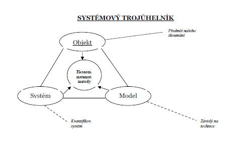
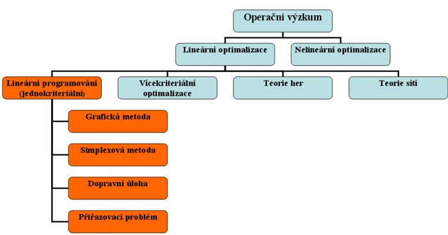
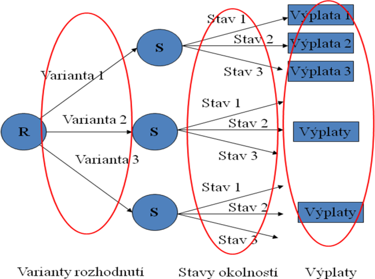
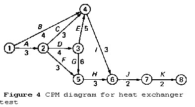
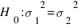
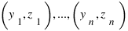
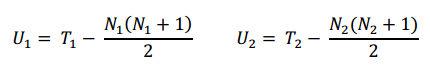
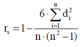

Systémový přístup, systémové analýza a její kroky, definice systému
===================================================================

**Systémový přístup** =  se myslí účelový způsob myšlení či řešení problémů
(jednání), přičemž jsou zkoumané jevy a procesy chápány komplexně (celistvě) v
jejich vnitřních a vnějších souvislostech. Metodickým cílem jeho aplikace v
informačním managementu je především pochopit, vhodně formulovat a pomoci řešit
zkoumaný problém, resp. jeho části, a to v kontextu organizace, vnějšího
prostředí, popř. odpovídajících procesů. Jedním z klíčových pojmů systémového
přístupu je pojem [systém](http://cs.wikipedia.org/wiki/Syst%C3%A9m).

-   základní znaky

    -   komplexní pohled na systém a jeho okolí

    -   strukturální a funkcionální pohled charakterizující vnitřní strukturu
        systému, prvky a jejich vzájemné vztahy a funkci systému

    -   dynamický pohled vycházející z minulého i budoucího vývoje

    -   cílový a účelový pohled na chování a vývoj systému

-   vychází z předpokladu že každý celek je systémem (množinou systémů) ve
    kterých probíhá řada procesů a činností svázaných vzájemnými vazbami.

-   nemá svůj vlastní předmět zkoumání ani vlastní metody

-   využívá se v různých vědních, technických a spol. disciplínách

**Systémová analýza**

-   aplikační systémová disciplína

-   systémová analýza vytváří a aplikuje metody systémového přístupu a
    systémového modelování k řešení složitých rozhodovacích problémů

-   **základní teze SA**

    -   každý existující systém lze zdokonalit, každý nově projektovaný systém
        lze zkonstruovat tak aby uspokojoval požadavky uživatele

    -   ne všechno má cenu zlepšovat - musí to naplňovat účel

-   předmětem zkoumání SA jsou vazby mezi prvky bez ohledu na oblast v níž byl
    systém vymezen -\> nejdůležitější je přesná identifikace systému a volba
    vhodné rozlišovací úrovně

-   části SA

    -   analytická = studování stavby a základních vazeb, formulování problému

    -   syntetická = řešení a implementace

-   metody SA

    -   **matematické a statistické metody operační analýzy a modelování**

    -   vlastní metody SA

    -   metody převzaté z oblastí zkoumaných problémů

-   **Kroky SA při řešení problémů**

    -   vymezení řešeného problému

    -   identifikace systému na zkoumaném objektu

    -   vytvoření systémového modelu a kvantifikace

    -   modelové výpočty a experimenty

    -   interpretace výsledků a řešení problému

    -   implementace a realizace řešení v praxi

**Definice Systému**

-   **je neprázdná účelově definovaná množina prvků a vazeb mezi nimi, která se
    zachycením vstupů a výstupů vykazuje kvantifikovatelné chování v čase.**

-   Na stejný objekt muže být většinou definován různý systém

-   Většinou systém nebývá uzavřený

-   Kvantifikovatelné chování = vykazuje vývoj v čase.

*6 základních kroku:*

>   *1.) vymezení a formulace problému (důležitá fáze)*

>   *2.) je potřeba zajistit informace a jejich třídění – je třeba si uvědomit
>   cenu informací,není vhodné mít více informací než je třeba.*

>   *3.) vymezení množiny přípustných alternativ – z čeho řešení budu vybírat,
>   množství alternativ muže být nekonečné.*

>   *4.) výběr rozhodnutí – nasadím EMM a jejichž pomocí vyberu řešení*

>   *5) stanovit plán realizace – jakým způsobem mohu vybranou možnost
>   realizovat*

>   *6) kontrola realizace – kontrola očekávaného průběhu*

>   **Struktura systemu**

>   \- patří sem základní komponenty, prvky a vazby

>   *Prvky* – relativně uzavřený systém nižšího řádu

>   *Vazby* – determinují a kvantifikují vztahy mezi prvky

>   *Vliv okolí:*

>   A) vstupy – působení na objekt

>   B) výstupy – působení na okolí

>   **Systémy z hlediska interakce s okolím**:

>   **1) uzav**ř*ené*

>   **2) relativn**ě *uzav*ř*ené* (předem jasně vymezeny) – většinou reálné
>   systémy

>   **3) otev**ř*ené* (složité)

>   *Stav systému* – souhrn přesně definovaných vlastností nebo podmínek, které
>   lze v daném

>   časovém okamžiku rozpoznat

>   *Chování systému* – způsob reakce systému na podněty v čase

>   *Deterministické systémy* – existuje jednoznačná souvislost mezi stavy
>   vstupů a výstupů (př.

>   Pokud tam leze dvakrát a vyleze dvakrát a´ )

>   *Stochastické systémy* – pro stejný vstup může systém generovat různé
>   výstupy.

>   **Postup systémového modelování**

>   1) **Homorfismus**– vztah mezi objektem a na něm zaváděným systémem – systém
>   je

>   jednodušší obraz objektu

>   2) **Izomorfismus** – vztah mezi systémem a z něho vzešlým modelem – každá
>   komponenta,

>   která je v systému musí být zobrazena v modelu

>   3) **Verifikace** – ověření, jestli ten model skutečně odráží vlastnosti,
>   strukturu toho reálného

>   objektu – ve snaze podrobně zpřesňovat by se mohl stát nepřehledným,
>   rostoucím,

>   nevyváženým – práce s ním obtížná

>   4) **Kvantifikace modelu**

>   5) Interpretovat model zpět na systém – neměl by být problém

>   6) Implementovat výsledky předchozích fází na reálný objekt mohl

**Systémový trojúhelník**

>   **je mentální mapa, která nám vyjadřuje systémové myšlení. Je to metodický
>   souhrn postupů při zkoumání**. Je to dohromady 6 kroků, které by jsme měli
>   být schopni analyzovat

>   vtahy v systémovém trojúhelníku jsou homomorfní (systém s objektem by měl
>   být stejný, ale ne totožný) a izomorfní (to co je v modelu musí být obsaženo
>   v systému ale ne naopak)

Význam a postup matematického modelování, definice a struktura modelu
=====================================================================

**Matematické modelování** = je umění resp. Schopnost překladu (převodu)
problémů (úloh) z aplikační oblasti do matematicky zpracovatelné a
vyšetřovatelné formulace umožňující teoretickou a numerickou analýzu problému
s cílem proniknout do jeho podstaty, klást otázky,hledat odpovědi a získat
užitečné a potřební informace o zkoumaném problému. Termínem matematické
modelování se také označuje vytváření a analýza postupů, které využívají
matematické prostředky pro hlubší pochopení a ovlivňování reálných procesů,jevů,
stavů a principů.

**Matematický model** - abstraktní objekt matematické povahy, který obsahuje

základní matematické veličiny (proměnné a parametry). Je to schéma, které slouží

k vyjádřeni určitého problému, resp. zobrazeni daného reálného systému.

Modelování je postup, při kterém jeden systém (originál) zobrazujeme jiným

systémem (modelem). Cílem modelováni je znázornění (zobrazeni) a zkoumáni

reálných objektů za účelem nalezeni určitých obecných i jedinečných vztahů a

zákonitosti čili získáváni komplexních informaci o objektu

**Definice a struktura modelu:**

**Model***:* model je záměrně zjednodušený obraz skutečnosti vytvořený pomocí
zvolených zobrazovacích prostředků. Slouží jako nástroj poznání a je prostředkem
řešení komplexních problému.

**Postup tvorby modelu**

-   Tvorba modelů – zobrazení složek identifikovaného systému modelovými
    prostředky

-   *Našla jsem dva způsoby (pokaždé z jiných skript) tak sem pro jistotu házím
    obojí:*

##### **Jeden způsob:**

-   **definování systému na reálný objekt** (vyčlenit prvky systému, cíl
    výzkumu)

-   **verbálně-grafický model daného objektu** (popsat vztahy mezi prvky, určit
    rozměr úlohy, parametry – strategie)

-   **matematický model** (výběr vhodných prostředků pro popis úlohy lineární,
    nelineární...., omezující podmínky, přepis závislostí do prostředí zvoleného
    modelu)

-   **testování a verifikace modelu**

    -   **ex post** – testování minulým vývojem

    -   **ex ante** – testování budoucností

    -   (zkoumání zda je model použitelný, stabilní, …ověření, zda výsledky
        odpovídají praxi, zda zvolený model je vhodný pro konkrétní aplikaci,
        interpretace výsledků, rozbor výsledků modelových výsledků modelových
        výpočtů v budoucnosti je nedílnou součástí verifikace modelu)

-   **modelové experimenty** (extrémní zatížení modelu, testování málo
    pravděpodobných situací na již ověřeném modelu)

**Druhý způsob**

-   **1. Sestavení kvalitativního modelu.**

    -   Na objektu modelování musíme vyčlenit systém

        -   určit prvky systému, které nás budou především zajímat, cíl našeho
            výzkumu

        -   popsat vztahy mezi jednotlivými prvky systému

        -   určit rozměr úlohy, určit parametry (strategie) apod.

-   **2. Sestavení matematického modelu.**

    -   vybrat vhodné matematické prostředky pro popis prvků vybraného systému a
        vztahů mezi prvky

    -   Určíme matematickou oblast, t.j. např.lineární algebru nebo
        diferenciální rovnice a následně provedeme přepis závislostí do
        zvoleného matematického prostředí model

    -   Musíme také matematicky omezit možný rozsah změn parametrů modelu.

-   **3. Výzkum chování modelu z hlediska možných změn parametrů.**

    -   Tato fáze je fází řešení matematického modelu

    -   všímáme si vlivu malých změn na chování řešení modelu

    -   Pokud malé změny parametrů vyvolávají neadekvátní změny řešení,je model
        nestabilní a proto i nepoužitelný.

-   **4. Konfrontace výsledku výpočtu se skutečností.**

    -   Jestliže výsledky výpočtu neodpovídají praxi, je model nepoužitelný a je
        nutné se vrátit k fázi 2 nebo fázi 1 modelování a celý postup opakovat.

**Struktura modelu**

Mezi hlavní složky struktury matematického modelu je následující

\- **rozhodnutí proměnné a parametry** - rozhodnutí proměnné jsou neznámé, které
mají být stanoveny na základě řešení modelu. Jednotlivých parametrů regulované
proměnné systému.

\- **Cíl Funkce** - Definuje měřítko účinnosti systému jako matematické funkce
svých rozhodovacích proměnných. Optimální řešení modelu je dosaženo tehdy, když
odpovídající hodnoty rozhodnutí proměnlivým výnosem nejlepší hodnotu účelové
funkce při uspokojování všech omezení. To znamená, že účelová funkce slouží jako
ukazatel pro dosažení optimálního řešení.

\- **Omezení -** účet pro fyzické omezení systému, musí být model obsahovat
omezení, které omezují rozhodovací proměnné, jejich možném rozsahu či hodnoty
oprávnění. , Které jsou vyjádřeny ve formě omezující matematické funkce.

3. Software pro operační výzkum základní standardy, možnosti. 
==============================================================

Operační výzkum
---------------

-   souhrn metod, pomocí nichž se řeší rozhodovací situace

-   řeší problémy, které mají obecně více možných řešení a mezi nimi hledá to
    řešení, které nejlépe vede k zadanému cíli - hledá se tzv. optimální řešení

-   \-základním nástrojem operačního výzkumu je matematické modelování

-   anglo-americké ekvivalenty: operationalresearch, operationsresearch,
    management science

**Software pro operační výzkum**

-   Matematické modelování v tabulkových procesorech

    -   **Tabulkový procesor**

        -   tabulkový procesor představuje softwarový nástroj pro
            automatizovanou práci s tabulkami

        -   obsahují řadu silných iteračních postupů pro optimalizaci vybraných
            hodnot v tabulce, postupy analýzy citlivosti a možnosti hledání
            řešení pro předem určené cíle

        -   možnost vytváření grafů

        -   možnost práce s databázemi

        -   vlastní programovací jazyky

    -   **Tabulkový model**

        -   vhodné seskupení údajů, funkcí, výpočtů, grafů a formátů v jednom
            nebo více listech sešitu tabulkového procesoru, které zorazují a
            popisují reálný systém, jeho stavy a chování

        -   tyto tabulky jsou matematickým modelem

        -   je možné znovu zopakovat výpočet pro jiné údaje

        -   má velmi blízko k simulačnímu modelu

        -   *WhatIf analýza*

            -   slouží k ověřování reakcí modelu na změněné vstupní podmínky,
                data atd.

        -   *Goalseeking*

            -   na základě zadaného cíle jsou dopočítány výchozí parametry
                modelovaného objektu

        -   *Optimalizační nástroje*

            -   založeny na obecných numerických postupech

            -   umožňují najít řešení i v nelineárních či nekonvexních modelech

    -   Modelové systémy

        -   propojené modely

        -   složité systémy jsou popisovány více modely, které situaci zobrazují
            z různých hledisek či na různých úrovních agregace

        -   jednotlivé modely jsou svým obsahem relativně samostatné -\> mohou
            být založeny na různých metodách

        -   z hlediska datových informací a vazeb mezi modely rozlišujeme:

            -   volné systémy modelů – neobsahují žádnou automatizaci přenosu
                dat a datové propojení je realizováno člověkem

            -   konjugované systémy modelů – částečná automatizace přenosu dat
                mezi jednotlivými dvojicemi modelů

            -   integrované systémy modelů – přímý automatizovaný přenos mezi
                všemi modely

            -   hybridní systémy modelů – založeny na koncepci kompaktního
                celku, který se skládá z různých typů modelů, modelových
                databází a algoritmických prostředků pro vzájemnou komunikaci
                mezi jednotlivými modely

    -   Vlastnosti modelů v tabulkových procesorech

        -   rozměry jednotlivých modelů – pevné nebo proměnné

        -   výpočetní postupy – analytické nebo iterační

        -   datové vazby mezi modely v modelovaném systému – pevně definovány
            nebo měněny na základě vstupních parametrů

**Doplňky MS Excel**

-   řešitel

    -   doplněk Excelu pro řešení konvexních úloh

    -   možnost výstupu v podobě citlivostních zpráv

-   systém ORKOSA

    -   linkosa.xla - lineární jednokriteriální optimalizace na bázi aplikace
        revidované simplexové metody

    -   dumkosa.xla - jednostupňová dopravní úloha s oboustranně omezenou
        propustností tras

    -   mcakosa.xla - soubor metod pro vícekriteriální analýzu variant. Zahrnuty
        jsou metody: Váženého součtu, TOPSIS, ELECTRE I, ORESTE AGREPREF, MPPAC

    -   alokosa.xla - aplikace interaktivní metody ALOP pro vícekriteriální
        programování

-   Whatsbest

    -   doplněk Excelu pro řešení konvexních úloh

    -   Knihovna vlastních funkcí které jsou přístupné přes řádek vzorců

    -   výsledkem jsou citlivostní zprávy

-   Lindo

    -   software pro řešení lineárních úloh

-   Lingo

    -   software pro řešení konvexních úloh

4. Lineární optimalizační modely a jejich praktické aplikace.
=============================================================

**Lineární optimalizační modely a jejich praktické aplikace**

**Cíl Lineárního optimalizačního modelu:**

-   hledá řešení, které splňuje omezující podmínky a v kterém účelová funkce
    z(x) nabývá požadovaného extrému (hodnoty)

    -   nalézt optimální řešení

    -   nalézt požadované maximum nebo minimum hodnoty kritéria

    -   splňující omezující podmínky

**Lineární modely** -Zobrazující systém s určitou mírou nepřesnosti,vyplývající
z předpokladu linearity zobrazovaných procesů a deterministického charakteru
parametrů modelů

**Prvky lineárního optimalizačního modelu:**

-   *proměnné – procesy* (x=(x1,x2,x3,....,xn)T který popisuje jednotlivé složky
    hledaného rozhodnutí)

-   *omezující podmínky* (Ax ≤≥= b, které popisují reálná omezení hledaných
    rozhodnutí)

-   *účelová funkce* (účelová funkce z(x)=ctx která popisuje cíl hledaného
    rozhodnutí)

-   (podmínky nezápornosti)

*Omezující podmínky jsou vyjádřeny pomocí lineárních rovnic a nerovnic a účelová
funkce je vyjádřena pomocí lineární funkce*

**Sestavení lineárního modelu**

1.  nejdříve musí být nadefinovány procesy, které jsou vyjádřeny pomocí
    proměnných ve vhodných jednotkách

2.  vyjádříme pomocí lin. rovnic a nerovnic omezení hledaného řešení. Při
    sestavování OP modelu musíme zachovat sčitatelnost (stejné jednotky u všech
    členů levé i pravé strany)

3.  určíme hodnoty technicko-ekonomických koeficientů, jednotlivé kapacitní
    požadavky a možné bilanční nerovnováhy či poměry

4.  specifikování účelové funkce a cenových koeficientů

**Základní úlohy řešitelné lin. opt. modelem**

-   optimalizace výrobní struktury – cílem je nalezení optimálních rozsahů
    výrobních procesů v rámci daných výrobních kapacit

-   alokační problémy – problémy které řeší rozdělení zdrojů na pořízení
    určitých objektů (např. přiřazení pracovníků s různou kvalifikací)

-   směšovací problémy – nalezení optimálních množství jednotlivých složek směsi

-   problémy dělení materiálů – tzv. úlohy o řezných plánech, optimální volba
    způsobu dělení materiálu aby byla zajištěna požadovaná množství jednotlivých
    částí

-   distribuční problémy – optimalizace distribuce zboží mezi dodavateli a
    odběrateli

**Typy Omezujících Podmínek:**

*vnější vazby systému*

-   kapacitní \<=

-   požadavkové \>=

-   určení – vyjadřují požadavek přesně dané hodnoty =

*vnitřní vazby systému*

-   bilanční – např. rozdělení produkce

-   poměrové – požadavek na určitý poměr komponent, *např. požadavek poměru
    škrobových jednotek a stravitelných dusíkatých látek v krmné dávce -\> 2SJ –
    7SNL ≥ 0*

**Grafické řešení LOM**

-   pouze pro řešení úloh s 2 OP nebo 2 proměnnými

    -   **Grafické řešení v prostoru řešení**

        -   v tomto prostoru leží všechna přípustná řešení úlohy

        -   prostor řešení graficky znázorníme jako průnik poloprostorů, které
            představují jednotlivé OP. Protože poloprostor je konvexní množina,
            je jejich průnik také konvexní množina

            -   je-li tato množina omezená

\-\> nazýváme konvexní polyedr *(ohraničený obrazec)*

-   je-li tato množina neomezená

\-\> polyedrický kužel *(otevřený do nekonečna)*

-   řešitelnost

    -   množina přípustných řešení je prázdná -\> není řešení

    -   množina přípustných řešení je konvexní polyedr -\> model má optimální
        řešení

        -   existuje jediné řešení právě tehdy, když ÚF protíná vrchol
            konvexního polyedru

        -   existuje nekonečně mnoho řešení, když ÚF protíná celou hranu
            konvexního polyedru

    -   množina přípustných řešení je polyedrický kužel

\-\> množina přípustných řešení je neomezená

-   **Grafické řešení v prostoru požadavků**

    -   prostor požadavků – prostor, ve kterém je možno zobrazit vektory
        koeficientů jednotlivých proměnných (tzv. aktivity) a vektor pravých
        stran OP (tzv. požadavek – b)

    -   nalezení řešení soustavy omezujících podmínek je možno chápat jako
        skládání vhodných vektorů aby výsledek byl vektor pravých stran

**Simplexový algoritmus**

-   univerzální metoda pro řešení úloh lineárních opt. modelů

-   iterační metoda, která využívá Jordanovu eliminační metodu doplněnou o dvě
    kritéria, které umožňují nalézt opt. řešení

-   umožňuje řešit pouze lin. modely s OP v rovnicovém a kanonickém tvaru a
    s nezápornými hodnotami vektoru pravých stran

**převedení lin. modelu pro SA**

-   *nezápornost hodnot pravých stran* – vynásobení rovnice či nerovnice -1

-   transformace OP do rovnicového kanonického tvaru – rozšíření počtu
    proměnných modelu

    -   **OP typu ≤ -- kapacitní podmínka**

        -   převedeme doplněním nezáporné doplňkové proměnné která vyjadřuje
            rezervu dané kapacity

-   **OP typu ≥ -- požadavková podmínka**

    -   převedeme doplněním záporné proměnné která vyjadřuje překročení
        požadavku

-   **OP je v rovnicovémtvaru ale není v kanonickém tvaru**

    -   nutno rozšířit o pomocné proměnné, které pomáhají vytvořit kanonický
        tvar

-   **kanonický tvar** – soustava lin. rovnic je v kanonickém tvaru jestliže
    její matice soustavy obsahuje jako svou submatici úplnou jednotkovou matici
    řádu m

-   **Frobeniova věta** – soustava lin. rovnice je řešitelná je-li hodnost
    matice soustavy rovna hodnosti rozšířené matice soustavy.

    -   je-li hodnost matice soustavy rovna počtu proměnných -\> jediné řešení

    -   je-li počet proměnných větší než hodnost matice (m)-\> nekonečně mnoho
        řešení

    -   **matice báze (B)** – vektory koeficientů u bazických proměnných
        v původním tvaru soustavy rovnic

    -   **matice transformace (B-1)** – inverzní matice k bazické matici a
        umožňuje v jednom kroku transformovat kterýkoliv vektor z výchozí
        simplexové tabulky do aktuální báze

    -   **bázické proměnné** – proměnné, které tvoří kanonický tvar matice

    -   **nebazické proměnné** – všechny ostatní

    -   **bazické řešení** – vektor x jehož nenulové složky odpovídají bazickým
        vektorům

    -   **degenerované řešení** – alespoň jedna z bazických proměnných má
        nulovou hodnotu

    -   **parametrické řešení** – pokud jsou hodnoty nebazických proměnných
        parametry

    -   **řešení lin. opt. modelu**

        -   založeno na nalezení vhodného bazického řešení soustavy lin rovnic
            odpovídajících OP

        -   **Kritérium optimality řešení**

            -   založeno na zjišťování, zda lze k danému řešení soustavy OP
                najít řešení jiné, které bude mít lepší hodnotu kritéria (ÚF)

            -   výpočet –\> (zj – cj)

                -   zj = cena ekvivalentní kombinace bazických procesů

            -   zj - cj ≥ 0 – když všechny nebazické proměnné v MAX úloze -\>
                optimum

            -   zj – cj\< 0 – když všechny nebazické proměnné v MIN úloze -\>
                optimum

            -   zj – cj = 0 – stejné řešení (stejné hodnota ÚF) pokud máme
                dopočítaný celý simplexový algoritmus tak se toto řešení nazývá
                alternativní řešení

            -   v každém kroku SA vypočítáme pro všechny nebazické proměnné a
                vybereme

                -   MAX - nejmenší záporné číslo

                -   MIN – největší kladné číslo

        -   **Kritérium přípustnosti řešení (Ω)**

            -   Zajišťuje, aby nové řešení, které zařazujeme do báze, splňovalo
                OP a podmínky nezápornosti

            -   slouží pro určení vyřazované proměnné z báze

            -   podíl vektoru pravých stran a koeficientem zařazované proměnné

            -   Ω=b/α , α \> 0

**Analýza optimálního řešení a postoptimalizační analýza**

-   **z výsledné ST lze zjistit**

    -   optimální řešení a opt. hodnotu ÚF

    -   matice transformace

    -   duální hodnoty – jsou hodnoty kritéria optimality (zj-cj) a udávají o
        kolik se zhorší hodnota ÚF zařazením jednotky daného procesu do řešení

-   **analýza citlivosti**

    -   zabývá se určením rozsahu změn výchozích údajů v rámci kterých nedochází
        ke změně optimální báze

    -   analýza citlivosti vzhledem ke změně jedné složky vektoru pravých stran
        b

        -   určí interval stability řešení při kterém zůstane zachovano
            přípustné řešení v téže optimální bázi

    -   analýza citlivosti vzhledem ke změně jedné složky vektoru cen

 5. Dopravní a pořizovací modely 
====================================

Distribuční(pořizovací) modely pomáhají řešit základní otázky přemíšťování či
přiřazování lidí, materiálu a informací, které lze vyjádřit slovy odkud, kam,
čím a kudy.

**Typy distribučních modelů:**

distribuční modely jsou speciálním případem lineárních optimalizačních modelů.
Odlišují se speciálními typem matice A, ve které se vyskytuje velice málo
nenulových často jednotkových koeficientů.

Mezi klasické distribuční modely patří dopravní modely, jejichž cílem je nalézt
optimální způsob přepravy materiálu, zboží apod. Důležitý je počet stupňů
přepravy tj. počet míst, meziskladů, přes které je přeprava realizována a počet
indexů, tj. počet rozlišovaných způsobů přepravy – dopravních prostředků.

**Jednostupňovádvouindexová dopravní úloha**

-   Cílem tohoto modelu je najít takový plán přepravy mezi m dodavateli a n
    spotřebiteli, při kterém budou celkové přepravní náklady minimální a budou
    vyčerpány kapacity dodavatelů a uspokojeny požadavky spotřebitelů.

-   Přeprava zboží, materiálu, lidí …z míst zdrojů k místům spotřeby jediným
    způsobem( odkud – dodavatele, kam – spotřebitele , co – kolik)

**Dvoustupňová dvouindexovádopravní úloha**

-   Přeprava zboží, materiálu, lidí …z míst zdrojů přes mezisklady k místům
    spotřeby jediným způsobem (odkud – dodavatele,přes co –mezi sklady, kam –
    spotřebitele , co – kolik)

**Jednostupňová tříindexovádopravní úloha**

-   Přeprava zboží, materiálu, lidí …z míst zdrojůk místům spotřeby **různými
    způsoby** (odkud – dodavatele,jak nebo čím, kam – spotřebitele , co – kolik)

**Proměnné**

• dodavatelé a jejich kapacity

• spotřebitelé a jejich požadavky

• dopravní náklady – ohodnocení každé trasy dodavatel – spotřebitel

• trasa – spojení mezi dodavateli a spotřebitelem

• přepravované množství

**Řešitelnost dopravní úlohy**

Dvě podmínky řešitelnosti dopravního problému – úplná zastupitelnost
přepravovaného produktu a dělitelnost materiálu a vyváženost úlohy (všichni
dodavatelé dohromady musí být schopni uspokojit všechny požadavky spotřebitelů a
nic nesmí přebývat a nic nesmí chybět tj. součet kapacit dodavatelů se musí
rovnat součtu požadavků spotřebitelů).

Jsou-li tyto dvě podmínky splněny, omezující podmínky dopravní úlohy jsou
soustavou lineárních rovnic, které splňuje Frobeniovu větu, a proto jsou
řešitelné.

**Vyváženost dopravní úlohy**

úlohy, ve kterých se součet kapacit rovná součtu požadavků, se nazývají
vyvážené, a úlohy, ve kterých se součet kapacit nerovná součtu požadavků, se
nazývají nevyvážené dopravní úlohy.

Nevyváženost může znamenat buď přebytek kapacit dodavatelů nebo převis požadavků
spotřebitelů.

Převis požadavků spotřebitelů znamená, že kapacity dodavatelů jsou menší než
požadavky spotřebitelů… rozšíříme o fiktivního dodavatele. Doplňkové proměnné x
vyjadřují zásobování spotřebitelů od fiktivního neexistujícího dodavatele, tedy
množství, které spotřebitelé nedostanou. Ceny za tuto přepravu jsou nulové.
Pokud je nutno některého spotřebitele skutečně plně zásobit, pak bude použita
prohibitivní cena.

Přebytečnou kapacitu, která dodavatelům zůstane ve skladu nahradíme fiktivním
spotřebitelem. Ceny jsou opět nulové.

**Řešení**

**algoritmus řešení DÚ**

1.  nalezení výchozího bazického přípustného řešení pomocí tzv. aproximačních
    metod:

-   metody severozápadního rohu

-   indexové metody

-   Voglovy aproximační metody

1.  test optimality ukáže, zda je možno nalézt jiné základní řešení s lepší
    hodnotou účelové funkce

2.  přechod k lepšímu řešení pomocí tzv. Dantzigových uzavřených obvodů
    představuje změnu báze, jestliže testované řešení nebylo optimální

**Výchozí bázické řešení**

Nalezení výchozího bazického řešení je tedy založeno pouze na vhodném výběru
tras, kterými se bude nějaké množství přepravovat. Je nutné vybírat trasy
s nejmenšími náklady. Omezující podmínky dopravního modelu jsou lineárně
závislé, jakmile však jednu vynecháme, zbývající jsou již lineárně nezávislé.
Počet bazických proměnných v řešení této soustavy je tedy roven m + n – 1.

**Metoda severozápadního rohu**

1.  v dopravní tabulce vybereme neobsazené volné pole, které má nejnižší možné
    indexy (severozápadní polev tabulce … tj x 11)

2.  vybrané proměnné přiřadíme hodnotu maximálního možného převáženého množství
    zboží, upravíme kapacity a požadavky

3.  dodavatele nebo spotřebitele s vyčerpanou kapacitou či požadavkem vyškrtneme

**Indexová metoda**

postup se liší pouze při výběru první trasy………nejprve obsahuji volné pole, které
má nejnižší sazbu

**Vogelova aproximační metoda**

Poskytuje řešení velmi blízká řešení optimálnímu. Pro obsazení určité trasy od
dodavatele je důležitá relativní výhodnost vzhledem k možnému zvýšení dopravních
nákladů, pokud nebude možno využít trasu nejlevnější.

Relativní výhodnost každé trasy se zjišťuje pomocí rozdílu mezi nejvýhodnější a
druhou nejvýhodnější sazbou tras od dodavatele (v řádku) reps.ke spotřebiteli
(ve sloupci). Tyto rozdíly lze interpretovat jako minimální velikost možné
jednotkové ztráty, která by vznikla, kdybychom obsadili nikoli nejvýhodnější,
ale až druhé nejvýhodnější pole

1.  vypočtou se diference mezi nejvýhodnější a druhou nejvýhodnější sazbou (při
    minimalizaci mezi nejnižší a druhou nejnižší sazbou)

2.  určí se maximální diference, ve vybraném řádku nebo sloupci se vybere trasa
    s nejvýhodnější sazbou (při stejných maximálních diferencích – obsazuje
    přednostně pole s nejvýhodnější sazbou z hlediska všech sazeb v matici sazeb
    – sedlové pole, několik sedlových polí – přednostně obsazujeme to pole, pro
    které je součet řádkových a sloupcových diferencí maximální)

**Dantzigovy uzavřené obvody**

představují grafické schéma v distribuční tabulce, které naznačuje jak provést
úpravy řešení, jak přesunout převážené zboží z jedné trasy na jinou a přitom
nebyly porušeny podmínky dopravní úlohy, tj. velikost kapacit a požadavků.

Dantzigovy uzavřené obvody jsou grafickým znázorněním lineární závislosti
proměnných, resp. jejich vektorů koeficientů v omezujících podmínkách dopravního
modelu.

*Dantzigův uzavřený obvod je uzavřená posloupnost – cyklus na sebe navazujících
tras, která obsahuje v řešení již použité trasy a právě jednu trasu novou, jejíž
každé dvě sousední trasy mají vždy buď stejného dodavatele nebo stejného
spotřebitele.*

Množství převáženého materiálu trasami ležícími na uzavřeném obvodu označujeme
střídavě znaménky + a -. Nová trasa, resp. množství převáženého materiálu touto
trasou bude označeno +, protože touto trasou plánujeme novou přepravu a tedy se
bude hodnota proměnné zvyšovat. Chceme-li aby nové řešení bylo bazické, musíme
tedy touto trasou převážet maximální možné množství zboží, tedy minimální
z hodnot x ij (je transport novou trasou) příslušných trasám, které se nacházejí
ve vrcholech uzavřeného obvodu označených znaménkem -.

**Test optimality**

je založen na porovnání sazeb jednotlivých nebázických tras c rs a příslušných
nepřímých sazeb z rs, tj. na porovnání hodnoty skutečných dopravních nákladů
touto trasou a nákladů ekvivalentní tras, pomocí níž je materiál
přepravován………..

Přepravu trasou x rs nazveme přímou přepravou a cena kombinací přeprav, která je
ekvivalentní přepravě od dodavatele ke spotřebiteli. … z rs – c rs\<= 0 tato
podmínky se nazývá kritériem optimality řešení minimalizační dopravní úlohy.

**Metoda MODI** slouží k rychlému nalezení nepřímých sazeb z ij. Její princip
spočívá v tom, že lze najít takové hodnoty duálních proměnných – řádková čísla u
i a sloupcová čísla v j , že pro všechny bázické proměnné x ij\> 0 (odpovídající
obsazeným bazickým polím) platí rovnice: u i + v j = c ij.

**Analýza propustnosti**

realizované spoje nyní posuzujeme z hlediska množství materiálu, který je po
nich přepravován nebo by po nich mohl být přepravován. Propustnost tras
představuje maximální objem materiálu, který lze přepravit po dané trase.
(Danzitzig)

vysoce propustné – propustné – málo propustné

**Analýza perspektivisty**

perspektivista tras je chápána jako vliv použití trasy na hodnotu dopravních
nákladů. Je to tedy hodnota, podle níž jsou testovány jednotlivé trasy v testu
optimality, tj. podle velikosti hodnoty :

r ij = c ij – z ij. pro trasy optimální a alternativní platí r ij= 0…..pro trasy
neoptimální je r ij\> 0. (jedná se o ty hodnoty, které jsem vypočítala u testu
optimality, nejlepší jsou ty nejblíže nulo, protože mi hodnotu kritéria zhorší
nejméně…tj. zvednou nejméně).

vysoce perspektivní trasy – perspektivní trasy – neperspektivní trasy

6. Teorie rozhodování, rozhodovací modely, modely teorie her. 
==============================================================

**Teorie rozhodování :**

Rozhodovací proces je charakterizován jako proces volby nejvýhodnějšího
rozhodnutí z několika možných alternativ rozhodnutí. Toto rozhodnutí by mělo
přinést co nejlepší efekt

-   *efekt* = v jednotlivých krocích je ovlivňován rizikem a nejistotou za jaké
    budoucí situace nastane

-   *riziko* = možnost nežádoucích výsledků, ke kterým by vedla realizace
    zvolené alternativy za nepříznivých situací

-   *nejistota* = nemožnost spolehlivého stanovení budoucích hodnot faktorů
    ovlivňujících dopady a účinky volby variant

-   formy rozhodovacích modelů

    -   maticová forma (výplatní tabulka)

    -   rozhodovací strom

**Rozhodovací modely**

-   **Rozhodovací situace**

    -   je charakterizována jako proces volby z alespoň dvou možných variant

    -   vybraná alternativa je jednorázové rozhodnutí které se nebude opakovat

    -   je možné vybrat pouze jedno řešení proto je to situace konfliktní

-   **Alternativy a stavy okolností**

    -   alternativy = možná rozhodnutí pro řešení problémů alternativy se
        navzájem vylučují

    -   stavy okolností = situace, které ovlivňují výsledky jednotlivých
        alternativ

        -   vyjadřují situace za nichž se uskutečňuje rozhodnutí a jsou mimo
            přesnou kontrolu rozhodovatele

        -   mají rozhodující dopad na učiněná rozhodnutí

        -   navzájem se vylučují

-   **Výplatní (rozhodovací) tabulka**

    -   každá alternativa je ohodnocena výsledkem (zisk výnos náklad ztráta)

    -   tento efekt se nazývá výplatou

    -   výplatní tabulka je matice o rozměru m\*n (m je počet alternativ a n
        počet stavů okolností) jejíž prvky jsou jednotlivé výplaty

-   **Rozhodovací kritérium**

    -   proces volby určité alternativy s ohledem na odpovídající výplaty

    -   řídí se záměrem a přístupem rozhodovatele k problému

    -   maximalizační, minimalizační atd.

-   **Jistota a riziko**

    -   vektor rizika = vektor pravděpodobností realizace jednotlivých stavů
        okolností

    -   pokud jerozhodovateli známo jaký stav okolností nastane -\> rozhodování
        za podmínek jistoty

    -   pokud rozhodovatel neví s jistotou jaký stav okolností nastane ale ví na
        základě odhadu který stav okolností pravděpodobně nastane -\> rozhoduje
        za podmínek rizika

    -   pokud rozhodovatel nemá vůbec žádnou představu o tom jaký bude stav
        okolností -\> rozhoduje za podmínek úplné nejistoty

    -   objektivní pravděpodobnosti

        -   určovány na základě statistických údajů

    -   subjektivní pravděpodobnosti

        -   na základě osobního přesvědčení rozhodovatele

Prvky rozhodovací tabulky (matice)

\+ výplaty v11, v12 etc.

\+ rozhodovací kritérium, podle něhož jsou jednotlivé výsledky hodnoceny

\+ riziko pj informace o možnostech realizace jednotlivých stavů okolností

Prvky rozhodovacího stromu

-   **Možnosti řešení rozhodovacích modelů**

    -   **Dominance variant**

        -   dominance alternativ – převaha jedné alternativy nad druhou

        -   ne vždy existuje jedna alternativa, která dominuje nad všemi
            ostatními

        -   hlavní využití k vypuštění dominovaných alternativ z modelu

        -   Dominance podle výplat

            -   nejostřejší a zároveň nejjednodušší forma dominance

            -   dominující alternativa musí poskytovat všechny výplaty lepší
                nebo stejně dobré jako alternativa dominovaná

        -   Dominance podle stavů okolností

            -   slabší forma dominance

            -   dominující alternativa poskytuje pro každý stav okolností
                výplaty lepší nebo stejné jako alternativa dominovaná

        -   Dominance podle pravděpodobností

            -   nejslabší a zároveň nejsložitější forma dominance

            -   pravděpodobnosti hodnot výplat stejných nebo lepších než nějaká
                hodnota x jsou u dominující alternativy větší nebo stejné než u
                alternativy dominované

            -   založena na kumulativní pravděpodobnosti hodnot výplat

            -   graf kumulativní pravděpodobnosti = profil rizika

    -   **Nejvýhodnější alternativa**

        -   alternativa slibující nejlepší očekávanou výplatu

        -   Nejvýhodnější alternativa při rozhodování za jistoty

            -   pokud víme, že nastane daný stav okolností, vybereme z něho
                maximální výplatu

        -   Nejvýhodnější alternativa při rozhodování za úplné nejistoty

            -   **Maximaxový přístup**

                -   maximální výplata pro každou alternativu a z těchto výplat
                    maximum

            -   **Maximinový přístup (Waldovo kritérium)**

                -   minimální výplata pro každou alternativu a z těchto výplat
                    vybereme maximální

            -   **Princip minimaxové ztráty (Savageovo kritérium)**

                -   zkoumá i ztráty vzhledem k nejlepší výplatě

                -   matice ztrát – výplaty jednotlivých alternativ vzhledem
                    k maximální výplatě pro každý stav okolností

                    -   vybereme maximální výplatu pro daný stav okolností a od
                        této výplaty odečteme jednotlivé alternativy

                -   v matici ztrát vybereme maxima jednotlivých alternativ a
                    z nich pak minimální ztrátu

            -   **Princip nedostatečné evidence (Bernoulli-Laplaceův)**

                -   zohledňuje všechny výplaty a jednotlivé stavy okolností
                    považuje za stejně pravděpodobné -\> rozhodování za
                    nejistoty je převedeno na rozhodování za rizika s vektorem
                    rizika

                -   sečteme výplaty pro jednotlivé alternativy a vydělíme počtem
                    stavů okolností z těchto vypočítaných průměrů vybereme
                    největší

                -   lze použít jak pro matici výplat tak pro matici ztrát

            -   **Hurwiczovo kritérium**

                -   založeno na očekávání nejlepších a nejhorších výsledků každé
                    alternativy

                -   nutno stanovit optimisticko pesimistický index t \<0,1\>
                    který vyjadřuje očekávaný podíl nejlepší a nejhorší výplaty
                    každé varianty

                -   pro každou variantu

                    -   vybereme maximální výplatu a vynásobíme t a přičteme
                        minimální výplatu vynásobenou (1-t)

                -   z výsledků vybíráme maximum

        -   Nejvýhodnější alternativa při rozhodování za rizika

            -   musíme znát vektor rizika

            -   **Očekávaná hodnota výplaty (EMV)**

                -   Bayesův princip

                -   pro každou alternativu

                    -   vynásobíme výplatu pravděpodobností stavu

                    -   tyto výsledky sečteme

                -   vybereme maximum ze sečtených výplat

            -   **Očekávaná možná ztráta (EOL)**

                -   stejný způsob výpočtu jako EMV akorát počítáme z matice
                    ztrát

            -   **EMV a EOL vedou k výběru stejné alternativy**

            -   **Pravděpodobnost dosažení aspirační úrovně**

                -   porovnání pravděpodobností, s nimiž budou jednotlivé
                    alternativy poskytovat alespoň určitou hodnotu výplaty

    -   **Dodatečné informace**

        -   *poskytují dodatečné informace aby se snížilo riziko rozhodnutí*

        -   Očekávaná hodnota spolehlivé informace (EVPI)

            -   spojena s dodatečnými náklady -\>rozhodovatel musí zvážit zda se
                vyplatí

            -   EVPI se shoduje s EOL

        -   Očekávaná hodnota výběrové informace (EVSI)

            -   dodatečná výběrová informace zpřesňuje vektor rizika

            -   EVSI=EMVS-EMV

            -   EMVS – očekávaná hodnota výplaty s dodatečnou informací

    -   **Rozhodovací stromy**

        -   účelově zjednodušené grafické zobrazení struktury rozhodovacího
            procesu

        -   popisují průběh rozhodovací situace pomocí grafů

        -   uzly rozhodovacího stromu

            -   rozhodovací

            -   situační

        -   hrany rozhodovacího stromu

            -   vystupující z rozhodovacích uzlů – zobrazují alternativy

            -   vystupující ze situačních uzlů – zobrazují stavy okolností

        -   výplaty pro příslušné kombinace alternativ a stavů jsou zachyceny na
            listech stromu

    -   **Pravděpodobnostní stromy**

        -   zobrazují průběh realizace rizikového rozhodnutí

        -   uzly zobrazují jednotlivé kroky rozhodnutí, jejichž výsledek je
            ovlivňován rizikem

        -   hrany vycházející z uzlů zobrazují možné výsledky těchto rizikových
            kroků včetně jejich pravděpodobností

        -   listy představují ukončení rozhodnutí

**Teorie her:**

**co je:** matematické zobrazení a řešení konfliktních situací min. dvou hráčů

**cíl:** najít optimální řešení pro každého z obou hráčů

v ekonomických modelech pak minimální náklady, min. ztráta, max. zisk

**Konfliktní situace:** všechny situace, kde jde o střet zájmů účastníků

**druh konfliktní situace:**

-   **antagonistick**ý - úspěch jednoho je závislý ne neúspěchu ostatních

-   **neantagonistický** - oba můžeme vyhrát

-   **ne/kooperativní** - hráči nechtějí/chtějí spolupracovat

-   **hry s nulovým součtem** - čím víc získám, tím víc protihráč ztratí. já 10
    on -10

**prvky rozhodování:**

-   **hra** - model konfliktní situace

-   **hráči** – účastníci konfliktu v teorii her, jedná se o souhrn zájmů a cílů
    ne o určitou osobu

>   \- inteligentní – hraje tak aby vyhrál

\- neinteligentní = příroda, účastní se hry na výsledku není interesován

-   **strategi**e - posloupnost tahů

    -   **Čistá strategie -** jednoznačně určená strategie hráče

    -   **Smíšená strategie -** pro každou strategii je dána pravděpodobnost
        jejího použití - četnost použití při opakování hry - při mnoha partiích

-   **prostor/množina strategií** - souhrn strategií =\> konečné, nekonečné

-   **výplata hráče** - výsledek hry hráčů na základě strategií

-   **partie –** jednotlivá část hry

-   **tah** – krok v průběhu hry, součást strategie

**zobrazení možností:**

-   tabulka

-   matice - v 1. řádku alternativy rozhodnutí, v 1. sloupci stavy okolností,
    pole = výplaty

-   rozhodovací strom

>   \- hrana - tah

>   \- uzel - pozice hry, stejná úroveň = možné tahy

>   \- listy jsou ohodnoceny výplatami alternativ

**Sedlový bod:**

-   pokud horní cena hry se rovná dolní ceně, pokud existuje, pak má hra řešení
    v oboru čistých strategií (jednoznačně určená strategie hráče – při smíšené
    je dána pravděpodobnost užití – při mnoha partiích)

**Hra dvou inteligentních hráčů:**

-   každá maticová hra je řešitelná! Neznáme strategii protihráče, nebo známe
    (riziko). – teorie her!!!

**Hra s neiteligentním hráčem**

-   neinteligentní hráč – příroda

-   stejné pustupy řešení

7. Vícekriteriální rozhodování, vícekriteriální analýza variant a vícekriteriální analýza variant a vícekriteriální optimalizace. 
==================================================================================================================================

-   rozhodovací problémy, v kterých se důsledky rozhodnutí posuzují podle více
    kritérií

-   zohlednění více kritérií přináší problém vzájemné rozporuplnosti kritérií

-   cílem vícekriteriálního rozhodování je nalezení nejlepší varianty podle
    všech uvažovaných hledisek, vyloučení neefektivních variant nebo uspořádání
    množiny variant

1.  **Modely vícekriteriální optimalizace**

    -   množina variant s nekonečně mnoho prvky je vyjádřena pomocí OP a
        ohodnocení jednotlivých variant je dáno kriteriálními funkcemi

    

    cílem je nalezení požadovaného extrému těchto kritérií na množině
    přípustných řešení

    -   **Dominované řešení**

        -   pokud nemáme informace o vzájemném vztahu jednotlivých kritérií,
            můžeme říct, že varianta xi je lepší než varianta xj je-li lepší
            podle všech kritérií respektive, je-li alespoň v jednom kritériu
            lepší a v ostatních stejná

    -   **Nedominované řešení (efektivní) - paretovské**

        -   přípustné řešení xi je nedominovaným řešením úlohy, pokud neexistuje
            žádné jiné přípustné řešení, které by jej dominovalo

    -   *Ideální řešení* – ve všech kritériích nejlepší možné hodnoty

    -   *Bazální řešení* – nejhorší ohodnocení ve všech kritériích

    -   Kompromisní řešení – nejmenší vzdálenost od ideálního řešení podle
        vhodné metriky

    -   **Prvky lin. vícekriteriálníhoopt. modelu**

        -   vektor proměnných, který popisuje jednotlivé složky hledaného
            rozhodnutí

        -   omezující podmínky, které popisují reálná omezení hledaných
            rozhodnutí

        -   vektor kriteriálních funkcí, který popisuje cíle, kritéria hledaného
            řešení

    -   **Metody řešení úloh vícekriteriální optimalizace**

        -   metody se liší především povahou informace požadované od řešitele,
            kvalitou poskytovaného výsledku nebo postupem výpočtu

        -   **Dílčí optimální řešení**

            -   Řešení, které splňuje všechny omezující podmínky a optimalizuje
                jedno z kritérií modelu (řešíme tolik jednokrit. modelů kolik
                máme ÚF)

            -   neobsahují vícekriteriální pohled na řešení problému

            -   nejsou považována za řešení kompromisní

            -   mají spíše analytický význam -\> umožňují hodnotit vliv
                jednotlivých kritérií na výsledek řešení problému

            -   kriteriální matice – obsahuje dílčí optimální řešení

                -   ideální řešení (h) – na diagonále hodnot

                -   bazální řešení (d) – nejhorší hodnoty kritérií
                    v jednotlivých sloupcích tabulky

        -   **Agregace kriteriálních funkcí**

            -   sloučení všech kritérií pomocí vhodného operátoru do jediného
                kritéria

            -   operátor nesmí zkreslit a nechtěně zesílit či zeslabit nějáké
                kritérium a musí být schopen zajistit preferencemi požadované
                zvýraznění či zeslabení

            -   základní typy agragací

                -   součinová či podílová

                    -   pokud jsou kritéria různého typu

                -   součtová či rozdílová

                    -   pokud jsou kritéria stejného typu

                -   konvexní lineární kombinace kritérií

                    -   kritéria mají přidělené váhové koeficienty které
                        vyjadřují stupeň jejich důležitosti

            -   agregace různorodých kritérií nemá praktickou interpretaci proto
                je agregované kritérium kritériem pomocným které slouží pouze
                k nalezení kompromisního řešení

        -   **Úprava kriteriálních funkcí na omezující podmínky**

            -   mezi OP a krit. fcemi existuje vzájemná zaměnitelnost

            -   kteroukoliv OP lze převést na KF a naopak

            -   požadavek maximalizace kritéria lze formulovat jako požadavkovou
                podmínku (≥)

            -   požadavek minimalizace krit. lze chápat jako kapacitní podmínku
                (≤)

            -   stanovíme si aspirační úroveň pro ostatní KF a převedeme je na
                OP

        -   **Cílové programování**

            -   postup výpočtu kompromisního řešení vychází z minimalizace
                odchylek od cílových (žádoucích) hodnot

            -   vstupem jsou cílové hodnoty a jejich preference, které mohou být
                vyjádřeny dvěma způsoby

                -   pomocí vah přiřazených jednotlivým KF – umožňují rozlišit
                    důležitost odchylek od jednotlivých cílových hodnot

                -   pomocí pořadí jednotlivých kritérií na základě jejich
                    důležitosti

                -   tyto způsoby lze kombinovat

            -   cílové prog. obsahujeodchylkové proměnné které představují
                odchylky od předem stanovených cílových hodnot v kladném nebo
                záporném směru.

                -   d+ - překročení

                -   d- - nedosažení

            -   pokud nejsou odchylky vzájemně srovnatelné je nutné upravit KF
                že se budou uvažovat relativní odchylky od zadaných hodnot

            -   relativní odchylky – jednotlivé odchylky d+ a d- jsou vyděleny
                optimální hodnotou příslušného kritéria nebo hodnotou
                požadovaného cíle

        -   **Interaktivní postupy**

            -   úzká spolupráce rozhodovatele a řešitele úlohy

            -   na začátku řešitel sdělí přibližné hodnoty vypočítané dílčími
                opt. úlohami. Rozhodovatel pak předá řešiteli informace na
                jejichž základě vypočte řešitel zpřesněné řešení a to se opakuje
                do uspokojení rozhodovatele

            -   Metoda ALOP

            -   Metoda STEM

2.  **Vícekriteriální analýza variant**

    -   jsou zadány pomocí konečného seznamu variant a jejich ohodnocení podle
        jednotlivých kritérií

    -   cíle vícekrit analýzy variant

        -   je nalézt variantu která je ohodnocena podle všech kritérií nejlépe

        -   seřadit varianty

        -   vyloučit neefektivní varianty

    -   kriteriální matice – obsahuje kvantifikované hodnocení variant podle
        kritérií, sloupce odpovídají kritériím a řádky hodnoceným variantám

    -   typy kritérií

        -   podle povahy

            -   minimalizační

            -   maximalizační

        -   podle kvantifikovatelnosti

            -   kvantitativní

            -   kvalitativní

    -   **preference kritérií**

        -   aspirační úroveň

            -   je úroveň kritéria, které má být dosaženo

            -   čím přísnější tím je kritérium důležitější

        -   pořadí kritérií

            -   posloupnost kritérií od nejdůležitějšího po nejméně důležité

        -   váhy jednotlivých kritérií

            -   udávají kolikrát je jedno kritérium důležitější než druhé

            -   \<0;1\>

        -   způsob kompenzace kriteriálních hodnot

            -   kompenzace hodnot kritérií je vyjádřena mírou substituce mezi
                kriteriálními hodnotami

    -   kompromisní varianta

        -   jediná nedominovaná varianta doporučená jako řešení problému

        -   výběr komp. varianty závisí na použitém postupu řešení

    -   celkové hodnocení variant závisí

        -   na důležitosti jednotlivých kritérií

        -   na hodnocení alternativ podle jednotlivých kritérií

    -   typy informací o preferencích mezi krit.

        -   žádná – přípustná pouze pro preference kritérií mezi sebou

        -   nominální - přípustná pouze pro preference kritérií mezi sebou, je
            vyjádřena pomocí aspiračních úrovní tj. nejhorších možných hodnot
            při kterých může být varianta akceptována

        -   ordinální – vyjadřuje slovně nebo schématicky uspořádání kritérií
            podle důležitosti nebo uspořádání variant podle toho jak jsou
            hodnoceny kritériem

        -   kardinální – kvantitativní charakkter,

            -   v případě preference kritérií se jedná o váhy,

            -   v případě ohodnocení variant podle kritéria se jedná o konkrétní
                nejčastěji číselné vyjádření tohoto hodnocení, které vlastně
                nezáleží na množině porovnávaných variant

    -   prvky modelu vícekriteriální analýzy variant

        -   alternativy rozhodnutí

        -   kritéria podle nichž jsou varianty hodnoceny

        -   kriteriální hodnoty – ohodnocení či preference variant podle
            jednotlivých kritérií

        -   preference kritérií

    -   Kvantifikace ordinální informace

        -   Metoda pořadí

            -   určení vah kriterií – seřadí se kritéria od nejdůležitějšího po
                nejméně důležité a nejdůležitějšímu se přidělí největší číslo
                které je rovno počtu kritérií potom vydělíme toto číslo součtem
                všech přiřazených hodnot

        -   Bodovací metoda

            -   určení vah kritérií – každému kritériu udělíme určitý počet bodů
                (podle předem zvolené stupnice více bodů znamení lepší variantu)
                počet udělených bodů vydělíme celkovým počtem udělených bodů

        -   Metoda párového porovnání

            -   pokud ordinální informace vyjadřuje pouze vztah mezi dvojicí
                hodnocených prvků

            -   ohodnocení prvku x důležitější jak prvek y ( musí platit naopak)

            -   porovnávání prvků pomocí tzv. fullerova trojúhelníku

                -   vypsané všechny dvojice

>   1 1 1 počet zakroužkovaných 1

>   2 3 4

>   2 2 počet zakroužkovaných 2

>   3 4

>   3 počet zakroužkovaných 3

>   4 počet zakroužkovaných 4

-   váhy vypočítáme jako počet zakroužkovaných/kroužků celkem

-   Saatyho metoda

    -   slouží k určení vah kritérií

    -   při vytváření párových porovnání se používá stupnice 1-9 (1 – kritéria i
        a j jsou rovnocenná, 9 kritérium i je absolutně preferované před
        kritériem j)

    -   porovnáme každou dvojici kritérií a zapíšeme hodnoty do tzv. Saatyho
        matice

    -   pro každý řádek uděláme geometrický průměr

    -   váhy stanovíme že geometrický průměr jednotlivého kritéria vydělíme
        součtem všech geometrických průměrů

-   Metody řešení modelů vícekriteriální analýzy variant

    -   Metoda pořadí

        -   nejlepší variantu ohodnotíme nejvyšším číslem (nejvyšší číslo je
            rovno počtu variant) druhou nejlepší číslem o jednotku menším

        -   v případě stejných variant hodnotíme průměrným pořadím

    -   Bodovací metoda

        -   nejdříve musíme stanovit bodovou stupnici

        -   hodnocení každé z variant podle tohoto kritéria vyjádříme určitým
            počtem bodů

        -   je možné přiřadit více variantám stejné číslo

        -   nejvíce bodů nejlepší varianta

        -   vypočítáme celkové ohodnocení (pro každou variantu sečteme dosažené
            body jednotlivých kritérií)

        -   seřadíme varianty podle celkového ohodnocení

    -   Metoda aspiračních úrovní

        -   použitelná je-li známa nominální informace o kritériích (nejhorší
            přípustné hodnoty kritérií) a kardinální ohodnocení variant podle
            jednotlivých kritérií

        -   vybíráme varianty které splňují dané aspirační úrovně

    -   Metoda váženého součtu

        -   vyžadují kardinální informace, kriteriální matici a vektor vah
            kritérií

        -   podává celkové hodnocení pro každou variantu

        -   vychází z principu maximalizace užitku

        -   varianta přináší užitek který lze vyjádřit pomocí funkční hodnoty
            dílčí funkce užitku. Tyto hodnoty leží v intervalu \<0,1\> a čím je
            varianta výhodnější tím je hodnota bližší 1

        -   postup

            -   převedeme minimalizační kritéria na maximalizační -\> vznikne
                kriteriální matice Y

            -   určíme ideální variantu h a bazální variantu d

            -   vytvoříme standardizovanou kriteriální matici R, prvky získáme
                pomocí vzorce

            -   pro jednotlivé varianty vypočteme funkci užitku tak že
                vynásobíme prvky variant příslušnými váhami a sečteme

            -   varianta s největším součtem je nejlepší

    -   Metoda TOPSIS

        -   je založena na principu minimalizace vzdálenosti od ideální
            varianty. Jako „nejlepší“ vybírá tu variantu, která je nejblíže
            k ideální variantě a nejdále od bazální varinty.

    -   metoda AHP

        -   je metoda rozkladu složité nestrukturované situace na jednodušší
            komponenty -\> vytváří hierarchický systém problému který je
            zobecněný

        -   na každé úrovni hierarchické struktury se použije saatyho metoda

 8. Modely teorie grafu, minimální kostra, maximální tok CPM,MPM,PERT
========================================================================

**Graf:** Prostředek sloužící k lepšímu porozumění vztahů. Grafem rozumíme
uspořádanou dvojici, která se skládá z množiny uzlů (vrcholů) a množin hran.
Přičemž hrany jsou dvojice uzlů.

**Graf je tvořen**

-   Množinou vrcholů ( uzlů) grafu

-   Množinou hran mezi uzli

**Uzly grafů:** Rozdělujeme na vstupní, výstupní a počáteční. Stupeň uzlů je
počet hran, které s uzlem incidují. Počet uzlů udává délku cesty.

**Hrany grafů:** spojení dvou uzlů. Rozlišujeme orientované (se šipkou) a
neorientované (bez šipky) a částečně orientovaný graf.

**Rozlišujeme typy grafů například:**

-   Orientovaný: u každé hrany záleží, ve kterém uzlu začíná a končí

-   Kružnice: uzavřená cesta, začíná a končí v jednom vrcholu

-   Orientovaná kružnice: cyklus

**Základní typy grafů**

**STROM**

>   \- souvislý graf neobsahující kružnice

>   z vlastnosti vyplývá, že mezi každými dvěma vrcholy existuje právě jedna
>   cesta

>   orientovaný strom

>   \- mezi každými dvěma vrcholy existuje jedna cesta

**SÍT** je graf který je souvislý, konečný, orientovaný, acyklický, má jeden
počáteční a jeden koncový uzel

>   \- aby byl graf sítí musí splňovat:

>   \- jeden počáteční uzel

>   \- jeden konečný uzel

>   \- souvislý

>   \- orientovaný

>   \- konečný

>   \- cyklický

**Síťové grafy:**

-   Hranově orientované (AOA)

    -   *hrany* – činnosti, *uzly* – vazby mezi činnostmi

    -   Hrany reprezentují činnosti

-   Uzlově orientovaný (AON)

    -   *uzly* – činnosti, *hrany*- vazby mezi činnostmi)

**Typy algoritmů:**

**- zabývající se kostrami**: Předpokládáme, že graf, který řešíme je graf
hranově ohodnocený a hrana v tomto grafu je obvykle ohodnocena cenou cij . Cílem
algoritmů je obvykle nalézt nejlevnější spojení všech vrcholů grafu.

\- **zabývající se toky:** Opět hranově ohodnocený a hrana je ohodnocena svojí
kapacitou hij. Navíc předpokládáme, že graf je typu sít. Obvykle je cílem
analyzovat propustnost systému zobrazeného grafem.

\- **zabývající se cestami**: Hrana je ohodnocena dobrou trvání t ij a nebo
vzdálenosti. Vyžadují graf typu sít a lze je rozdělit na

dvě kategorie:

**- nejkratší cesta v síti**: hrany jsou spíše ohodnoceny vzdálenosti

\- **nejdelší cesta v síti (kritická cesta):** hrana je spíše ohodnocena dobou
trvání

**Minimální kostra:** úkol nalezení systému hran spojující všechny uzly co
nejlevnějším způsobem, je to úplný podgraf typu strom řeší se:

-   **Borůvkův algoritmus**

-   **Jarníkův algoritmus**

    -   zvolíme libovolný uzel od kterého začneme kostru konstruovat

    -   mezi hranami jejichž jeden uzel je do kostry zařazen a druhý ne najdeme
        minimální a přidáme jí do kostry k níž připojíme dosud nepřipojený uzel

    -   opakujeme dokud nejsou připojeny všechny uzly

-   **Kruskalův algoritmus**

    -   seřadíme hrany podle ohodnocení

    -   pak podle tohoto seřazení postupně přidáváme hrany do kostry

    -   přidání nové hrany nesmí vytvořit kružnici

**Maximální tok**: úloha o nalezení maximálního toku v síti tj. cílem je
transportovat co největší množství materiálu od výchozího uzlu U „zdroje“ ke
koncovému zdroji V „spotřebiči“.  
Musí platit, že veškerý materiál, který do uzlu přiteče, musí z uzlu zase
odejít. Maximální tok je určen jejím nejuzším místem

-   **Ford-Fulkersonův algoritmus**

    -   maximální tok v síti je roven minimálnímu řezu sítě

    -   vybereme nějakou cestu z této cesty vybereme minimální kapacitu a tu
        odečteme od hran dané cesty

    -   vybereme novou cestu z již upraveného grafu a opakujeme postup

    -   algoritmus končí nelze-li nalézt nenasycenou cestu

    -   maximální tok je dán součtem jednotlivých minimálních toků cest

**CPM =** Metoda kritické cesty
([anglicky](http://cs.wikipedia.org/wiki/Angli%C4%8Dtina)CriticalPathMethod,
zkráceno CPM) je matematický
[algoritmus](http://cs.wikipedia.org/wiki/Algoritmus) plánování průběhu množiny
činností projektu. Je to jeden z důležitých nástrojů [řízení
projektů](http://cs.wikipedia.org/wiki/%C5%98%C3%ADzen%C3%AD_projekt%C5%AF).

-   Deterministická struktura (pevný počet hran, všechny činnosti sem musí
    realizovat)

-   Deterministické hodnocení (přesně dána doba trvání úkolu)

-   Úkolem je najít kritickou cestu ( nejdelší posloupnost činností a zároveň
    její délka určuje nejkratší dobu trvání projektu)

**PERT:** je analytická metoda která zkoumá úlohy v projektu, používá se pro
určení času, který potřebujeme pro dokončení každé úlohy, dále pak zjišťujeme
minimální čas pro dokončení celého projektu.

Pert byl primárně vyvinut k lehčímu plánování a rozvrhování velkých projektů. Na
rozdíl od CPM počítá s pravděpodobností pro úlohy. Stanovujeme tři odhady
**optimistický**, **pesimistický** a **nejpravděpodobnější**. Následně počítáme
váženou dobu trvání, můžeme také počítat směrodatnou odchylku.

-   Tato metoda je přesnější, ale je o něco málo složitější.

-   deterministická struktura, stochastické ohodnocení (trvání úkolu je náhodná
    veličina s pravděpodobností)

-   CÍL: výpočet očekávané kritické cesty, statistická charakteristika ukazatelů
    CPM ( rezervy, začátky, konce)

-   Kritická cesta prochází vrcholy s nulovou časovou rezervou

-   Časová rezerva se rozlišuje na celkovou, volnou, nezávislou, zvláštní a
    interferenční

**MPM** = metoda měření potenciálu v sítích

-   Základní metoda pro uzlově orientované grafy /aon/

-   Předpokládá se deterministická struktura, deterministické ohodnocení, ale
    uzlově ohodnocený graf. Uzel reprezentuje činost a hrana vazby mezi
    činostmi.

-   Potenciál: vzdálenost počátku dvou činností, rozdělujeme na kladné
    (následující činnost I může začít po uplynutí určitého času po začátku
    činnosti J) a záporné (Činnost I musí začít nejpozději po uplynutí určitého
    času po uplynutí činnosti J).

-   Výpočet termínu jednotlivých činností, určení časových rezerv, cíle nalezení
    kritické cesty

-   **Kritická cesta** = kritické činosti mají nulovou kritickou rezervu, cesta
    je definovaná uzly s nulovou celkou rezervou.

 9. projektové řízení, principy a nástroje 
==============================================

Smyslem každé podnikatelské aktivity je dlouhodobé udržení konkurenceschopnosti
na domácích i zahraničních trzích spojené s maximálním profitem.

-   Sílí tlak na management na všech úrovních:

>   zdokonalování produkce

>   snižování nákladů

>   rychlé zavádění produkce na trh

-   Tradiční techniky, nástroje a styl řízení nestačí

-   Svět nalézá řešení v systémovém přístupu k projektování změn, v pružnější a
    plošší organizaci, v podpoře řízení vědeckými metodami a stále dokonalejšími
    informačními systémy

**Definice projektového řízení**

**Projekt** je činnost, která má jasně daný cíl, začátek a konec. Zdroje na jeho
realizaci jsou omezené a protože se vymyká běžné denní praxi, tak není předem
jistý jeho výsledek. Ten může být hmotný i nehmotný: realizace stavby, nová
webová stránka, uspořádání školního srazu a nebo rekonstrukce koupelny – to vše
jsou příklady projektů různého rozsahu...

abstraktnější definice:

projekt je chápán jako podnik, aktivita omezená v čase (má začátek a konec),
realizovaná pouze jedenkrát bez opakování se značným množstvím speciálních
charakteristických rysů, ke kterým patří:

-   výsledek musí sloužit užívání po celou dobu přesně určenou zadavatelem
    projektu

-   úspěch projektu při jeho startu není zřejmý (riziko)

-   trvání projektu je časově omezeno

-   projekt je uskutečňován mimo běžnou podnikatelskou rutinu

-   zdroje pro realizaci projektu jsou limitovány

-   projekt má jeden výsledek

**Projektové řízení** je proces, ve kterém jednotlivci nebo organizace využívají
své zdroje k realizaci projektů. (Stejný význam mají výrazy *vedení* či *řízení
projektů* a anglické označení *project management*, jehož se běžně užívá i u
nás.)

**Metodologie projektového řízení** představuje způsob řízení projektu. Tato
metodika může být buď přejatá (např. PRINCE2 či PMBOK) a nebo vlastní, šitá na
míru osobitým potřebám. Metodologií ovšem nenazýváme intuitivní přístupy řízení,
protože jsou ve své podstatě nahodilé a tudíž neopakovatelné, nedefinovatelné
a prakticky nesdělitelné.

**Základní rysy projektového řízení**

-   Přesně definován začátek i konec

ZÁKON PM – splnění dílčích a konečného termínu

-   Pružné organizační struktury nutné

-   Neopakovatelnost procesů

-   Proměnlivost účastníků projektu

-   Vytvořit práceschopný tým je výrazem umění

-   Vysoká míra neurčitosti

-   Metody a nástroje rozhodování za rizika a nejistoty

-   Projektové řízení ≠ rutinní řízení → Potřeba specifických nástrojů, technik

**Nástroje projektového řízení:**

-   **Logický rámec (logicalframework)**: vytváří se na začátku projektu
    k zachycení smyslu projektu. K vypracování se používá vzorová tabulka a
    seznam kontrolních otázek.

-   **Workbreakdownstructure (WBS)**: jedná se o rozdělení práce projektu na
    jednotlivé činnosti, nebo balíky činností

-   **Ganttův diagram:** grafické znázornění průběhů činností v čase

-   **Sítový graf:**

    -   CPM

    -   PERT

    -   GERT (grafické vyjádření metody PERT)

-   **Riscprojectanalysis (RIPRAN):** Jednoduché určení očekávaných rizik
    projektu ve třech krocích:

    -   **I. Risk identification** (WHAT IF, WHAT IS): identifikace možných
        rizik, co se stane a co může být příčinou- typy hrozby a její scénář

    -   **II. Risk quantification:** určení míry pravděpodobnosti daného rizika
        a jeho dopadu na projekt.

    -   **III. Risk control**: nalezení opatření ke snížení rizika

 10. Teorie omezení a lidský činitel v projektovém řízení 
=============================================================

**Teorie omezení (TheoryofConstraints - TOC)** je ucelená manažerská filozofie
nabízející nový přístup k řízení a trvalému zlepšování činnosti organizací. Tato
filozofie, jejíž základní myšlenky rozvinul dr. Eliyahu M. Goldratt, pokrývá
všechny základní funkční oblasti podniku....

Proč teorie omezení přináší výsledky:

-   Její řešení jsou konstruována na základě jediného nezpochybnitelného cíle,
    který je určen typem organizace. U komerčních organizací je jím vydělávat co
    nejvíce peněz dnes i v budoucnosti.

-   Její klíčovou myšlenkou je tvrzení, že každý systém v sobě skrývá minimálně
    jedno úzké místo – omezení. Kdyby tomu tak nebylo, pak by systém (podnik)
    dosahoval svého cíle v neomezené míře.

-   Poskytuje metodiku, jak omezení nalézt a účinně je využívat. Zaměřením úsilí
    na nejslabší článek je dosaženo rychlých a reálných přínosů.

Řiďme svoje omezení a nedovolme, aby omezení řídilo nás

**NástrojeTO:**

-   **Kritický řetěz (CriticalChain)**

**Projektové řízení je jednou** z mála manažerských disciplín, které
v uplynulých 40 letech takřka stagnovaly. Byly vytvořeny různé aplikace
softwarových produktů, ale vždy se jednalo o využití základního principu
plánování projektů - Kritické cesty ve všech jejích možných variantách. Metoda
kritického řetězu je progresivní metoda řízení času a zdrojů projektů, která
zohledňuje a řeší dvě důležité skutečnosti:

-   trvání aktivit je proměnlivé, proto není možné odhadnout ho se 100%
    spolehlivostí a přesností

-   zdroje organizace jsou omezené - mezi projektovými aktivitami existují nejen
    logické, ale i zdrojové vazby 

Metoda kritického řetězu používá k řízení odchylek trvání a ochranu termínu
ukončení projektu před jejich následky řízené časové nárazníky vložené na
strategická místa projektu a soubor dalších technik.

-   **Drum-Buffer-Rope**

Je logistický koncept pro řízení výroby, která vychází  z TOC
(TheoryofConstraints). Principem je hledání úzkého místa, které udává tempo.

**DBR v praxi:** DBR se využívá univerzálně při kterékoliv opakované činnosti,
ve které hraje roli logistika

**DBR má tyto části:**

-   **Drum (buben):**

    -   Vytvoření plánu výroby podle kritického místa.

    -   Úzké (kritické) místo tedy určuje rytmus výroby.

-   **Buffer (zásobník):**

    -   Vytvoření časových a materiálových zásobníků práce před kritickým místem
        výroby.

    -   Každá minuta ztracená v kritickém místě systému je nenahraditelná a
        každá hodina ušetřená v jiném než kritickém místě nemá žádný ekonomický
        význam.

-   **Rope (lano):**

    -   Vytvoření plánu výroby pro nekritické zdroje.

    -   Ostatní nekritická místa výroby nesmí být zbytečně přetěžována
        (zahlcována), když průtok udává nejužší místo v řetězci.

Přínosy, které lze od aplikace teorie omezení ve výrobě očekávat: dramatické
snížení zásob, zvýšení průtoku, snížení průběžné doby výroby, lepší
předvídatelnost výrobního procesu, nasměrování investic do výrobního systému jen
tam, kde to přinese reálné efekty

**Lidský činitel v projektovém řízení:** Kvalita projektového managementu je i
při užití rozsáhlých metodologií a pravidel plně závislá na lidech, kteří jsou
jeho nositeli, ne výhradně a pouze na jejich individuálním výkonu, ale na
aktivitách celého projektového týmu a jeho snaze dosáhnout vytyčeného cíle. Aby
bylo řízení projektu maximálně efektivním procesem, je potřeba vytvořit
přechodnou strukturu rolí, popsat vztahy mezi těmito rolemi, rozdělit
rozhodovací autoritu, aby úkoly řízení měly své opěrné body- řídící a výkonné
složky- a bylo jasné rozdělení odpovědností za splnění dílčích úkolů a jejich
syntézu a splnění celkového cíle projektu.

**Základními subjekty projektového managementu jsou:**

-   **Manažer projektu:** Osoba odpovědná za splnění cílů projektu, při dodržení
    všech stanovených charakteristik

-   **Asistent manažera projektu:** pokud to rozsah projektu vyžaduje

-   **Projektová kancelář:** pokud to rozsah projektu vyžaduje

-   **Projektový tým:** Hlavní výkonný článek projektu, skupina osob, která se
    realizačně podílí na splnění cílů projektu. Po dobu trvání projektu spadají
    pod manažera projektu.

**Vliv lidského činitele na projekt:**

-   **Proměnlivost reálné doby trvání:** Kolik času budeme potřebovat pro
    splnění určitého úkolu nedokážeme nikdy zcela přesně říci. Doba trvání
    jednotlivých činností je totiž pravděpodobnostní veličina a při plánování se
    musí pracovat s odhady.

-   **Rezervy v časových odhadech**: Při plánování projektu je potřeba na každou
    činnost vymezit určitý čas, tedy odhad doby, která uplyne od zahájení
    činnosti do jejího dokončení.

-   **Jev studentům syndrom**: Pokud na nějakou činnost byla plánovaná určitá
    časová rezerva je spotřebována dříve než jí je opravdu třeba. Jinými slovy
    nikdo nedokončí práci dříve než je nezbytně nutné.

-   **Parkinsonův zákon**: Práce přibývá úměrně s tím, kolik času na ni můžeme
    vynaložit. Jinými slovy nejvíce práce mývá ten, kdo na ní má celý den

 11. Softwarové nástroje jako podpora při řízení projektů
============================================================

V současné době je tvorba projektů neodlučitelně spjatá s potřebou softwarového
zázemí jako základního prostředku k jejich řešení. Vždy je třeba si uvědomit, o
jaký typ projektu jde, co je jeho cílem. Tomu by pak měla odpovídat i volba
vhodného softvérového prostředí

**Požadavky na SW:**

-   Kompletní časová analýza

-   Zobrazení – Gantt, Síť, WBS

-   Správa zdrojů

-   Nákladová analýza

-   (optimalizační výpočty)

-   (multiprojektování)

-   **Software pro projektové řízení**

    -   **Freeware:**

        -   **Ganttproject**

        -   **OpenProj**

        -   **Planner**

    -   **Shareware**

        -   **Aceproject**

        -   **Merlin**

        -   **PlanerSuite**

    -   **Profisofware**

        -   **Primavera**

        -   **MS Office Project**

        -   **Spiderproject**

**MS project**

-   je výkonný a pružný nástroj k řízení projektů.

-   umožňuje efektivně plánovat a řídit samostatné projekty i celé skupiny
    projektů které jsou vzájemně časově i zdrojově propojeny

-   výstupem je časový harmonogram, podrobná nákladová, časová a zdrojová
    analýza

-   umožňuje efektivně spravovat a rozvrhovat zdroje a řešit zdrojové problémy

-   Minimalizace doby trvání projektu při omezených zdrojích (ručně,
    poloautomaticky, automaticky)

-   Postup při vytváření projektu

    -   Nastavení základních parametrů

    -   Zadání kalendářů

    -   Zadání zdrojů

    -   Zadání úkolů

    -   Nastavení úrovní osnovy

    -   Definice vazeb

    -   Vyřešení zdrojových konfliktů

**Spiderproject**

-   Nejužívanější SW v Rusku a na Ukrajině

-   Mnoho „netradičních“ zobrazení

-   Přehledné struktury nákladů i výnosů

-   Finanční limity plánování

-   Velmi efektivní práce se zdroji

-   Simulační prvky

12. Simulační modely a postupy 
===============================

**Definice simulace**:

-   dle Shannona: simulace je proces tvorby modelu reálného systému a provádění
    experimentů s tímto modelu za účelem dosažení lepšího pochopení chování
    studováného systému či za účelem posouzení různých variant činnosti systému.

-   Simulace je proces, během něhož počítač napodobuje reálné situace.

-   Získané a analyzované výsledky umožňují usuzovat na chování, vlastnosti a
    funkce modelovaného systému.

**Základní prvky simulačního modelu:**

**Proměnné**

-   **Vstupní proměnné**

    -   Řiditelné

    -   Neřiditelné

    -   Náhodné

-   **Stavové proměnné**

-   **Parametry modelu**

-   **Výstupní proměnné**

**Funkční vztahy**

-   Různá nastavení parametrů modelu.

-   Vztahy mezi vstupními a výstupními proměnnými.

-   Charakter pravděpodobnostních zákonů.

**Prvky simulačního modelu:**

**Deterministické prvky:**

-   Přiřazení hodnoty proměnné

-   Elementární operace

**Stochastické prvky**

-   generátor pseudo náhodných čísel

-   náhodné veličiny ( s daným rozdělením,dobré a stabilní vlastnosti, efektivní
    vytvářecí procedura)

**Příznak** ( slouží k určení budoucího děje, přiřadí hodnotu proměné filtru)

**Filtr** - slouží k větvení děje

**Dynamické prvky**

-   pevný časový krok

-   proměnný časový krok

-   kombinovaný časový krok

**Postup při simulačním modelování**

-   Sestrojení souboru matematických a logických vztahů.

-   Zahrnutí náhodných vlivů do modelu.

-   Zahrnutí času do modelu.

-   Postupné výpočty s různými vstupními údaji

**Výhody a nevýhody simulací:**

\- Není nutné experimentovat přímo se systémem

\- Pomohou v případech, že analytické řešení je obtížné

\- Model není obecně platný

\- Nezjistíme závislost mezi vstupy a výstupy

13. Markovské řetězce a modely teorie hromadné obsluhy
======================================================

**Markovské řetězce** představují pravděpodobnostní model, ve kterém výsledek
náhodného pokusu závisí pouze na výsledku bezprostředně předcházejícího pokusu.
Veškerá starší historie se zanedbává. Jedná se o nejjednodušší zobecnění
pravděpodobnostního modelu nezávislých pokusů. Základem koncepce jsou pojmy
**stav** systému a **přechod** mezi stavy. Při sestrojování modelu je třeba
vystihnout správný popis stavu tak, aby příslušný stochastický (náhodný) proces
měl markovskou vlastnost.

**Teorie hromadné obsluhy** zkoumá modely, v nichž do nějakého systému ob­sluhy,
kerý může mít jeden či více linek obsluhy vstupují jednotky, které mají být
těmito linkami obslouženy. Typickým příkladem může být prodejna, kam přicházejí
zákazníci a ti musejí projít přes určitý počet kas, kadeřnictví, kde určitý
počet kadeřnic se snaží uspokojit náhodně příchozí zákaznice atd. Je vidět, že v
těchto modelech se pracuje s prvky náhody, neboť počet vstupu­jících jednotek
(např. zákazníků) bývá náhodný, doba, kterou stráví jednotka v systému (délka
obsluhy u kasy, délka doby střihání) je náhodná.

Cílem těchto úloh je často optimalizovat počet linek tak, aby zbytečně
nedo­cházelo k frontám či opouštění systému (můžeme uvažovat, že někteří
zákazníci raději odejdou, než aby čekali ve frontě) a naopak aby nebyli zbytečné
náklady (vždycky bychom mohli ke kasám posadit tolik prodavaček, že by se žádné
fronty netvořily).

Jak jsme již poznamenali, tyto modely pracují s prvky náhody, jedná se o tzv.
stochastické modely. Řešení je možné dvojího typu.

-   **Analytické** – spočívá v tom, že na základě známých parametrů modelu
    pomocí nástrojů teorie pravděpodobnosti či jiných matematických odvětví
    spočteme či odhadneme ty parametry modelu, kterou nás zajímají (např.
    průměrný počet zákazníků ve frontě, apod.).

-   **Simulační** – známých parametrů modelu využijeme k nasimulování dané
    situace pomocí nějakého vhodného software. Na základě těchto simulací
    odhadneme parametry modelu, které nás zajímají.

**Parametry modelu**

K vytvoření matematického modelu hromadné obsluhy, potřebujeme specifiko­vat:

-   vstup jednotek

-   doby obsluhy na jednotlivých linkách

-   siť obslužných linek

-   pravidla pro odchod z front do systému obsluhy

-   specifické rysy systému

**Vstup jednotek**

Je zřejmé, že jednou z hlavních charakteristik systému hromadné obsluhy je vstup
jednotek do tohoto systému. Většinou přicházejí jednotky do systému v náhodných
časech takových, že doba mezi příchody jednotlivých jednotek je náhodná
veličina. Neboli tato doba je náhodná a lze určit její rozdělení.

**Doba obsluhy**

Stejně jako v případě příchodů jednotek do systému i zde potřebujeme znát
roz­dělení doby obsluhy jednotlivých jednotek v systému. Opět tyto jednotlivé
doby mohou být nezávislé náhodné veličiny, jejichž rozdělení známe, či
potřebujeme zjistit, viz předchozí odstavec.

Ovšem může se stát, že doba obsluhy závisí na čase a stavu systému (např. únava,
či jiný obsluhující), někdy také musíme uvažovat poruchovost obslužných linek.
To vše opět komplikuje řešení úloh.

**Síť obslužných linek**

Je třeba vědět, kolik linek je v provozu a zda obsluhují paralelně, sériově,
nebo je zde nějaké speciální uspořádání.

**Pravidla odchodu z front do systému obsluhy**

Pro výpočet doby, kterou jednotka stráví ve frontě nebo celkově v systému je
nezbytné znát pravidla, podle jakých odcházejí jednotky z fronty do systému. Pro
tato pravidla se vžilo následující značení:

>   FIFO – first in, firstout,

>   LIFO – last in, firstout,

>   SIRO – selection in randomorder,

PŘI **–**Priorityvyjadřuje přechod z fronty k obsluze podle zadaných priorit
(VIP)

 14. NÁHODNÝ JEV, NÁHODNÁ VELIČINA. NÁHODNÉ JEVY, DEFINICE PRAVDĚPODOBNOSTI, VĚTY O SČÍTÁNÍ A NÁSOBENÍ PRAVDĚPODOBNOSTÍ. ČÍSELNÉ CHARAKTERISTIKY NÁHODNÉ VELIČINY, ROZDĚLENÍ NÁHODNÝCH VELIČIN
=================================================================================================================================================================================================

NÁHODNÝ JEV
===========

Výsledek náhodného pokusu nebo skupina výsledků náhodného pokusu.

**Náhodný pokus** – každá činnost, jejíž výsledek je zatížen nejistotou a která
může být v daných podmínkách teoreticky neomezeně opakovatelná

**Jev jistý** – nastane při každé realizaci náhodného pokusu

**Jev nemožný** – nemůže nastat při žádné realizaci daného

náhodného pokusu

**Elementární jev** – nejjednodušší výsledek náhodného

pokusu (např. padne líc)

**Složený jev** – výsledek náhodného pokusu je vyjádřen pomocí elementárních
jevů a operací mezi nimi

*Operace s náhodnými jevy*
--------------------------

**Implikace jevů A ⊂ B**

Jestliže při každém výskytu jevu A nastává i jev B, říkáme, že jev A má za
následek nastoupení jevu B.

**Rovnost jevů A = B**

Platí-li současně, že A ⊂ B i B ⊂ A.

**Průnik jevů A ∩ B**

Jev, který nastane tehdy, když nastanou oba jevy A i B.

**Sjednocení jevů A ∪ B**

Jev spočívající ve výskytu alespoň jednoho z jevů A a

B.

**Neslučitelné jevy**

Výskyt jednoho z jevů vylučuje možnost výskytu

druhého jevu, tzn. A ∩ B = ∅.

**Jev opačný (doplňkový, komplementární) Ā**

Nastane právě tehdy, když nenastane jev A.

NÁHODNÁ VELIČINA
================

Náhodná veličina – proměnná, jejíž hodnota je jednoznačně určena výsledkem
náhodného pokusu a která nabývá různých hodnot v závislosti na náhodě.

**Rozdělení náhodných veličin**

**Nespojité (diskrétní)** – nabývají od sebe vzájemně oddělené hodnoty

-   *Alternativní rozdělení*

>   \- velmi jednoduché rozdělení používané pro tzv. nula-jedničkovou náhodnou
>   veličinu

>   \- nula-jedničková náhodná veličina – může nabývat pouze dvou hodnot – 1

>   s pravděpodobností p

>   – 0 s pravděpodobností q = 1 - p

-   *Binomické rozdělení*

\- při opakování pokusu n-krát za stejných podmínek

>   \- v každém pokusu může nastat náhodný jev A se stejnou pravděpodobností p

-   *Poissonovo rozdělení*

pokud v Bernoulliho schématu *n* →∞ a pravděpodobnost *p* → 0 = np je kladná

konstanta

>   \- v praxi vhodné použití pří n \> 30 a p \< 0.1

>   \- často používáno při analýze stochastických procesů (posloupnost náhodných
>   jevů sledovaných v čase)

-   *Hypergeometrické rozdělení*

>   \-při opakování náhodného pokusu je pravděpodobnost nastoupení sledovaného
>   jevu závislá na výsledcích předcházejících pokusů, tj. kdy opakované náhodné
>   pokusy jsou závislé.

>   \- velmi se uplatňuje ve statistické kontrole jakosti

**Spojité** – mohou nabývat všech hodnot

-   Rovnoměrné rozdělení

-   Exponenciání rozdělení

-   Normální rozdělení

ČÍSELNÉ CHARAKTERISTIKY NÁHODNÝCH VELIČIN
=========================================

Charakteristiky náhodných veličiny dělíme na charakteristiky:

*Polohy* – měří střední úroveň náhodné veličiny

-   Střední hodnota

    -   Medián – prostřední hodnota řady pozorování, uspořádané podle velikosti

    -   Modus – Nejčastější hodnota v souboru

    -   Aritmetický průměr – nejčastější

    -   Geometrický průměr – použití např. u časových řad

*Variability* – měří měnlivost (rozptýlenost) hodnot náhodné veličiny

-   Variační rozpětí – rozdíl mezi největší a nejmenší hodnotou v souboru

-   Rozptyl – rozdělení hodnot v souboru kolem střední hodnoty

-   Směrodatná odchylka – kvadratický průměr odchylek hodnot znaku od
    aritmetického průměru

*Šikmosti* – srovnání stupně nahuštěnosti malých hodnot se stupněm nahuštěnosti
velkých hodnot

*Špičatosti* - srovnání stupně nahuštěnosti hodnot prostřední velikosti se
stupněm nahuštěnosti ostatních hodnot, resp. všech hodnot proměnné

DEFINICE PRAVDĚPODOBNOSTI
=========================

Pravděpodobnost náhodného jevu je číslo, které interpretujeme jako míru možnosti
nastoupení náhodného jevu.

Ke stanovení numerické hodnoty se používají 3 metody:

**a) klasická definice pravděpodobnosti**

Může-li náhodný pokus vykázat konečný počet **n** různých výsledků, které jsou
stejně možné, a jestliže **m** z těchto výsledků má za následek nastoupení jevu
A, zatímco

zbylých **n - m** výsledků je vylučuje, pak pravděpodobnost jevu A bude rovna:

>   P(A)=m/n

**b) statistická definice pravděpodobnosti**

Opakujeme-li n-krát nezávisle náhodný pokus a nastoupí-li v těchto pokusech
sledovaný jev m-krát, potom jeho relativní četnost je **m/n**.

**c) subjektivní pravděpodobnost**

*Základní vlastnosti pravděpodobnosti*
--------------------------------------

1) Pro každý náhodný jev A je 0 ≤ P(A) ≤ 1

2) P(∅) = 0 a P(_) = 1

3) Je-li A ⊂ B, potom P(A) ≤ P(B)

4) P(Ā) = 1 – P(A)

5) Dva rovnocenné jevy jsou i stejně pravděpodobné.

*Věta o sčítání pravděpodobností*
---------------------------------

P(A ∪ B) = P(A) + P(B) – P(A ∩ B).

Jestliže P(A ∩ B) = 0, tzn. jevy jsou neslučitelné, dostává věta o sčítání
pravděpodobností tvar

P(A ∪ B) = P(A) + P(B).

*Věta o násobení pravděpodobností*
----------------------------------

-   **Věta o násobení pravděpodobností pro nezávislé jevy**

>   P(A ∩ B) = P(A) · P(B)

-   **Podmíněná pravděpodobnost**

>   Pravděpodobnost jevu A určovaná za podmínky, že již předem jistě nastal jev
>   B s pravděpodobností P(B) ¹ 0, se nazývá podmíněná pravděpodobnost jevu A za
>   podmínky, že nastal jev B, a stanoví se jako

$$
\mathbf{P}\left( \mathbf{A/B} \right)\mathbf{=}\frac{\mathbf{P(A \cap B)}}{\mathbf{P(B)}}
$$

>   Obdobně pravděpodobnost náhodného jevu B za podmínky, že nastane náhodný jev
>   A, se vypočte jako

$$
\mathbf{P}\left( \mathbf{B/A} \right)\mathbf{=}\frac{\mathbf{P(A \cap B)}}{\mathbf{P(A)}}
$$

>   Z obou výrazů vyplývá, že pravděpodobnost průniku náhodných jevů A a B se
>   určí jako

>   *P(A*$$\mathbf{\  \cap}$$ *B) = P(A / B) . P(B) = P(B / A) . P(A)*

-   **Bayesův vzorec**

>   Je dána úplná skupina neslučitelných náhodných jevů B1, B2, …, Bn
>   (*hypotéz*) a byl zjištěn výskyt náhodného jevu A. Pravděpodobnost, že
>   příčinou výskytu jevu A je jev Bi, tzn. podmíněnou pravděpodobnost P(Bi /A)
>   lze vyjádřit pomocí

>   Bayesova vzorce (někdy též označován jako *věta o inverzní
>   pravděpodobnosti*):

$$
\mathbf{P}\left( \mathbf{B}_{\mathbf{i}}\mathbf{/A} \right)\mathbf{=}\frac{\mathbf{P}\left( \mathbf{B}_{\mathbf{i}} \right)\mathbf{.P(A/B\_ i\ )}}{\sum_{\mathbf{i = 1}}^{\mathbf{n}}{\mathbf{P}\left( \mathbf{B}_{\mathbf{i}} \right)\mathbf{.P(A/B\_ i\ )}}}
$$

15. Základní statistické charakteristiky, výběrové techniky, průzkumová analýza dat
===================================================================================

**Základní statistické charakteristiky:** Statistické charakteristiky jsou
čísla, která ve stručné a koncentrované formě popisují **hlavní** vlastnosti
statistického souboru. Máme čtyři základní charakteristiky:

-   **Char. Polohy:** souborně informují o středové, průměrné hodnotě souboru:

>   \-*Aritmetický průměr:* Sečtu všechny hodnoty a vydělím počtem hodnot.

>   \-*Geometrický průměr:* Vynásobím všechny hodnoty a udělám odmocninu na
>   počet hodnot.

>   \-*Medián:* Hodnota, která rozděluje setříděný soubor na polovinu.

\-*Modus:* Hodnota, které se v souboru vyskytne nejčastěji.

-   **Char. Variability:** informují nás o kolísavosti a variabilitě souboru

neboli hodnotí rozptýlenost hodnot okolo střední hodnoty:

\-*Variační rozpětí:* maximum soubor – (mínus) minimum souboru.

\-*Mezikvartilové rozpětí:* 75 kvartil – (minus) 25 kvartil souboru.

\-*Rozptyl:* rozdíl mezi naměřenou hodnotou a střední hodnotou umocněná na
druhou.

\-*Směrodatná odchylka:* Odmocnina z rozptylu

\-*Variační koeficient:* podíl směrodatné odchylky a absolutní hodnoty ze
střední hodnoty.

-   **Char. Šikmosti (asymetrie):** Charakteristika rozdělení náhodné veličiny,
    která popisuje jeho nesymetrie. Normální rozdělení má šikmost hodno nula.

*Kladná hodnota:* modus \< medián \< průměr → vpravo od průměru jsou odlehlejší
hodnoty.

*Záporná hodnota:* modus \> medián \> průměr → vlevo od průměru jsou odlehlejší
hodnoty.

-   **Char Špičatosti:** Charakteristika náhodné veličiny. Porovnává rozdělení
    daného souboru s normálním rozdělením. Normální rozdělení má špičatost nula.

*Kladná hodnota:* většina hodnot leží okolo střední hodnoty. Výsledný graf
vypadá jako hrot šípu

*Záporná hodnota:* hodnoty jsou více rozprostřeny. Graf je plošší než Gaussova
křivka.

**Výběrové techniky:**

**Základní soubor**

-   Soubor, který obsahuje všechny zkoumaná data.

**Výběrový soubor**

-   Část základního souboru. Rozdělení na intervaly atd.

**Jednostupňové výběry**

-   Lze použít jakákoliv výše uvedená technika.

**Vícestupňové výběry**

-   Nejčastěji dvoustupňové. V prvním kole sestavím primární jednotky (skupiny
    statistických jednotek). V druhém kole sestavím sekundární jednotky (ve
    vybraných skupinách vybírám jednotlivé jednotky). Omezuje rozptýlenost
    vybraných jednotek.

**Anketa**

-   Oslovuje část statistických jednotek pomocí sdělovacích prostředků. Nelze
    považovat za obecně platné pro celý základní soubor, protože mezi skutečnou
    a zjištěnou odpovědí bývá subjektivní vztah.

**Metoda základního masivu**

-   Používá se tam, kde se základní soubor skládá z několika velkých jednotek a
    z většího počtu jednotek malých. Snižuje to především pracnost celého
    šetření a zkracuje jeho dobu.

**Záměrný výběr**

-   Analyzovanou problematiku podle svého nejlepšího uvážení vybere ty jednotky,
    o nichž se lze domnívat, že ve svém souhrnu nejlépe umožní provést zkoumání.
    O zahrnování jednotek do výběrového souboru spolurozhodují různá logická
    hlediska a subjektivní názor vybírajícího.

V praxi to znamená:

>   Vybírat jednotky s hodnotami blízkými průměru,

Sestavit takový výběrový soubor, v němž rozdělení četností u známého znaku
souhlasí s rozdělením četností v celém ZS.

**Náhodný výběr, pravděpodobnostní výběr**

-   O nezahrnutí či zahrnutí určité výběrové jednotky rozhoduje jen náhoda. Tím,
    že jednotlivým výběrovým jednotkám přiřadíme předem známé pravděpodobnosti,
    můžeme stanovit u náhodného výběru takové odhady, které se s rostoucím
    rozsahem výběru blíží ke skutečném odhadované charakteristice.

**Prostý**

-   Všechny členy základního souboru mají stejnou pravděpodobnost výběru (každý
    n-tý člen se může být vybrán). Vybírají se jednotlivé znaky, ne celé
    skupiny. Používá se u stejnorodého základního souboru.

**Výběr s nestejnou pravděpodobností**

-   Je potřeba znát doplňkové informace podle, kterých se pravděpodobnost výběru
    bude řídit.

**S vracením**

-   Každá vybraná jednotka je zpět vrácena do základního souboru. Vybrané
    jednotky se mohou vybrat vícekrát než jednou. V každém kole výběru mají
    všechny jednotky stejnou pravděpodobnost výběru.

**Bez vracení**

-   Každým výběrem se základní soubor mění, protože vybrané jednotky nejsou
    vraceny zpět do základního výběru. Žádná jednotka základního souboru nemůže
    být vybrána víckrát než jednou. Pravděpodobnost vybrání jednotky v dalším
    tahu se mění, protože se mění základní soubor.

**Losování**

-   Nevhodné pro velké soubory.

**Tabulky náhodných čísel**

-   Sestaveny pomocí speciálních algoritmů. V tabulkách naleznu „pořadová čísla“
    jednotek základního souboru. Jedná se o výběry, které mají stejnou
    pravděpodobnost výběru, jinak asi se nedá použít.

**Průzkumová analýza dat:** Účelem průzkumové analýzy dat je odhalit jejich
zvláštnosti a ověřit předpoklady pro následné statistické zpracování. Mezi
základní zvláštnosti patří šikmost a špičatost, dále se zkoumají vybočující
hodnoty a normální rozdělení výběrového souboru. V podstatě se jedná o první
zevrubnou analýzu zkoumaného souboru vycházejících převážně grafů zmiňovaných
zvláštností. Výsledné prozkoumání nám řekne, zda následující složitější výpočty
budou věrohodné a nebudou zkresleny nějakými odchylkami.

 16. Teorie odhadu. Základní principy, bodový odhad, intervalový odhad průměru základního souboru, rozptylu základního souboru, parametr p alternativního rozdělení
======================================================================================================================================================================

**Teorie odhadu:** je určení typu rozdělení sledovaného znaku, resp. některých
charakteristik a to na základě výběrových dat. Hodnoty parametrů nelze stanovit
nikdy přesně, na základě výběrových dat lze získat pouze přibližné hodnoty
parametrů v Základním Souboru. Z toho důvodu hovoříme o **odhadu parametrů.**

**Základní principy:** zmíníme zde metody odhadování parametrů, kterými jsou:

-   Bodový odhad a Intervalový odhad.

Dále můžeme zmínit spolehlivost intervalu:

-   Spolehlivost odhadu je dána zvolenou pravděpodobností. Čím je tato
    pravděpodobnost větší, tím je i daný odhad spolehlivější. Závěr: mezi
    přesností a spolehlivostí odhadu při daném rozsahu výběru existuje nepřímá
    úměrnost.

**Bodový odhad:** na základě zjištěných hodnot výběrového souboru vypočteme
předem stanoveným způsobem jedno číslo, které považujeme za odhad parametru ZS.

**Intervalový odhad:** neznámou hodnotu parametru odhadneme tak, že uvedeme
interval, který s předem danou pravděpodobností obsahuje danou hodnotu parametru
ZS.

**Intervalový odhad průměru základního souboru:** Je potřeba vycházet z několika
předpokladů:

-   základní soubor má normální rozdělení,

-   rozdělení ZS neznáme, ale náhodný výběr má velký rozsah,

-   známe či neznáme rozptyl (σ2) ZS,

-   zda se jedná o výběr s vracením nebo bez vracení,

-   zda půjde o interval jednostranný nebo oboustranný.

**Rozptylu základního souboru:**

-   měří současně variabilitu hodnot kolem aritmetického průměru a také
    variabilitu ve smyslu vzájemných odchylek jednotlivých hodnot znaku

-   je definován jako průměrná kvadratická odchylka měření od aritmetického
    průměru (průměr čtverců odchylek jednotlivých hodnot znaku od jejich
    aritmetického průměru)

-   dává větší váhu extrémnějším hodnotám než průměrná absolutní odchylka

-   používá se především při statistické indukci, např. při výpočtu různých
    testovacích statistik

**Parametr p alternativního rozdělení -** jinak řečeno jedná se o intervalový
odhad relativní četnosti ZS:

-   Jde o odhad pravděpodobnosti výskytu určitého jevu, resp. podílu jednotek s
    určitou vlastností v konečném základním souboru. Bodovým odhadem je výběrová
    relativní četnost fi = m/n, kde n je rozsah výběrového souboru a m počet
    jednotek s určitou vlastností. Tento výběrový podíl je nestranným odhadem
    parametru p.

-   Při konstrukci intervalu spolehlivosti pro parametr p je nutno rozlišovat,
    zda pracujeme s malými nebo velkými výběry.

17. Testování statistických hypotéz. Parametrické testovací postupy
===================================================================

**Testování statistických hypotéz:** Testování hypotéz je forma statistického
usuzování, která hledá doporučení ve formě „ano“ nebo „ne“ na určitým způsobem
formulované otázky. Např. se můžeme zeptat, zda průměrný krevní tlak v celé
populaci nebo zda určitá forma výuky zlepšuje úspěšnost žáků v pedagogickém
testu. V těchto případech se požaduje odpověď „ano“ nebo „ne“ a testuje se
určité hypotetické tvrzení pomocí dat, jež máme k dispozici. Hypotetické
tvrzení, které jsme vyslovili a jehož platnost chceme pomocí testování ověřit,
se nazývá **statistická hypotéza:**

-   jakýkoliv předpoklad týkající se neznámého rozdělení ZS,

-   každé tvrzení o tvaru nebo charakteristikách rozdělení jednoho či několika
    statistických znaků,

-   určitý předpoklad o parametrech či tvaru rozdělení zkoumaného znaku.

Na základě náhodného výběru, pořízeného ze zkoumaného ZS, budeme chtít posoudit,
zda vytýčená statistická hypotéza je pravdivá či nikoliv. Z těchto řádků
vyplývají dvě následující definice **nulové a alternativní hypotézy:**

**Nulová Hypotéza – H0: θ = θ0**

-   předpoklad, který jsme vyslovili o určité charakteristice či tvaru rozdělení

-   tvrzení, že neexistuje rozdíl mezi nebo větším počtem rozdělení

**Alternativní Hypotéza - H1**

-   popírá platnost nulové hypotézy

-   obvykle se vyjadřuje jako „existence diference“ mezi skupinami nebo
    „existence závislosti“ mezi proměnnými

-   nemusí jít o přesný logický opak nulové hypotézy, pokud např. pracujeme s
    jednostrannou alternativou

**H1: θ ≠ θ0 ⇒** Oboustranná alternativa

**H1: θ \> θ0 ⇒** Pravostranná alternativa

**H1: θ \< θ0 ⇒** Levostranná alternativa

**Parametrické testovací postupy:**

Jednovýběrové testy hypotéz
---------------------------

-   Máme pouze jeden výběrový soubor, který porovnáváme se známou hodnotou

-   Testy

    -   **Test hypotézy o rozptylu normálního rozdělení (T-test)**

    -   **Test hypotézy o průměru normálního rozdělení (T-test)**

        -   Známe rozptyl ZS σ2

        -   Neznáme rozptyl ZS σ2

    -   **Test hypotézy o parametru p alternativního rozdělení**

Dvouvýběrové testy hypotéz
--------------------------

-   Máme dva výběrové soubory, na základě jejich porovnání provádíme úsudky o
    základních charakteristikách těchto souborů

-   Testy

    -   **Test významnosti rozdílu dvou výběrových rozptylů (F-test)**

        -   je obecně libovolný statistický test, kde má náhodná veličina podle
            nulové hypotézy F-rozdělení (Fisher-Snedeckorovo), tedy rozdělení,
            které má mít podíl dvou náhodných veličin s distribucí chí-kvadrát
            (takové rozdělení má například výběrový rozptyl).

        -   testuje nulovou hypotézu

            

            . Testujeme tedy, zda hodnota vysvětlované proměnné závisí na
            lineární kombinaci vysvětlujících proměnných. Pokud bychom nulovou
            hypotézu nezamítli, znamenalo by to, že množina vysvětlujících
            proměnných je zvolena zcela špatně a museli bychom najít jinou,
            lepší skladbu těchto proměnných.

    -   **Test významnosti rozdílů dvou výběrových průměrů (T-test)**

        -   **T-test při známých rozptylech**

            -   Na základě **nezávislých náhodných výběrů** o rozsazích *m* a
                *n* chceme ověřit nulovou hypotézu proti alternativní hypotéze

        -   **T-test při neznámých rozptylech**

    -   **Welschův test**

        -   T-test pro neshodné rozptyly

    -   **Párový t-test**

        -   Používá se v případě tzv. **párových výběrů**.

        -   od jednovýběrového liší pouze v tom, že náhodný výběr poskytuje
            dvojice hodnot

            

            , přičemž uvnitř každé dvojice nemusí jít o nezávislé veličiny.

        -   V párovém t-testu ověřujeme, zda rozdíl středních hodnot rozdělení
            pro veličiny *y* a rozdělení pro veličiny *z,* je roven určitému
            číslu (často nule).

18. Neparametrické testy
========================

**Neparametrické testy:**

-   Jde o speciální testy, které nevyžadují splnění žádných nebo skoro žádných
    předpokladů o charakteru rozdělení studovaných náhodných veličin.

-   Jsou nezávislé na tvaru rozdělení ZS a netýkají se parametrů rozdělení v
    jejich tradičním smyslu.

-   V testovacích charakteristikách, užívaných v neparametrických testech,
    nefigurují parametry rozdělení, nýbrž jiné důležité charakteristiky,
    popisující dané statistické souboru (např. pořadí)

**Hlavní přednost**

-   nezávislost na tvaru rozdělení,

-   použitelnost pro studium jak znaků kvantitativních, tak kvalitativních

-   po výpočetní stránce jsou mnohem jednodušší a rychlejší (zejména při
    výběrech malého rozsahu)

**Nedostatky**

-   menší síla testů

**Testy:**

**Wilcoxon – Whiteův test**

-   představuje neparametrickou obdobu dvouvýběrového t–testu pro nezávislé
    soubory.

-   Pro testové kritérium je potřeba nahradit původní hodnoty pořadovými čísly,
    která roztřídíme do dvou skupin podle jednotlivých výběrů a sečteme.

-   Testové kritérium pak představuje menší z obou součtů, tzn. T = min (Tx;
    Ty).

-   Pokud T \<Ta (m; n), zamítáme nulovou hypotézu na hladině významnosti αa
    konstatujeme, že hodnoty znaku v prvém souboru jsou průkazně rozdílné od
    hodnot znaku druhého souboru.

**JednovýběrovýWilkoxonův**

-   Používá se pro hodnocení **párových pokusů**, kdy sledovaná veličina
    neodpovídá Gaussovu normálnímu rozdělení. Porovnává 2 měření provedená u
    jednoho výběrového souboru. Testuje hypotézu rovnosti distribučních funkcí
    na základě ověření symetrického rozložení sledované [náhodné
    veličiny](http://cit.vfu.cz/statpotr/POTR/Teorie/Predn1/nahvelic.htm).

-   Výpočet testu vychází z párových hodnot dvou měření na jednom výběrovém
    souboru: veličiny *X* a *X´* (obvykle měření před a po pokusném zásahu,
    případně měření dvou polovin každého odebraného vzorku ošetřených různým
    pokusným zásahem).

**DvouvýběrovýWilkoxonův test**

-   Jedná se o neparametrickou obdobu testu shodnosti středních hodnot dvou
    souborů -H0: µ1= µ2; H1: µ1≠µ2. Označme jeden výběr X1 a druhý X2, jejich
    rozsahy N1 a N2.

-   Všechny prvky z obou výběrů (sdružený výběr) uspořádáme do neklesající
    posloupnosti a zjistíme součet pořadí výběru X1, který označíme T1, obdobně
    pak určíme T2

-   Pokud U \< Ua (m; n), zamítáme nulovou hypotézu o shodě hodnot sledovaných
    znaků.

**Kolmogorov - Smirnovův test**

-   Je-li plně známo teoretické rozdělení, tzn. jeho typ i příslušné parametry,
    je velmi výhodným a jednoduchým testem shody Kolmogorov – Smirnovův test,
    který je použitelný i v případech, kdy není použitelný c2 – test dobré shody
    (např. v případě výběru malého rozsahu, velký podíl teoretických četností
    menších než 5).

-   Test se používá k ověření hypotézy, že pořízený výběr pochází z rozdělení se
    spojitou distribuční funkcí F (x), která ovšem musí být úplně specifikována
    včetně všech parametrů.

**Shapirův –Wilkův test**

-   Tento test formalizuje optický dojem, kdy graficky porovnáváme hodnoty x(i)
    s kvantily normovaného normálního rozdělení pro pravděpodobnosti i/n
    výběrové distribuční funkce Fn(x).

-   Má-li veličina X normální rozdělení, měly by body určeného hodnotami x(i) a
    kvantily q(i) = F-1 (i/n) přibližně ležet na přímce procházející počátkem a
    svírající úhel 45°s oběma osami.

**Kruskalův – Wallisův test**

-   Test, který je zobecněním dvou výběrového Wilkoxonova testu

-   pro testování zda vzorky pocházejí ze stejného rozdělení. 

Používá se pro srovnání více než dvou vzorků, které jsou nezávislé, nebo
nesouvisí.  

19. Regresní a korelační analýza, jednoduchá lineární regrese a korelace, nelineární regrese a korelace, vícenásobná regrese a korelace, pořadová korelace
==========================================================================================================================================================

**Regresní a korelační analýza:** Zabývá se závislostí mezi statistickými znaky
a charakteristickou formou podstatné závislosti je **závislost příčinná
(kauzální).** Při této závislosti jeden jev (příčina) vyvolává existenci (vznik,
změnu, zánik apod.) jevu druhého. Jeden jev (příčina) podmiňuje jev jiný
(účinek, následek). **Máme tři druhy závislostí:**

-   Pevná

-   Volná

-   Statistická: zde se využívají právě metody regresní a korelační analýzy.

**Regresní analýza**

-   zabývá se jednostrannými závislostmi

-   Jedná se o situaci, kdy proti sobě stojí vysvětlující (nezávisle) proměnná v
    úloze „příčin“ a vysvětlovaná (závisle) proměnná v úloze „následků“

**Korelační analýza**

-   zabývá vzájemnými (většinou lineárními) závislostmi, kdy se klade důraz
    především na intenzitu (sílu) vzájemného vztahu než na zkoumání veličin ve
    směru příčina – následek

**NEBO:**

**Základním úkolem regresní a korelační analýzy** je přispět k porovnání
příčinných vztahů mezi statistickými znaky (proměnnými), tzn. změřit a
kvantifikovat korelační závislosti. Úsek statistiky zabývající se měřením
korelačních závislostí, se nazývá **korelační počet**.

Při zkoumání korelační závislosti jde o splnění dvou **základních úkolů**:

-   vystihnutí průběhu závislosti (regrese),

-   charakterizování těsnosti čili stupně závislosti (korelace).

**Reg**r**ese:**

-   charakterizuje průběh závislosti a změny závisle proměnného znaku na základě
    změn jedné či více nezávisle proměnných (matematické funkce).

-   Statistické problémy, která nás u regrese zajímají, jsou:

    -   získání statistických odhadů neznámých parametrů regresní funkce,

    -   testování hypotéz o těchto parametrech,

    -   ověřování předpokladů regresního modelu.

**Korelace:**

-   měří těsnost korelační závislosti příslušnými mírami.

-   Měření těsnosti spočívá ve zjištění, jak těsně se jednotlivé skutečně
    napozorované hodnoty přimykají regresní čáře, kterou jsme vystihli průběh
    závislosti.

-   Umožňuje také posoudit přesnost regresních odhadů – čím více se jednotlivé
    napozorované hodnoty soustřeďují kolem zvolené regresní čáry, tím je
    závislost těsnější a odhad přesnější.

**Jednoduchá lineární regrese a korelace:**

-   Máme k dispozici uspořádané dvojice číselných údajů (x1,y1), (x2, y2),
    …,(xn, yn) pro proměnné X a Y.

-   Jestliže graf ukáže lineární vztah mezi proměnnými,usilujeme o zachycení
    vztahu tím, že body proložíme **přímku** ve tvaru y\` = a + b · x.

-   Hledáme přímku, jež je naměřeným hodnotám co možná nejblíže (žádná přímka
    neprotne všechny body) a která bude co nejlépe predikovat y-hodnoty pomocí
    x-hodnot.

Dobře proložená přímka minimalizuje velikosti reziduálních odchylek pro hodnoty
(xi, yi), kterými přímku prokládáme

**Nelineární regrese a korelace:**

-   Hledanou funkci nelze popsat přímkou a proto funkce hledám jinde, viz.
    následující

-   Funkci hledám v předepsaném tvaru (exponenciální, polynomiální,…)parametry
    nalezneme metodou nejmenších čtverců

-   Koeficient determinace R2- popisná míra vhodnosti použití regresní rovnice
    pro predikování.

-   Hodnoty blízké nule naznačují, že zvolená funkce není vhodná.

-   Naopak, hodnoty blízké 1 naznačují, že rovnice je velmi vhodná pro
    extrapolaci.

-   Malá hodnota ale nemusí znamenat nízký stupeň závislosti mezi proměnnými,
    ale může signalizovat špatně zvolenou regresní funkci

**Vícenásobná regrese a korelace:** je prostředkem zkoumání statistické
závislosti pomocí modelu, jenž zahrnuje jednu závisle proměnnou a několik
nezávislých proměnných. Obdobně jako u jednoduché korelační závislosti je možno
rovněž u vícenásobné a dílčí korelační

závislosti charakterizovat prostřednictvím regrese očekávanou úroveň, resp.
změnu závisle

proměnné podle úrovní, resp. změn nezávisle proměnných a prostřednictvím
korelace stupeň

(těsnost) vztahu.

**Pořadová korelace:** vypočteme ji pomocí Spearmanova koeficientu což je
neparametrický koeficient u monotónních statistických závislostí a používá se u
méně rozsáhlých souborů nebo v případě, že chceme získat rychlou představu o
intenzitě závislosti.

Kde :

-   di = pi – qi

-   pi – pořadí hodnot yi

-   qi – pořadí hodnot xi

20. Analýza časových řad, základní charakteristiky, analýza periodických a neperiodických časových řad
======================================================================================================

**Analýza časových řad:** soubor metod, které slouží k popisu dynamických
systémů (a případně k předvídání jejich budoucího chování).

**Definice:** časovou řadou budeme rozumět posloupnost věcně a prostorově
srovnatelných pozorování, která jsou jednoznačně uspořádána v čase ve směru
minulost – přítomnost.

-   **Interpolace** (vyrovnání časové řady) – popis dosavadního, minulého vývoje

-   **Extrapolace** – předvídání budoucího vývoje časové řady

**Časovou řadou:** rozumíme posloupnost věcně a prostorově srovnatelných
pozorování (dat), která jsou jednoznačně uspořádaná z hlediska času ve směru
minulost-přítomnost

**Typy časových řad**

Časové řady lze členit z různých hledisek.

1.  podle tzv. **Rozhodného časového hlediska**

    -   řady *okamžikové* – jsou představovány hodnotami zaznamenávanými
        k určitému časovému okamžiku nebo určitému datu

    -   řady *intervalové* – vyjadřují kolik případů, věcí, událostí apod.
        vzniklo, nahromadilo se, spotřebovalo se nebo zaniklo za určitý časový
        interval

2.  podle **Periodicity** – s jakou jsou údaje časové řady sledovány

    -   *krátkodobé* – v době kratší než jeden rok

    -   *dlouhodobé* – periodicita sledování je minimálně jeden rok

3.  Podle **druhu sledovaných ukazatelů** rozlišujeme:

    -   Časovou řadu absolutních hodnot (zpravidla časová řada očištěna od
        kalendářních variaci).

    -   – Časovou řadu odvozených charakteristik – vznikají na základě
        absolutních údajů, např. časové řady součtové (např. časová řada
        klouzavých ročních úhrnů)

    -   **Klouzavým ročním úhrnem** rozumíme hodnotu intervalového ukazatele za
        celé roční

        období, které konči sledovaným měsícem.

4.  Podle **způsobu vyjádření údajů** rozlišujeme:

-   Naturálních ukazatelů (hodnoty příslušného ukazatele jsou vyjádřeny
    narutálním kritériem)

-   Peněžních ukazatelů (hodnoty ukazatele jsou vyjádřeny v peněžní formě)

**Základní charakteristiky:**

-   Diference jednotlivých řádů (zejména 1. a 2.řádu).

    -   Dif 1.řádu je rozdíl mezi současnou a minulou hodnotou

    -   Dif 2.rádu Popisuje rozdíl diferencí, resp. zrychlení nebo zpomalení
        vývoje v čase. Převod na počítání s 2 sousedními naměřenými hodnotami.

-   Tempa růstu (řetězové indexy).

-   Průměrné tempo růstu.

-   Průměry hodnot časové řady.

**Analýza periodických časových řad:**

1.  Cyklicky (cyklické kolísání má periodu \> 1 rok

2.  Sezóně ( sezónní kolísání je 1 sezóna \~ 1 rok)

3.  Krátkodobě ( záležitost \< 1 rok)

4.  Matematické vyjádření periodickými funkcemi (sinus, kosinus)

**Analýza neperiodických časových řad:**

Periodická složka nebo ta sezónní složka je = 0.

2 možnosti analýzy:

**a) mechanická – klouzavé průměry.**

Nejtypičtější časovou řadou je přímka. Já se rozhodnu, že udělám klouzavé
průměry. Z naměřených hodnot, chceme proložit křivku. Chybí náhodnost a každý
údaj je jen jeden jediní, pro daný interval nebo rok pouze 1 číslo. Neplést
z regresí! Všechny údaje závisí na čase a nikde není řečeno že závisí na sobě.

Vyberu nějakých K hodnot, udělám průměr a získám 1 hodnotu atd. atd.. **Dělím
stejným počtem K které sem si zvolil. Časovou řadu sem si převedl na řadu
průměrných hodnot.**

**;**

**Nevýhody:**

-   Vysledovaný trend je pouze aproximací skutečného trendu, protože se
    nahrazoval průměrem

-   Průměry jsou náchylné k extrémním hodnotám

-   Nejsou vůbec vhodné k extrapolaci do budoucna, protože mám pouze K hodnot .?
    Podléhám subjektivnímu měření.

**Výhody:**

-   Jednoduchá

-   Orientační

**Analytické vyrovnávání – trendová funkce.**

Používá se v praxi. Hledám funkci která mi co nejlépe popíše řadů

Přímka, nepřímá úměrnost atd.

.

-   Tt = a + bt lineární t – časový interval (např.počet let)

-   Tt = a . bt exponenciální

-   Tt = a + b . log t logaritmická

-   Tt = a + b.t + c. t2 . Kvadratická: dobře postihuje všechny věci

-   Tt = a + nepřímá úměrnost

**Vybraná funkce musí splňovat:**

Funkce musí být na intervalu spojitá. Proměnnou je čas t. Ne moc extrému a
inflexních bodů.
