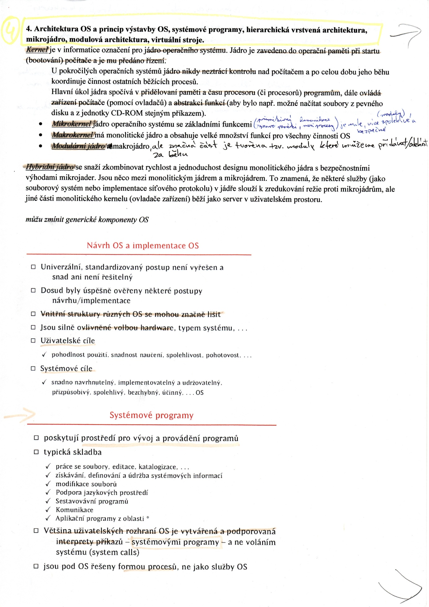
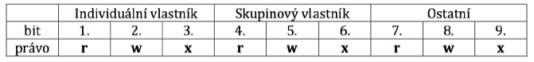

**I/O Operace:** Vstupně výstupní operace- komunikace počítače se vstupně -
výstupním hardwarem. Jedná se například o požadavek na tisk, čtení z disku.
Komunikace probíhá po sběrnici za sběrnici za pomoci přerušení.

**2- Výpočetní model a operační systémy (batch procesing, host/terminal, …,
cloud computing)**

s vývojem výpočetní techniky a všech jejích složek, tedy jak hardwaru, tak i
softwaru, nutně docházelo k výrazným změnám i ve způsobu, jakým uživatelé
provozují své aplikace, jak tyto aplikace fungují, kde běží, kde mají uložena
svá data a kde je zpracovávají - tedy vlastně celková architektura aplikací,
označovaná často také jako tzv. výpočetní model.

-   **výpočetní model se vyvíjel a stále vyvíjí**

    -   **některé výpočetní modely nepočítají s existencí sítě** (např. dávkové
        zpracování)

    -   **jiné výpočetní modely spíše počítají s existencí sítě** (např.
        klient/server)

    -   **další modely vyžadují existenci sítě** (např. distribuované
        zpracování, network-centric computing)

**Batch processing (dávkové zpracování)**

-   Historicky nejstarším výpočetním modelem je dávkové zpracování, pocházející
    ještě z doby prvních počítačů. Ty neumožňovaly svým uživatelům interaktivní
    styk s jejich úlohami, místo toho museli uživatelé dopředu přesně říci, co a
    jak si přejí (vypočítat, spustit, uložit atd.), své pokyny museli "zabalit"
    do vhodného "balíčku" (tzv. dávky, anglicky batch), a ten pak zařadit do
    fronty dalších dávek, čekajících na zpracování. Až na příslušnou dávku
    přišla řada, počítač ji zpracoval a výsledky opět vhodně "zabalil"
    (například do formy výstupní tiskové sestavy), tak aby mohly být následně
    předány uživateli.

-   Vyhody: dokáže (relativně) dobře vytížit dostupné zdroje, vychází vstříc
    intenzivním výpočtům (hodně „počítavým“ úlohám, s minimem V/V), *nutí
    programátory programovat „hlavou“ a ne „rukama“* (protože při dlouhé obrátce
    si nemohou dovolit experimentovat)

-   Nevyhody: uživatel nemá bezprostřední kontakt se svou úlohou (chybí
    interaktivita, uživatel nemůže reagovat na průběh výpočtu (volit varianty
    dalšího průběhu, opravovat chyby, ....) ), doba obrátky (od odevzdání
    vstupní dávky do získání výstupní sestavy) bývá relativně dlouhá

**Host/terminal**

>   Možnost interaktivního styku uživatele s jeho úlohou - tedy například
>   průběžné reagování uživatele na průběh výpočtu - přinesl až další výpočetní
>   model, označovaný jako host/terminál. Nástup tohoto výpočetní modelu se stal
>   možný v okamžiku, kdy vývoj systémového programového vybavení (operačních
>   systémů) pokročil natolik, že bylo možné na jednom procesoru provozovat
>   několik úloh současně - přesněji "skoro současně", v tzv. režimu sdílení
>   času, kdy se provádění jednotlivé úlohy ve velmi rychlém sledu střídá a
>   vytváří tak iluzi, že tyto úlohy běží současně. Dalším nezbytným
>   předpokladem zavedení nového výpočetního modelu bylo připojení vhodných
>   terminálů, neboli vstupně/výstupních zařízení, umožňujících jednotlivým
>   uživatelům zadávat své vstupy (typicky prostřednictvím klávesnice terminálu)
>   a přijímat výstupy svých úloh (které se zobrazují na obrazovce terminálu).
>   Samotný počítač, na kterém se úlohy zpracovávaly, se dostal do role tzv.
>   hostitelského počítače (anglicky: host computer, odsud také termín
>   "host/terminál"). Hostitelským v tom smyslu, že "hostil" veškeré systémové
>   zdroje, od výpočetní kapacity (procesoru) přes různé druhy pamětí a dalších
>   zařízení, po operační systém, nejrůznější aplikace a jejich data. Samotné
>   terminály pak byly vysloveně pasivními prvky, a veškeré zpracování se
>   odehrávalo jen na hostitelském počítači.

-   Vyhody: má centralizovaný charakter ( správu stačí zajišťovat na jednom
    místě, snazší sdílení dat, programů, .....), relativně snadná implementace
    (neklade příliš velké nároky na aplikace), neklade velké nároky na přenos
    dat mezi hostitelským počítačem a terminály(přenáší se pouze výstupy na
    obrazovku uživatele a vstupy z uživatelovy klávesnice)

-   Nevyhody: uživatel má iluzi, že má hostitelský počítač výhradně ke své
    dispozici ale ve skutečnosti má k dispozici jen n-tou část jeho výkonnosti,
    uživatelský komfort je relativně nízký (vzhledem ke znakovému režimu)

 

**Izolované osobní počítače**

>   Výpočetní model host/terminál dlouho vládnul celému počítačovému světu, ale
>   byl také často kritizován. Nejčastěji proto, že uživatelům nabízel jen malý
>   komfort a nutil je sdílet veškeré systémové zdroje s ostatními uživateli
>   (což vyplývalo ze samotné podstaty, která je značně centralizovaná, a
>   všechny zdroje jsou "na jedné hromadě"). Proto všichni toužebně očekávali
>   dobu, kdy cena počítačů poklesne natolik, že bude možné každému dát k
>   dispozici jeho vlastní počítač, který již nebude muset s nikým sdílet. K
>   tomu došlo s příchodem osobních počítačů, zejména těch kompatibilních s IBM
>   PC. Nástup těchto skutečně "osobních" počítačů opravdu přinesl mnoho
>   zlepšení - například větší komfort pro uživatele - ale přinesl také nový
>   výpočetní model, který by bylo možné nazvat jako "model izolovaných
>   počítačů". Ten totiž předpokládal, že jednotlivé aplikace běží na
>   samostatném počítači, který není nijak propojen s ostatními počítači (je od
>   nich zcela izolován), a tudíž má i vše potřebné jen k vlastní dispozici. To
>   sice přineslo určité zjednodušení pro tvůrce aplikací a umožnilo jim zvýšit
>   uživatelský komfort, ale na druhé straně to přineslo i některé zcela nové
>   problémy. Například problém se sdílenými daty, se kterými chce pracovat více
>   uživatelů: při neexistenci propojení mezi různými počítači bylo nutné
>   vytvořit několik samostatných kopií těchto dat, a pak vznikaly opravdu
>   nepříjemné problémy, pokud uživatelé chtěli tato data měnit. Dalším
>   problémem byla správa izolovaných počítačů: jestliže u předchozího modelu
>   host/terminál stačilo odstranit příslušný problém na jediném centrálním
>   místě (na hostitelském počítači), nyní bylo třeba problém odstraňovat na
>   mnoha místech (současně na jednotlivých počítačích).

 

**File server/workstation (file server/pracovní stanice)**

>   Po určitém vystřízlivění z počáteční euforie nad zcela samostatnými a
>   vzájemně izolovanými osobními počítači lidé přišli na to, že je přeci jen
>   vhodné zase některé věci vrátit "na jednu hromadu", místo toho aby
>   existovaly v několika kopiích nezávisle na sobě. Týkalo se to nejen
>   společných (sdílených) dat, ale kvůli snazší správě také samotných aplikací.
>   Proto se vyvinul další výpočetní model, umožňující zajistit potřebné sdílení
>   toho, co má být sdíleno, a naopak individualizaci a izolovanost toho, co
>   sdíleno být nemusí. Tento model předpokládá existenci lokální počítačové
>   sítě a v ní existenci centrálního uzlu, který vystupuje v roli tzv. file
>   serveru - ostatním uzlům (svým klientům) poskytuje službu spočívající v
>   uchovávání jejich souborů. Díky tomu mohou být jednotlivé soubory
>   (představující jak data, tak i samotné aplikace) umístěny centrálně na tomto
>   file serveru, ale z pohledu ostatních uzlů (klientů file serveru) se mohou
>   tvářit jako jejich vlastní soubory. V důsledku toho pak aplikace i data
>   "sedí" na file serveru, ale zpracovávány jsou na jeho klientech, neboli na
>   pracovních stanicích jednotlivých uživatelů. Důležité přitom je, že celé
>   sdílení centrálně umístěných souborů je z pohledu aplikací neviditelné,
>   takže tyto aplikace s ním nemusí vůbec počítat (a mohou to tedy být aplikace
>   určené pro provozování na samostatných izolovaných počítačích PC).

 

**Client/server (klient/server)**

>   Výpočetní model file server/pracovní stanice má i mnoho nevýhod, mezi které
>   patří i jeho dosti častá neefektivnost. Jestliže jsou totiž data uchovávána
>   na jednom místě (centrálně na file serveru) a zpracovávána jinde (u
>   uživatele, na jeho pracovní stanici), je nutné je vždy přenést z jednoho
>   místa na druhé. Je přitom nutné je přenést všechny (jako příslušné datové
>   soubory), bez ohledu na to, jak velká či malá část z nich bude skutečně
>   potřeba. Takže jde-li například o vyhledání jediného dvouhodnotového údaje
>   (typu ano/ne) v megabytové databázi, je nutné nejprve přenést celou tuto
>   megabytovou z file serveru na uživatelovu pracovní stanici. Možnost
>   minimalizovat takovéto zbytečné přenosy vede k "roztržení" aplikace, která
>   data zpracovává - ta část aplikace, která s daty fakticky pracuje, bude
>   provozována tam, kde se nachází i samotná data, tedy na centrálním serveru.
>   Naproti tomu ta část aplikace, která zajišťuje styk s uživatelem, sběr jeho
>   dotazů i prezentaci výsledků, je provozována přímo na uživatelově stanici.
>   Pokud jsou obě "roztržené" části aplikace vhodně koncipovány, jejich
>   vzájemná komunikace může být velmi efektivní a nenáročná na objem
>   přenášených dat. To je jedna z velkých výhod výpočetního modelu
>   klient/server, který jsme si právě popsali.

**Cloud computing-**

Integruje mnoho z předchozích konceptů

3

Networking: Sdružení počítačů do počítačových jednotlivých sítí

**OS se skládá z:**

-   **Jádro (kernel):**

    -   **Monolitické:** Jeden funkční celek

    -   **Mikrojádro:** velmi malé a všechny oddělitelné části pracují
        samostatně

    -   **Hybridní**: Kombinuje vlastnosti obou

-   **Systémové nástroje**: Slouží ke správě PC a k zaručení schopnosti
    uživatele ovládat počítač. Některé aplikace se systémovým nástrojů velmi
    podobají, takže je nelze přesně vymezit.

-   **Knihovny:** Obsahují velké množství kódu. Programy si z knihoven
    „vytahují“ způsob, kterým se budou řešit. (matematické operace,…).

    

    

| **Srovnání**                        | **Windows**                          | **Linux**                        |
|-------------------------------------|--------------------------------------|----------------------------------|
| **Vlastník**                        | Microsoft                            | Vývojáři na celém světě          |
| **Cena**                            | Vyšší                                | nižší                            |
| **Čeština- překlad**                | Komplet                              | 90%                              |
| **Čeština- klávesnice**             | Funguje dobře                        | Těžší ovládání                   |
| **Počeštění programů jiných firem** | Slabé a nemožné                      | Velmi dobré a snadné             |
| **Ovladače pro HW**                 | Ano                                  | Ne                               |
| **Správa disků**                    | Rozdělení na části 1 disk max 9      | 1 disk max 16                    |
|                                     | Označení písmeny (neměnné)           | Označení uživatelem (možno měnit |
|                                     | Citlivé na strukturu a oblasti disku |                                  |
| **Bezpečnost**                      | Pomocí programů jiných firem         | Přímo v jádře a spolehlivé       |
| **Vzájemná kompatibilita**          | Nepodporuje soubory z →              |                                  |
| **Stabilita**                       | Menší než →                          |                                  |

**Operační systémy pro mobilní zařízení**: zejména pro smartphone

**Vlastní OS výrobce mobilu:**

-   **Nokia:** OS symbian, ale protože nokia podcenila smartphone, prodává nyní
    své smartphony s OS Windows Mobile 8 (mango)

-   **Blackberry**: OS Blackberry, nebo RIM ( firma RIM jej vyvinula), trh
    zejména v UK, ale jde dolů, poslední verze 6.0

-   **iPhone:** iOS, pro zařízení firmy Apple

**OS pro různé výrobce mobilu:**

-   **Windows (microsoft):** OS Windows Mobile (poslední verze Mango), obsahuje
    verze aplikací pro office, napojení na sociální sítě. Pro výrobce: HTC,
    Nokia

-   **Android (google):** OS Android, poslední verze 4.0 (ice cream sandwich),
    na bázi linuxu. Pro výrobce: Samsung, LG

-   **Bada:** Jen pro zařízení Samsung, konkurent android. Zatím se moc neujal.

**Další systémy:**

-   **Firmware:** Výrobcem dodané ovládání ovladačů zařízení jako disky,
    klávesnice, obrazovky a další. Definice: Kombinace HW zařízení a
    počítačových instrukcí a dat, které jsou v zařízení umístěny jako SW jen pro
    čtení.

-   **BIOS**: je vlastně firmware pro osobní počítače. Používá se při startu pro
    inicializace a konfiguraci HW zařízení a spouštění OS. Používá se také pro
    provádění většiny vstupních a výstupních operací (klávesnice, myš, displaj,
    disk)

-   **EFI**: **Extensible firmware interface**, je softwarové rozhraní mezi
    operačním systémem a firmwarem použitého HW. Je to náhrada za BIOS. Vyvinuto
    společností Intel. Používají: Linux, Mac OS (apple), Windows (od procesoru
    ITANIUM)

7

8. Program a životní cyklus programů. Programovací jazyk a typy programovacích jazyků. Pojmy interpret, kompilátor virtuální stroj.
===================================================================================================================================

**Program:** je algoritmus zapsaný formálně, tj. srozumitelně pro počítač,
obvykle v programovacím jazyce. Program se skládá z elementárních kroků
(instrukcí), kterými mohou být:

-   Instrukce operačního kódu počítače

-   Příkazy programovacího jazyka

-   Již hotové úseky kódu nebo podprogramy

**Životní cyklus programu:** Program prochází při své existenci od specifikace
požadavků až po jeho užívání několika fázemi – životním cyklem:

-   *Specifikace požadavků na řešený úkol:* v této fázi je třeba vyjasnit co
    nejpřesněji požadavky uživatele na problém řešený programem. Velmi důležité
    je vyjasnit rozpory, neúplnosti a nejasnosti zadání i reakci programu na
    nepřípustná data. Často zde platí, že „Uživatel neví, co chce, ale běda,
    když to nedostane!“

-   *Dekompozice úkolu na části:* v této fázi je proveden hierarchický rozklad
    úlohy na části řešitelné jedním pracovníkem nebo týmem.

-   *Návrh algoritmu(ů):* v této fázi je v každé úrovni hierarchického rozkladu
    proveden návrh strukturovaných algoritmů dílčích částí nezávislých na
    konečné implementaci a určení vazeb mezi jednotlivými částmi.

-   *Implementace algoritmu na program:* Ve fázi implementací dochází
    k postupnému zjemňování návrhu za použití CASE nástrojů (Computer Aided
    Software Engineering). Výsledkem jsou zdrojové texty ve zvoleném
    programovacím jazyce a jejich překlad do spustitelné podoby, tj. do kódu
    počítače

-   *Testování programu:* v této fázi se zkouší a odhalují chyby jednotlivých
    komponent programu i programu jako celku na vhodně zvolených testovacích
    datech. Platí pravidlo „Zkoušej a prověřuj okamžitě, jakmile je co zkoušet!“

-   *Používání a údržba programu:* ve fázi používání a údržby se odstraňují
    skryté vady programu a řeší potřeba reakce programu na změny okolí, např.
    jiné technické vybavení, jiný operační systém, změny v legislativě,
    organizační struktuře.

Ve všech fázích životního cyklu programu je nezbytná **pečlivá dokumentace**
z důvodu snadnější analýzy a úpravy programu nezávislé na řešitelském týmu a
době uplynulé od zahájení životního cyklu.

**Programovací jazyk:** je speciální jazyk, ve kterém programátor dokáže snadno
vyjadřovat algoritmy ve formě programů a který je bez větších problémů
převoditelný do kódu srozumitelného pro počítač. Dříve se programovalo přímo
v kódu počítače, dnes už je programování blíže řeči člověka (ale tím je
vzdálenější kódu počítače). Každý programovací jazyk je určen svojí syntaxí a
sémantikou.

**Syntaxe:** je soubor pravidel, které určují, jaké zápisy jsou v daném jazyce
povolené. Povolený zápis jednotlivých příkazů.

**Sémantika:** je soubor pravidel popisující význam povolených konstrukcí
(příkazů).

**Typy programovacích jazyků:** lze je rozdělit na dvě rozsáhlé třídy a to na
ne/procedurální prog. jazyky.

**Neprocedurální programovací jazyky:** (nepříkazové, neimperativní,
deklarativní) popisují pouze, co se má řešit, ale ne postup, jak řešení
dosáhnout.

-   *Obecně orientované:* umožňují řešit široký okruh úloh za cenu omezených
    možností a menší rychlosti. Nejznámější příklady těchto jazyků je PROLOG
    (popis pomocí logických formulí) a LISP (zadání zapsáno jako řetězec funkcí)

-   *Specializované:* umožňují řešit úzký okruh úloh, ale účinněji a rychleji.
    Typickým příkladem jsou dotazovací jazyky na obsah databáze, např. SQL.
    Zadají se pouze podmínky výstupu, ale nemusí nás zajímat, jak to vyhledávání
    probíhá.

**Procedurální programovací jazyky:** (příkazové, imperativní, algoritmické)
popisují algoritmus, jak řešit úlohu rozkladem na dílčí kroky (příkazy).

-   *Strojově orientované jazyky:* nazývají se též jazyky symbolických adres
    nebo assemblery. Pro všechny instrukce kódu se používají mnemotechnické
    zkratky místo binární hodnoty. Programy napsané v těchto jazycích jsou těžko
    přenositelné na jiné systémy.

-   *Vyšší programovací jazyky:* jsou bližší člověku a umožňují pohodlnější a
    bezpečnější programování. Jsou více nezávislé na počítači, je však nutné
    před použitím programu přeložit do strojového kódu počítače. Do této skupiny
    spadá mnoho zástupců například COBOL (databázové aplikace), PASCAL (výuka
    programování), C, FORTRAN (pro vědecké účely)

-   *Objektově orientované jazyky:* tvoří zvláštní skupinu mající rysy
    procedurálních a neprocedurálních jazyků. Popisují model světa pomocí tříd
    objektů (popis datového typu a metod) a objektů (konkrétní instance třídy).
    Objekty mezi sebou komunikují pomocí zpráv. Jsou buď rozšířením
    algoritmických jazyků (např. OBJECT PASCAL či C++), nebo jako zcela
    samostatné „ryze objektivní“ (SMALLTALK nebo JAVA).

**Pojmy:**

-   **Interpret:** má pro spouštěný program funkci operačního prostředí –
    postupně čte, překládá a ihned vykonává jednotlivé příkazy zdrojového textu.
    Lze chyby v programu opravit za běhu, ale na úkor rychlosti.

-   **Kompilátor:** neboli překladač, který slouží pro překlad algoritmů
    zapsaných ve vyšším programovacím jazyce do jazyka strojového. Přeloží
    hotový zdrojový text programu na cílový kód. Cílový kód je poté provozován
    nezávisle na kompilátoru. Pokud kód upravíme, musíme jej opět zkompilovat.

-   **Virtuální stroj:** je v jednom ze svých významů považován za software,
    který nad nějakou počítačovou platformou vytváří jednotné virtuální
    prostředí pro běh aplikací. Mezi nejznámější virtuální stroje patří JVM –
    Java Virtual Machine

>   skrývá rozdíly mezi různými hardwarovýmí platformami

>   definuje sadu instrukcí

>   vytváří jednotnou abstraktní vrstvu nad různými operačními systémy

>   efektivně překládá virtuální instrukce na skutečné instrukce procesoru

>   poskytuje podporu pro vyšší programovací jazyky (např. způsob voláni
>   podprogramů, OOP)

9. Porovnání procedurálního a objektového návrhu programu. Pojem podprogram (procedura), funkce, třída objektu, metoda, zpráva, rozhraní. Komunikace komponent. Možnosti implementace v procedurálním a objektovém prostředí.
=============================================================================================================================================================================================================================

**Porovnání procedurálního a objektového návrhu programu:** při porovnání těchto
dvou návrhů programu je zásadní rozdíl v pohledu, na řešení problému. Zatímco u
procedurálního návrhu je systém rozdělen na dvě samostatné oblasti **data** a
**funkce**, které se navrhují, analyzují a implementují samostatně. A data jsou
uložena někde samostatně například v databázových tabulkách. Tak u objektového
návrhu je na systém nahlíženo jako na jednotlivé objekty, které jsou vzájemně
propojeny a spolupracují spolu. Jednotlivé objekty obsahují vlastnosti, funkce a
události.

**Pojmy:**

-   **Podprogram:** lze také vyjádřit jako část kódu plnící specifickou úlohu
    uvnitř našeho programu. Vlastně rozděluje náš program na dílčí úlohy, a tím
    přispívá k lepší přehlednosti a srozumitelnosti. Podprogram se dělí na
    procedury a funkce.

**- Procedura:** Je popis algoritmu, který nějakým způsobem transformuje data.
Procedury umožňují opakovaně použít stejnou funkčnost. Pokud se v programu
objevuje kód, který provádí stejnou činnost, je dobré tento kód umístit do
procedury. Program bude kratší a opravy chyb pohodlnější, protože daný kód se
bude v programu nalézat pouze jednou. Procedura nevrací žádnou hodnotu.

**-Funkce:** Je algoritmus, jehož provedením se vypočte hodnota určitého typu.
V objektově orientovaném programu je funkce = metodě. Důležité je, že funkce nám
vrací nějakou hodnotu.

-   **Třída objektu:** Je základní konstrukční prvek sloužící jako předpis pro
    objekty (instance třídy). Definuje jejich vlastnosti a metody

-   **Metoda:** operace nacházející se ve třídě a spouštějící se pomocí zpráv.
    Určují chování objektu.

-   **Zpráva:** požadavek na objekt, komunikace mezi objekty

-   **Rozhraní:** lze jej charakterizovat jak šablonu vzoru. Vytvořením kostry
    třídy, která se naimplementuje do tříd.

**Komunikace komponent:**

-   u strukturovaného programování komponenty komunikují pomocí proměnných a
    volání funkce.

-   u objektově orientovaného programování komponenty komunikují pomocí zpráv

**Možnosti implementace v procedurálním a objektovém prostředí:** Souvisí to
s implementací funkcí a volání metod v konkrétním softwaru. Jako například u
procedurálního prostředí, kde za ukázku použijeme jazyk C a v objektovém
prostředí použijeme jazyk Smalltalk nebo Javu.

-   v C je funkce základním stavebním kamenem a každý program musí obsahovat
    hlavní funkci main(), která se začne vykonávat jako první po spuštění
    programu.

-   v Jave nebo Smalltalku jde o volání a zasílání určitých zpráv daným
    objektům, které na ně reagují. Například je zaslána zpráva „uveď velikost“
    každý z objektů na tuto zprávu reaguje jinak a dostává se nám různých
    výstupů. Objekt osoba zašle zpět svou výšku, objekt čtverec zašle svůj obsah
    a podobně.

10. Statické a dynamické datové struktury. Fronta, zásobník, spojový seznam, strom, graf – jejich význam a možná realizace v procedurálních i objektových programovacích jazycích.
==================================================================================================================================================================================

**Statické datové struktury:**

Během vykonávání programu nemění svůj obsah. Příkladem je pole. Statické

proměnné se v každém programu zavádějí deklarací, mají svá jména
(identifikátory) a jsou

statické ve smyslu statické datové struktury.

**Dynamické datové struktury:**

Jejich rozsah se může během vykonávání programu měnit. Vzniknou v průběhu

programu pomocí speciálního příkazu. Vzhledem k tomu, že dynamické proměnné se

nezavádějí v programu deklarací, nemají také své jméno - identifikátor. K tomu,
abychom se

k těmto proměnným nějakým způsobem dostali, slouží nový datový typ Ukazatel,
který

ukazuje na proměnnou, uloženou v operační paměti.

**Ukazatel = pointer:** vždy ukazuje na jiný bázový typ, obsahuje adresu, na
které je uložena

hodnota bázového typu a může obsahovat hodnotu nill (nikam neukazuje).

**Fronta:** dynamická datová struktura

Jedná se o řadu prvků, které jsou na jeden konec fronty přidávány a z druhého
konce

odebírány – tzv. FIFO (First In First Out). Používá se u požadavků na vstupní a
výstupní

zařízení v OS, ve vyrovnávací a synchronizační paměti a v simulačních systémech.

Vyžaduje rychlý přístup k oběma koncům. Každý prvek ve frontě má přiřazen svůj
index, po

odebrání prvku se posune začátek fronty a s ním i ostatní prvky o jedno místo.

**Využití:** Fronta má v informatice široké využití, toto jsou některé příklady:

-   Synchronizační primitivum

-   Operátor roura (pipe) - komunikace mezi procesy v operačních systémech

-   Kruhový buffer - vyrovnávací paměť pro datové toky

-   Řazení prioritní frotou (haldou) - heapsort

**Zásobník:** dynamická datová struktura

Množina prvků, které jsou přidávány i odebírány ze stejného konce, tzv. vrcholu

zásobníku. Používá se metoda LIFO (Last In First Out). Používá se při volání
podprogramu,

nebo při ukládání lokálních proměnných. Vyžaduje přístup pouze na jeden konec.

Vrcholu zásobníku je přiřazen index posledního prvku pole. Při odebrání prvku z
pole

se vrcholem stává předcházející index.

Operace zásobníku jsou totožné s operacemi fronty, pouze se pracuje jen s jedním
koncem.

**Strom:** dynamická datová struktura

Souvislý orientovaný graf bez cyklů (v neorientovaném stromu lze za kořen
prohlásit

libovolný vrchol -\> tím je určena orientace). Každý uzel má jednoho předchůdce
a jednoho

nebo více následovníků. Jen **ko**ř**en** nemá žádného předchůdce a **list**
nemá žádné

následovníky. Zvláštním případem je **binární strom**, který má maximálně 2
následovníky.

**Spojový seznam:** dynamická datová struktura

Obsahuje ukazatel, který ukazuje na následující prvek seznamu (v případě

posledního prvku obsahuje NULL). Minimální obsah dat je ukazatel na první prvek.
Postupně

tedy můžeme projít seznam od začátku do konce. Existuje i složitější typ
seznamu, který

obsahuje dva ukazatele – na předchozí a na následující prvek.

**Graf**

Skládá se z nekonečné množiny uzlů (U) a konečné množiny hran (H). Hrana jsem
spojnicí dvou uzlů. Jestliže hrana spojuje neuspořádanou dvojici uzlů, hovoříme
o neorientované hraně. Jestliže spojuje uspořádanou dvojici uzlů (tj.
rozlišujeme počáteční a koncový uzel), hovoříme o orientované hraně.

Neorientovaný graf je takový graf, který obsahuje pouze neorientované hrany.
Obdobně orientovaný graf obsahuje pouze orientované hrany. Graf nazýváme
souvislým, jestliže pro každé dva uzly najdeme konečnou množinu hran, které se
spojují. Smyčka (cyklus) v grafu je spojnice (jedna nebo více hran), která
spojuje tentýž uzel grafu.

**11.** Relační datový model, relační algebra, relačně databázová terminologie, Coddova pravidla
================================================================================================

**Relační datový model:** Počátky relačního datového modelu (RDM) se kladou do
roku 1969, přičemž autorem prvních prací byl E.F.Codd (matematik laboratoří IBM
v San José) a prvním prakticky používaným relačním databázovým systémem byl
produkt DB2 formy IBM. Relační datový model se od svých předchůdců (síťového a
hierarchického) liší tím, že byl důsledně budován na teoretickém základě
spočívajícím v definici struktury dat a povolených operací nad nimi.

**Charakteristika RDM:**

-   Hodnoty v tabulkách jsou **atomické** – nelze připustit, aby se skládaly
    z dalších hodnot.

-   Hodnoty jsou **skalární** – musí mít pouze jeden rozměr.

-   Hodnoty v tabulkách existují jako prvky jednotlivých **domén**. Všechny
    prvky dané domény musejí být mezi sebou provázané a musejí náležet stejnému
    datovému typu.

-   Pro práci s tabulkami se používá operací **výrokové logiky**.

-   V každé tabulce hodnoty v jednom nebo více sloupcích (doménách) slouží
    k jednoznačné identifikaci řádek mezi sebou. Tyto hodnoty jsou označovány
    jako **primární klíče**.

-   V některých tabulkách hodnoty v jednom nebo více sloupcích (doménách) mají
    vztah k hodnotám v jiných tabulkách (nebo ve zvláštních případech k hodnotám
    vlastní tabulky). Tyto hodnoty jsou označovány jako **cizí klíče**.

-   V tabulkách lze definovat podmnožiny řádek a nebo podmnožiny sloupců.
    Operace vybírající podmnožinu řádek jako výběr řádek z tabulky je označován
    jako **selekce** tabulky. Operace vybírající podmnožinu sloupců jako výběr
    sloupců z tabulky je označován jako **projekce** tabulky.

-   Více tabulek lze kombinovat mezi sebou jako běžné množiny pomocí
    **sjednocení, rozdíl, průnik** a **kartézký součin** množin. Kombinace
    kartézského součinu a selekce se nazývá **sjednocení** tabulek.

-   Základním pojmem teorie relačních datových bazí je tedy **relace**, která je
    neformálně prezentovaná jako **tabulka**.

-   Každý sloupec obsahuje hodnoty určitého datového typu, přičemž obor těchto
    hodnot, které se v daném sloupci mohou vyskytovat, se nazývají **doména**
    sloupce nebo atributu.

-   V relační databázové terminologii je sloupec nazýván **položkou** a řádek
    **záznamem** neboli větou. Průsečík řádku a sloupce je označován jako
    **pole.**

>   **Typy dat:**

-   Znakový (řetězec)

-   Číselný (numeric, float)

-   Datumový (date)

-   Logický (logical)

-   Poznámkový (memo)

-   Obrazový (picture)

**Relační tabulka musí splňovat:**

-   **Všechny hodnoty v tabulce musí být elementární**, tj. dále nedělitelné
    údaje.

-   **V tabulce je 1 až n sloupců, přičemž jejich pozice je nevýznamná**, tj
    pořadí těchto sloupců lze libovolně měnit.

-   **V tabulce je 0 až n řádků, jejichž pozice je nevýznamná** tj pořadí těchto
    řádků lze libovolně měnit.

-   **Sloupec musí být homogení, tj. obor hodnot tohoto sloupce musí být
    stejný** (údaje stejného druhu).

-   **Každý sloupec musí být jednoznačně pojmenován**, toto jméno je tzv.
    atribut

-   **Každý řádek tabulky musí být jednoznačně rozlišený,** v tabulce nesmí
    existovat dva stejné řádky shodující se ve všech sloupcích.

**Relační algebra:** Relační algebra představuje nejzákladnější formální
prostředek pro práci s relacemi. Tvořena je:

-   definicemi jednotlivých elementů relačního datového modelu

-   definicemi relačních operací nad těmito elementy.

Relační algebra popisuje vlastnosti jednotlivých relačních operací (selekce,
projekce a spojení). *Relačně úplný jazyk je ten, který splňuje všechny operace
relační algebry (selekce, projekce a spojení)!!!*

**Operace projekce (project):**Slouží pro potlačení označených sloupců
(atributů). Výsledkem je relace o p-sloupcích, která vznikla z původní relace
s n-sloupci, přičemž platí, že p\<n.

**Operace selekce (select):**Při této operaci vzniká nová relace, do které jsou
vybrány pouze ty řádky (záznamy) z původní tabulky, které splňují uživatelem
specifikovanou podmínku.

**Operace spojení (join):**Spojením dvou relací se vytváří třetí relace, přičemž
výsledná tabulka vždy obsahuje všechny kombinace, které vyhovují zadané
podmínce. Podle způsobu porovnání hodnot ve spojovaných sloupcích se rozjišují
tři druhy spojení (na rovnost, na nerovnost nebo jinou podmínku, vnější –
inkluze).

**Relačně databázová terminologie:**

**Databáze (database):**

Je systematicky organizovaná datová struktura. Obvykle obsahuje centralizovaná
data určená k hromadnému zpracování. Vnitřně je uspořádána do tabulek.

**Tabulka (table):**

Je datová struktura uspořádaná do řádků a sloupců. Lze si ji také představit
jako dvourozměrné pole s pojmenovanými sloupci členěné do řádek. V teorii
relačního modelu dat je pojem tabulka nahrazován termínem relace.

**Řádka (row):**

Reprezentuje veškerou informaci o objektu popisovaném tabulkou. V teorii
relačního modelu dat se hovoří o tzv. prvku relace.

**Sloupec (column):**

Reprezentuje jen jeden určitý druh informace. Tato informace musí být dále
nedělitelná, tj. atomická. V teorii relačního modelu dat se nazývá atribut.

**12 pravidel E.F. Codda pro relační model – Coddova pravidla:** Tato pravidla
byla publikována již na počátku 70. Let a jsou dodnes platná, ale bohužel nejsou
dosud všemi databázovými systémy beze zbytku dodržována, což má za následek
jejich nedostatečné fungování. Znění těchto pravidel je takové:

1.  **Pravidlo Systém Řízení Báze Dat (SŘBD):** databázový systém musí spravovat
    všechna data pouze pomocí relačních operací

2.  **Pravidlo informační:** Všechna data musejí být reprezentována na logické
    úrovni pouze jako hodnoty v relačních tabulkách

3.  **Pravidlo zajišťující přístup:** Každý údaj v databázi musí být logicky
    dosažitelný pomocí kombinace názvu tabulky, názvu sloupce a hodnoty
    primárního klíče.

4.  **Pravidlo zpracovatelnosti neznámých hodnot:** Ke každé neznámé hodnotě se
    musí dojít prostřednictvím jiných známých hodnot.

5.  **Pravidlo relačního katalogu:** Popis celé databáze musí být na logické
    úrovni reprezentován také relačním způsobem jako tzv. systémový katalog –
    tedy také jako tabulka

6.  **Pravidlo pro jazyk:** Pro komunikaci se SŘBD musí existovat minimálně
    jeden počítačový jazyk, který musí umožňovat:

-   definici dat (DDL)

-   integrální omezení

-   manipulaci s daty (DML)

-   práci s transakcemi

-   autorizační pravidla

1.  **Pravidlo pohledů:** SŘBD musí poskytovat možnost práce s pohledy do
    databáze včetně aktualizace obsažených dat.

2.  **Pravidlo operaci:** Všechny relační operace vybírající a vkládající data
    musejí pracovat s tabulkami jako celky.

3.  **Pravidlo fyzické a logické nezávislosti dat:** Výsledky operací nesmějí
    být ovlivněny změnami struktury tabulek a konkrétní implementací
    databázového systému.

4.  **Pravidlo nezávislosti dat na integrálních omezeních:** Výsledky operací
    nesmějí být ovlivněny změnami v integrálních omezeních, pokud nedošlo ke
    změně dat.

5.  **Pravidlo nezávislosti dat na distribuci:** Výsledky operací nesmějí být
    ovlivněny konkrétním rozmístěním dat v distribuované databázi.

6.  **Pravidlo nenarušitelnosti SŘBD:** Žádný uživatel ani aplikace nesmí
    obcházet ani narušovat rozhraní SŘBD

12. Integrita dat, druhy integritních omezení, database triggers.
=================================================================

**Datová integrita:** jedná se o ochranu dat v databázi a to z těchto důvodů:

-   **Všechna data jsou pro všechny potencionální uživatele uložena ve společné
    bázi dat.**

-   **Každý údaj je uložený v bázi dat pouze jednou** (s výjimkou přísně
    odůvodněné redundance).

-   **Mezi daty existuje logická struktura**, tj. jsou navzájem propojena jemným
    mechanismem systémových dat, který při sebemenším narušení může způsobit
    nezpracovatelnost velké části evidovaných dat.

-   **Interaktivní přístup k bázi dat**, který umožňuje přímý a okamžitý přístup
    k datům z kteréhokoliv místa počítačové sítě, vyžaduje pohotovost a
    spolehlivost těchto dat a současně nedovoluje **zopakovat zpracování**,
    protože vstupní data jsou v odlišné formě než při agendovém zpracování.

-   **Vícenásobná současná aktualizace báze dat.**

**Druhy integritních omezení:** integritní omezení = pravidla vymezující
nezbytnou korektnost uložených dat a rozhodující o proveditelnosti
aktualizačních operací, které by mohli tento stav narušit. Jednotlivé druhy:

**Entitní integrita:** Zabezpečení entitní integrity vyžaduje dodržení
**jednoznačné identifikace** každého řádku dotyčné relační tabulky. Zachycuje-li
tento řádek jeden konkrétní výskyt entity (objektu) či vztahu objektivní
reality, musí být vzájemně odlišen od dalších. Každá referenční tabulka proto
musí mít určen **primární klíč (primarykey)**, jako minimální množinu atributů,
jejichž hodnoty společně identifikují každý řádek této tabulky. Má-li tento klíč
plnit svůj účel, musí mít jedinečnou hodnotu v každém řádku relační tabulky.
**Zabezpečení integrity databáze znamená nepřipustit uložení žádného řádku, ve
kterém je hodnota položky představující klíč či některou z jeho komponent
nenaplněná nebo vzhledem k řádkům již uloženým duplicitním.**

**Referenční integrita:** databáze garantuje korektnost vztahů mezi logicky
souvisejícími tabulkami. Vazby mezi logicky nadřízenými a podřízenými záznamy
v databázi jsou vytvářeny doplněním jednoznačné identifikace řádků logicky
nadřízené tabulky do logicky podřízené tabulky pomocí tzv. **cizího klíče
(foreignkey).** Několik způsobů jak udržet referenční integritu:

>   **- Restriktivním způsobem**, tzn. znemožnit:

-   Zrušení řádku, pokud se hodnota některé z jeho položek vyskytuje v nějaké
    jiné tabulce jako cizí klíč.

-   Aktualizaci hodnoty této položky.

-   Uložení řádku s hodnotou klíče, která se dosud mezi hodnotami odkazované
    položky v logicky nadřízené tabulce nevyskytuje.

-   **Alternativní možností:** je **kaskádovité dovedení změn v logicky
    nadřízené tabulce do všech logicky podřízených záznamů.** To konkrétně
    představuje v případě zrušení řádku zajistit odstranění i všech dalších
    řádků, ve kterých se hodnota některé položky rušeného řádku vyskytuje v roli
    cizího klíče. Obdobně je nutno zajistit, že bude případná aktualizace hodnot
    atributu, představujícího v jiných záznamech cizí klíč, promítnuta i do
    těchto záznamů.

-   **Pokud** však uchování těchto záznamů má své opodstatnění, lze referenční
    integritu udržet **nahrazením hodnot cizích klíčů hodnotou neurčenou
    (NULL).** V příkladu to znamená, že při zrušením záznamu o učiteli je nutno
    naplnit položku GARANT v záznamech předmětu, obsahující odkaz na v databázi
    již neexistujícího učitele hodnotou NULL.

**Doménová integrita (domain constraints): Doménou je chápána množina všech
přípustných hodnot určitého daného atributu (sloupce) relační tabulky.** Omezení
doménové integrity je realizováno pravidlem definujícím tyto platné hodnoty,
přičemž doména není totéž co datový typ daného atributu. K zachování takovéto
doménové integrity databáze je nutné zabezpečit, aby každá hodnota obsažená
v databázi byla pouze z množiny hodnot pro daný sloupec přípustných. Např.
v případě tabulky EXEMPLAR je požadováno, že hodnota položky CENA musí být
v rozmezí intervalu 1 až 10 000včetně. Omezení tohoto typu mohou mít v praxi
mnohem složitější podobu, než jen pouhý výčet mezních hodnot. Přípustnost hodnot
atributu může být dokonce dána hodnotami jiného atributu i z jiných tabulek
databáze.

**Database triggers:** zajišťují procedurální integritu. Spouští se při každém
vkládání, aktualizaci nebo odstranění záznamu, jinak řečeno při uvedení
aktivujícího DML příkazu (INSERT,DELETE,UPDATE). Jde tedy v podstatě o
pojmenované množiny příkazů uložené na serveru jako součást databáze, které jsou
vázaný na konkrétní aktualizující operace s konkrétní relační tabulkou, a
databázovým serverem jsou při výskytu dané operace prováděny automaticky.

13. Datová normalizace, redundance dat, normální formy
======================================================

**Datová normalizace:** týká se schopnosti realizovaného systému zodpovědět
každou relevantní smysluplnou otázku a minimalizace veškerých redundancí a
problémů s nimi spojených. Normalizace dat představuje takový způsob seskupení
datových prvků do struktur záznamů, který zabraňuje problémům s jejich
aktualizací.

**Cíle datové normalizace:**

-   umožnit reprezentaci každé relace v databázi

-   získat účinné algoritmy vyhledávání založené na jednodušší množině relačních
    operací

-   odstranit v relacích nežádoucí závislosti při operacích vkládání,
    aktualizace a rušení

-   redukovat potřebu restrukturalizace při zavedení nového typu dat

-   zajistit, aby souhrn relací byl neutrální vzhledem k četnosti dotazů, které
    mají tendenci měnit se v čase

**Výhody datové normalizace:** datová normalizace má zabránit vzniku
duplicitních dat, šetřit kapacitu média a zjednodušit aktualizaci a vyhledávání
dat.

Technika datové normalizace patří mezi základní techniky návrhu relačního
databázového schématu a platí pro ni následující skutečnosti:

-   je **kombinovatelná s ostatními technikami** - př:s dekompozicí a syntézou

-   slouží k **dekompozičnímu návrhu tabulek** s min.redundancí a max.
    konzistencí dat

-   umožňuje **ověřování správnosti** navrženého modelu

-   **není deterministická** - připouští více správných řešení

**Techniky návrhu relačního databázového schématu:** na řešené problémy je
nejlepší nahlížet jako na univerzální relaci. Tato univerzální relace musí být
následně dekomponována povětšího počtu menších tabulek navzájem propojených
klíči. Kritéria takového rozřazení jsou následující:

-   tabulka musí vždy obsahovat věcně a časově příbuzná data příslušející
    k určité organizační jednotce

-   tabulka musí obsahovat data, která jsou společně chráněna proti neoprávněným
    přístupům

-   je třeba vytvářet spíše menší celky = tabulky, které nemá smysl již dále
    dělit

-   tabulky by neměly obsahovat redundantní a agregovaná data

**Redundance dat neboli nadbytečnost:** Redundance v podstatě znamená to, že
některé evidované informace se vyskytují opakovaně ve více souborech, přičemž
všechny tyto výskyty musí mít za všech okolností stejnou hodnotu, protože
popisují shodnou vlastnost jediného objektu. Jestliže se tato vlastnost změní,
musí se tato změna provést ve všech výskytech a ve všech souborech. Pokud toto
není zajištěno, data ztrácejí svoji konzistenci, což znamená, že daná vlastnost
jediného objektu má hodnoty, které si navzájem odporují.

*Odstranění redundance:* každý údaj, i když se vyskytuje několikrát v různém
kontextu, je v bázi dat ve většině případů uložen pouze jedenkrát.

**Normální formy:** vychází z datové normalizace a normální formy byly vynuceny
praktickými problémy souvisejícími s aktualizací dat v jednotlivých relačních
tabulkách. V současné praxi se používá 6 normálních forem, viz. obrázek.

Schéma znázorňuje vzájemnou závislost jednotlivých forem. Například databáze je
v 3NF, je i v 2NF a 1NF. Pokud ale relace(tabulky) obsahují pouze jednoduché
primární klíče, dochází ke splývání normálních forem, jak naznačuje čárkovaní
hranice v obrázku. Ve výsledku to znamená, že v případě tabulky s primárním
klíčem tvořeným pouze jednou doménou a její normalizace do 1NF, bude také
automaticky v 2NF. Tabulka normalizovaná do 3NF je automaticky v BCNF, 4NF a
5NF. Tento jev spolu s tím, že vyšší normální formy značně snižují výkonnost
reálného databázového systému, má za následek, že ve většině praktických řešení
normalizace končí u 3NF resp.BCNF.

### 1. normální forma (1NF)

>   *Relace nesmí obsahovat násobná data* (v tabulce nesmí být obsaženy
>   **multizávislosti**). Jinými slovy to znamená, že pokud v jedné tabulce
>   existují závislosti více hodnot na jedné klíčové hodnotě, tak (*vzhledem
>   k tomu, že v položkách tabulky nesmí být více než po jedné hodnotě*) je
>   třeba tuto tabulku dekomponovat na dvě tabulky

>   (Např. evidence zaměstnanců a jejich dětí nemůže být v jedné tabulce, neboť
>   každý zaměstnanec může mít i více než jedno dítě; rozdělí se tedy na dvě
>   relace – zaměstnanci a děti, kde každé dítě má potom přiřazeno stejné číslo
>   jako pracovník/rodič).

### 2. normální forma (2NF)

>   *Všechna neklíčová data v jedné relaci musejí záviset na celém primárním
>   klíči.* Týká se tabulek se složeným klíčem (alespoň ze dvou domén) a
>   takovéto tabulky jsou v 2NF jen tehdy, pokud jsou všechny hodnoty
>   v tabulkách závislé na celém klíči tabulky. Pokud tomu tak není, je třeba
>   tabulky dekomponovat. (Pokud bychom například evidovali v jedné univerzální
>   relaci problematiku dodávání součástek od dodavatelů obsahující údaje: číslo
>   součástky, číslo a jméno dodavatele, typ dodavatele a cena za jednotku a
>   chtěli bychom provést UPDATE u dodavatelů, je nutno jej provést u všech
>   záznamů, neboť je předpokladem, že nám bude dodávat součástky několikrát a
>   ne jen jednou; také by nebylo možno zadat údaje o potencionálním dodavateli,
>   doku nám součástku nedodá. Dekompozicí na relace dodavatelé a dodávky by byl
>   tento problém odstraněn.)

**3. normální forma (3NF)**

>   *Všechna neklíčová data musí záviset pouze na klíčových hodnotách a ne mezi
>   sebou.* Týká se **vzájemných závislostí mezi daty v tabulce.** Aby byla
>   tabulka v 3NF, musí dílčí hodnoty v ní obsažené záviset pouze na klíčových
>   hodnotách a ne mezi sebou. V případě nežádoucí závislosti mezi daty se
>   tabulka musí opět dekomponovat - např.:

>   *Číslo faktury Číslo faktury Číslo Zákazníka*

>   Datum Vystavení Datum Vystavení Adresa Zákazníka

>   Číslo Zákazníka Číslo Zákazníka Bankovní Spojení Zák. Adresa Zákazníka Datum
>   Splatnosti

>   Bankovní Spojení Zák.

>   Datum Splatnosti

**Boyce-Coddova normální forma (BCNF nebo 3.5NF)**

>   *Je vymezena stejným pravidlem jako 3NF, ale je přísnější v tom, že toto
>   pravidlo musí platit i mezi hodnotami uvnitř složeného primárního klíče*.

**4. normální forma (4NF)**

>   *Složený primární klíč nesmí být tvořen z nezávislých dat.* Zabývá se vztahy
>   uvnitř složeného primárního klíče, neboť se může stát, že některé jeho
>   hodnoty jsou na sobě nezávislé, ale tím, že společně vytvářejí složený klíč,
>   tak vniká falešná souvislost mezi těmito hodnotami a nemohou existovat
>   nezávisle na sobě, což není v souladu s modelovanou realitou. 4NF proto
>   vyžaduje, aby klíč vytvořily jen ty hodnoty, které mají skutečnou vzájemnou
>   souvislost, a v případě nezávislých hodnot se vyžaduje rozklad.

**5. normální forma (5NF)**

>   *Složený (3 a více) primární klíč nesmí obsahovat párové cyklické
>   závislosti.* Tato poslední v praxi používaná normální forma se týká
>   primárních klíčů, které jsou tvořené nejméně třemi hodnotami. V případě, že
>   mezi těmito hodnotami v klíči existují **párové cyklické závislosti**, tak
>   je třeba tyto závislosti extrahovat do samostatných tabulek (ale původní
>   tabulka zůstává zachována). Tyto zdánlivě nadbytečné tabulky nám pak
>   umožňují udržovat informaci o zmíněných závislostech i v případě, že hlavní
>   tabulka neobsahuje záznam s odpovídajícími hodnotami jeho složeného klíče.

-   mezi normálními formami jsou vzájemné závislosti, např. je-li databáze
    v 3NF, je i v 1NF a 2NF

-   jsou-li relace obsahující jednoduché primární klíče, dochází ke splývání
    normálních forem

-   datová normalizace má zabránit vzniku duplicitních dat, šetřit kapacitu
    média a zjednodušit aktualizaci a vyhledávání dat

14. Databázové transakce, smysl a principy, varianty řešení.
============================================================

**Databázové transakce:** Zajišťují konzistence dat v existujících tabulkách.
Skupina příkazů, která zpřístupňuje, případně i modifikuje data v databázi.
Převádí databázi z jednoho konzistentního stavu do druhého.

**Používané příkazy, smysl a jejich principy:**

-   ROLLBACK: Příkaz odvolává všechny nepotvrzené změny, přičemž odvolat
    transakci může pouze ten uživatel, který operaci provedl. Lze použít i pro
    případ omylem vymazaného záznamu a navrátit jej do původního stavu.

-   COMMIT: Potvrzení platnosti transakce.

-   SAVEPOINT: Vytvoření bodu návratu pro případné odvolání transakce k určitému
    bodu.

**Varianty řešení:**

-   První možná varianta nastane, když příkazem COMMIT; nepotvrdíme stávající
    transakce. A při následné transakci, ať už je správná či ne, lze příkazem
    ROLLBACK; vrátit do původního stavu. Jedná se například o situaci zlevnění
    sortimentu na polovinu a následné navrácení hodnot.

-   Další z možných variant je, že potvrdíme stávající transakci příkazem
    COMMIT; což znamená, že zlevnění sortimentu na polovinu je konečné. Příkazem
    ROLLBACK; již nic nevrátíme, ale ostatní nepotvrzené transakce budou vráceny
    zpět do původního stavu.

-   Jedna z posledních variant nastane v případě, když v průběhu vytváření
    transakcí vytvoříme bod návratu pomocí příkazu SAVEPOINT návrat; například
    mezi transakcemi Zlevnění a Vymazání. Po zavolání příkazu ROLLBACK TO
    návrat; se odvolají veškeré transakce od vytvoření bodu před transakcí
    Vymazání (takže i ona.) transakce Zlevnění zůstane bez povšimnutí.

15. Dotazovací jazyky, předpoklady a principy , SQL a QBE, standardizace SQL, kritika SQL.
==========================================================================================

**Dotazovací jazyky =** Dotazovací jazyky představují standardizovaný nástroj
pro komunikaci mezi aplikacemi a bází dat. Podle způsobu zadávání dat dělíme
dotazovací jazyky na jazyky **procedurální a neprocedurální**. Procedurální
jazyky vyžadují zadání algoritmu pro získání požadované odpovědi jsou určeny
především pro profesionální programátory pracující například s programovacím
jazykem COBOL. Neprocedurální jazyky jsou v důsledku jednoduší ,neboť vyžadují
pouze specifikování podmínek , které má požadované odpověď splňovat. V praxi se
využívají především dva neprocedurální jazyky SQL, QBE.

*Předpoklady a principy =* každý dotazovací jazyk jako součást daného
databázového prostředku musí obsahovat konstrukce:

-   Ze kterých lze skládat příkazy pro definici nových dat včetně jednoznačného
    popisu jejich struktury. Tato část dotazovacího jazyka se nazývá **jazyk pro
    definici dat** (DDL – *data definition language*).

-   Ze kterých lze skládat příkazy pro kladení dotazů nad množinou dat
    v databázi, pro vkládání nových dat, rušení a změny existujících dat. Tato
    část dotazovacího jazyka je nazývána jako **jazyk pro manipulaci dat** (DML
    – *data manipulation language* )

-   Pro řízení přístupových práv jednotlivých uživatelů systému a také např. pro
    řízení transakcí. Tato část dotazovacího jazyka je označovaná jako **jazyk
    pro řízení dat** (DCL- *data control languague*)

**SQL** = (Structured Query Languague) – strukturovaný dotazovací jazyk, při
jeho tvorbě byla dodržena zásada přiblížit specifikování dotazu principu kladení
otázek v přirozeném jazyce, tj. v angličtině. Deklarativní dotazovací jazyk
založený na n-ticovém relačním kalkulu. Příkazy

definují co se má provést a ne jak. Tento jazyk je specializovaný pro práci s
daty v databázi

pomocí rozhraní SŘBD (systém pro řízení báze dat).

**Interaktivní SQL** - implementován jako příkazový interpret určený pro přímý
dialog

uživatele se SŘBD. Příkladem je SQL\*PLUS, který je součástí databázového

systému Oracle

**Vno**ř**ený SQL** - spočívá v přidání jazyka SQL do prostředí zvoleného

programovacího jazyka

**Dynamický SQL** - variantou vnořeného SQL do hostitelského jazyka umožňující

napsat programy, které i za chodu dovolují vkládat a spouštět SQL dotazy

**SQL jako sou**č**ást jazyka 4GL**

**Typy programovacích jazyk**ů

-   **Procedurální jazyky -** (nutno zadat algoritmus pro získání požadované
    odpovědi –

COBOL, FORTRAN)

-   **Neprocedurální jazyky -** ( v principu jednodušší, pouze se specifikují
    podmínky pro

požadovanou odpověď):

-   **Jazyk SQL** (Struktured Query Language) kopíruje princip kladení otázek v

přirozeném jazyce

-   **Jazyk QBE** (Query By Example) pro zadávání dotazů pomocí grafických

symbolů zapisovaných do návrhových formulářů. Pro vytvoření dotazu do databáze
využívá zapisování příkazů a podmínek do zjednodušených tabulek představujících
tabulky z databáze. V současné době není QBE a jeho odvozené varianty moc
používané. Pokud na něj narazíme, dá se předpokládat, že je to pouze grafické
rozhraní pro jazyk SQL, který se stal standardem.

**Relačně úplný jazyk** - umožňuje definovat všechny operace relační algebry

**Standardizace jazyka SQL =** zajistila organizace ANSI

**Výhody:**

· Snížení ceny na zaškolení pracovníků

· Přenositelnost vytvořené aplikace

· Délka života aplikace se zvyšuje

· Společný přístup k datům v heterogenním prostředí

**Mezi kritizované vlastnosti jazyka SQL patří :**

-   Nelze definovat vlastní funkce

-   Nedostatek ortogonality syntaxí ( podmínka selece se zadává where, podmínka
    selece skupiny se zadává having, selece podstromu se zadává connect by)

-   Nelze definovat procedury a proměné

-   SQL nepodporuje validaci ( kontrolu správnosti na vstupu)

-   Neobsahuje prostředky bězného programování ( SQL je jazyk pouze pro
    komunikaci s SŘBD. Programování databázové aplikace musí být naprogramováno
    v jiném prostředí).

16. přístupová práva k souborům a adresářům v UNIXU. Nastavování přístupových práv. Řízené předávání přístupových práv pomocí s- bitu.
======================================================================================================================================

**Přístupová práva k souborům**

Spustitelné soubory většinou nemají příponu žádnou, ale mohou mít i libovolnou.
Jestli je soubor spustitelný, se nerozlišuje podle koncovky, ale podle
přístupových práv. Ta mohou být k jednomu souboru pro dva uživatele rozdílná, to
znamená, že jeden z nich bude moci soubor spustit a druhý ne. Práva lze nastavit
ke každému souboru nebo adresáři. Jsou tři přístupová práva a to: **čtení (r) ,
psaní (w) a spuštění (x)**. Jaká práva k souboru máte přidělená se dozvíte
pomocí příkazu **ls - l**.

**Výstup získaný pomocí příkazu ls – l:**

-   \-rw------- 1 jmeno jmeno 10010624 led 30 23:32 core

-   **d**rwxr-xr-x 6 jmeno users 4096 říj 25 23:00 cscmail-1.7.x

-   **d**rwxr-xr-x 4 jmeno users 4096 led 30 17:10 cvsroot

-   \-rwxr-x--- 1 jmeno users 3880 led 26 12:28 pokus

-   1.bit **–** pomlčka : spustitelný soubor

-   1.Bit **d** directory ( složka)

V prvním sloupci jsou jednotlivá práva k souborům. **První znak je typ
souboru**. Pokud je tam **pomlčka**, jedná se o obyčejný datový nebo spustitelný
soubor. **Písmeno d** označuje adresář. Dále tam může být písmenko **l, které
označuje odkaz (link)**, a nebo další písmenka označující různé speciální
soubory, ovladače atd. (zejména v adresáři /dev). Další tři písmenka jsou práva
vlastníka souboru, následující tři označují skupiny vlastníka a poslední tři
jsou práva pro ostatní uživatele. Například soubor pokus: vlastník (jmeno)
ze souboru může číst, zapisovat do něho a spouštět ho. Skupina, do které
uživatel patří (může patřit do více skupin), může ze soubor pouze číst, a nebo
ho spustit. Ostatní nemají žádná práva k souboru.  
Číslo ve druhém sloupci označuje počet pevných odkazů na daný soubor nebo
adresář. Dále následuje jméno vlastníka a jméno skupiny vlastníka souboru k
těmto údajům se vztahují práva k souboru. Poslední údaje jsou velikost souboru,
datum a čas poslední změny a název souboru.

Základní oprávnění (označována také jako tradiční unixová oprávnění), která
v unixových systémech pocházejí z přelomu 60. a 70. let minulého století, kdy
počítače měly velmi málo paměti (řádově desítky kB) a pomalé procesory.
Oprávnění byla proto vytvořena co nejjednodušeji, aby se minimalizovala režie
operačního systému při jejich interpretaci.

**Adresáře** jsou na tom ale trochu jinak. Co totiž znamená zapisovat do
adresáře nebo spouštět adresář? Zde by se možná hodilo krátce popsat, co to
vlastně adresář je: Adresář je vlastně tabulka, ve které jsou zapsány názvy
souborů a jim odpovídající čísla i-nodů.

Pokud chceme vylistovat obsah adresáře potřebujeme číst z jeho tabulky. Proto
musí mít adresář **nastaven bit r**. Pokud ale chceme nějakým způsobem operovat
se soubory ve složce (měnit, vytvářet) musíme mít nastaven nejen **bit w, ale i
bit x**. Bit x v tomto případě znamená, že nám adresář dovolí "spustit" číslo
i-nodu, což potřebujeme, abysme mohli pracovat s daty souboru.

Z těchto pár poznatků vyplývá jedna podstatná věc: Pokud má složka nastaven
pouze bit x, vypadá to na první pohled, že je nepřístupná. To ale není pravda.
Nemůžeme sice vylistovat obsah složky, ale můžeme přistupovat k souborům složky.
Pokud tedy známe jméno nějakého souboru uvnitř složky, můžeme si ho bez problému
otevřít. Pravě tato bezpečnostní díra se objevila na jednom nejmenovaném
hostingu u složek klientů. Jakýkoliv chytrý klient si tak mohl číst v souborech
ostatních.

**S-bit**

Spolu s přístupovými právy se ještě nastavují tři bity a sice *s-bit uživatele*,
*s-bit skupiny* a *t-bit*. Pokud se vyjadřuje nastavení nejen přístupových práv,
ale i těchto bitů, předřadí se tyto tři bity před posloupnost bitů přístupových
práv. Dostaneme tak posloupnost 12 bitů, kterou můžeme vyjádřit čtyřmi
osmičkovými čísly.

Například posloupnost čísel 5644 znamená , že je nastaven s-bit uživatele a
t-bit , že individuální vlastník smí ze souboru číst i do souboru zapisovat a že
ostatní smí jen ze souboru číst.

Nebo volání systému

**chmod(“/home/novak/prog“,6755);**

nastaví souboru prog s-bit uživatele a s-bit skupiny, pro individuálního
vlastníka souboru nastaví práva rwx a pro ostatní právo soubor číst a spouštět.

Nastavený s-bit uživatele mají například ty systémové programy, které píší do
systémových souborů, jejichž obsah nemůže být dovoleno uživatelům běžnými
prostředky měnit. Typickým příkladem je program **passwd**. Pomocí tohoto
programu mění uživatelé svá hesla.

s-bit uživatele a s-bit skupiny slouží pro omezené předávání přístupových práv k
souborům. Princip omezeného předávání přístupových práv vysvětlíme na s-bitu
uživatele. Pro s-bit skupiny je mechanismus předávání práv zcela analogický.

Za normálních okolností je EUID procesu rovno jeho UID. Jinak řečeno reálný
vlastník procesu je i jeho efektivním vlastníkem. V okamžiku, kdy proces spustí
program, který je uložen v souboru s nastaveným s-bitem, změní se EUID procesu
na vlastníka tohoto souboru. Vzhledem k tomu, že kontrola přístupových práv se
provádí vzhledem k efektivnímu vlastníku a nikoliv ke skutečnému vlastníku
procesu, získá proces práva vlastníka spuštěného souboru.

*t-bit* (*sticky bit*) u obyčejných souborů s přístupovými právy nesouvisí. Má
význam pouze pro spustitelné soubory. Pro soubor, který byl spuštěn a měl
nastaven t-bit, si operační systém i nadále uchová některé systémové datové
struktury nutné pro jeho spuštění. Jeho následné spuštění je proto rychlejší než
kdyby t-bit nastaven neměl a byl spuštěn standardním způsobem. Administrátoři
nastavují t-bit u těch programů, které uživatelé velmi často spouštějí
(například editor).

**chmod** přístupová_práva soubor

Přístupová práva mohou obsahovat i požadavek na nastavení obou s-bitů a t-bitu.
Specifikují se osmičkovým číslem a to způsobem, který byl popsán výše. Například
příkaz

\$**chmod** 644 s1 Nastaví přístupová práva souboru s1 na **rw-r--r--**

\$**chmod** 4755 s2 Nastaví přístupová práva souboru s2 na **rwxr-xr-x** a s-bit
uživatele

 17. Procesy v UNIXU, Struktura procesu. Základní stavy procesů a možné přechody mezi nimi. Přidělování vnitřní paměti procesů. Priorita procesů. 
=====================================================================================================================================================

**Proces:**

Co to takový proces vlastně je? Jedná se o každý spuštěný program v Linuxu,
kterému systém po spuštění přidělí paměť a další systémové prostředky. Systémy
Linux/Unix jsou víceúlohové a víceuživatelské, což znamená více procesů,
z hlediska uživatele, běžících najednou. Není to tak úplně pravda,
v jednoprocesorovém jedno jádrovém procesoru běží v jeden okamžik pouze jeden
proces. V systému je samozřejmě více procesů, které čekají na přidělení
procesorového času. Toto přidělování řídí náš operační systém a není to
jednoduchá věc, protože procesy mohou mít různé priority nebo být v různých
stavech.

**Příkaz ps:**

příkazem ps se zjišťují informace o právě běžících procesech Příkaz ps bez
parametrů vypíše procesy aktuálního uživatele, běžící na aktuálním terminálu.
Pro podrobnější informace můžeme za příkaz ps použít přepínač – l. Příkaz ps
vypíše například údaje o UID (číslo vlastníka procesu), PID (číslo procesu),
PPID (číslo rodičovského procesu), PRI (priorita procesu), stav procesu (běžící,
spící, čekající na vstupně/výstupní operaci, zastavený, zombie), C (využití
procesoru) apod. Příkaz ps má poměrně dost dalších přepínačů. Podrobnější
informace lze dohledat v manuálových stránkách příkazu ps (man ps).

**Procesy v Unixu : j**

-   **Init =** spouští všechny ostatní procesy, běží jako daemon a typicky má
    PID =1.

-   **Swapper** = Jádro systému vytvoří první proces, který se nazývá swapper,
    má PID=0 a běží v režimu jádra. Jeho úkolem je odkládání procesů do
    odkládací (swappovací) oblasti na disku.

-   atd

**Struktura procesu:**

každý proces, který se spustí se stane potomkem (synovským procesem) procesu,
který jej spustil. Většinou se procesy spouští z příkazového interpretu (shell)
stávají se tedy potomky shellu, který je jejich rodič (parent). Každý proces má
určité atributy:

-   PID – číslo procesu, toto číslo je unikátní v rámci celého systému

-   PPID – číslo procesu rodiče (parent PID)

-   vlastníka tedy uživatele, který proces spustil

-   terminál (TTY), na kterém je proces spuštěn

Proces za každou cenu nemusí mít terminál. Mohou běžet odpojené od terminálu
(detached). Jsou přezdívány démoni (deamons).

-   priorita – proces má přidělenou svou prioritu. Je to číslo udávající , jak
    často proces dostane přidělen čas procesoru.

**Přidělování vnitřní paměti procesorům:**

Součástí každého procesu jsou tyto tři základní části: **text, data a
zásobník**. Pokud operační systém pracuje se segmentovaným logickým prostorem,
umisťuje text, data a zásobník do samostatných segmentů. Pokud pracuje s
lineárním logickým prostorem, pak umístí tyto části do souvislých částí
logického adresového prostoru.Při přidělování fyzické paměti procesům operační
systém postupuje tak, že procesy, které jsou řízeny stejným programem, ve
fyzické paměti navzájem sdílejí text procesu. Mají ale vlastní data a vlastní
zásobník.Pro přidělování fyzické paměti se používá technika stránkování na
žádost, která je kombinována s technikou odkládání celých procesů na disk.Pro
účely přidělování paměti operační systém udržuje důležitou tabulku, která se
obvykle nazývá mapa paměti. Každému rámu paměti odpovídá v mapě paměti jeden
řádek. V tomto řádku je uvedeno číslo bloku systému souborů, odkud může být rám
načten nebo číslo bloku swappovací oblasti, kam byl obsah rámu odložen.Operační
systém z mapy paměti tedy může okamžitě zjistit, zda určitý blok je, či není v
paměti.V mapě paměti je zároveň pomocí pointerů udržován seznam volných rámů.Je
zřejmé, že rámy nelze procesům pouze přiřazovat, ale že je nutné je také
procesům odnímat, protože jinak by volné rámy brzy došly a systém by nemohl dále
pracovat.Uvolňování stránek provádí zvláštní proces, který se nazývá
page_stealer nebo page_daemon. Ten je systémem spouštěn v pravidelných časových
intervalech. Technika stránkování je obvykle kombinována s odkládáním procesů na
disk. Toto odkládání na disk provádí swapper, který je samostatným procesem
(PID=0) a který běží v módu jádra. Je probouzen v pravidelných intervalech. Po
svém probuzení analyzuje stav procesů, které jsou odloženy na disk a jsou
připraveny ke zpracování a procesy, které jsou v paměti a jsou zablokovány.
Používají se různá pravidla, podle kterých swapper některé z dlouho v paměti
zablokovaných procesů odloží na disk a některé z procesů, které jsou již dlouho
odloženy na disku naopak převede do paměti a zařadí do fronty scheduleru.

**Priorita procesu :**

Unix je víceúlohový systém. To samozřejmě ale neznamená, že všechny spuštěné
procesy běží najednou. Jsou tedy ve stavu running. *V unixu může v tomto stavu
být pouze tolik procesů, kolik má pc procesorů.* Ostatní jsou ve stavu sleeping
a čekají až na ně přijde řada a procesor jim přidělí svůj čas. To kdy a jak
často na ně přijde řada určuje priorita procesu. Nejvyšší priorita je 0.
Prioritu můžeme měnit. Běžný uživatel může prioritu pouze snižovat. Uživatel
root ji může i zvyšovat. Prioritu měníme pomocí příkazu nice. Nice – 10 prioritu
o 10 sníží a nice - - 10 prioritu procesu o 10 zvýší.

**Stavy procesů**

Proces může být během své existence v systému v různých stavech. Během své
činnosti přechází z jednoho stavu do druhého. Všechny možné přechody mezi
jednotlivými stavy se nejčastěji vyjadřují stavovým grafem. 1. **Běh v
uživatelském módu (User running)**.2. **Běh v módu jádra (Kernel running**).3.
**Připraven k běhu v paměti (Ready to run in memory)**. Proces je připraven ke
zpracování. Je zařazen do fronty scheduleru a scheduler ho časem spustí.**4.
Zablokován v paměti (Asleep in memory)**. Proces je z nějakého důvodu
zablokován, to jest provedl algoritmus sleep_on(). Je v paměti, tj. zatím nebyl
swapperem odložen na disk. Do fronty scheduleru bude zařazen až po svém
probuzení. **5. Připraven k běhu na disku (Ready to run swapped)**. Proces je
připraven ke zpracování, ale byl swapperem odložen na disk (nejspíše byl předtím
nějaký čas zablokován). Nefiguruje ve frontě scheduleru a nemůže být proto
schedulerem spuštěn. Swapper jej časem převede z disku do paměti a zařadí do
fronty sheduleru**.6. Zablokován na disku (Asleep and swapped)**. Proces je
zablokován a swapper jej odložil na disk, aby uvolnil paměť jiným procesům.**7.
Pozastaven po preemci (Preempted)**. Proces vyčerpal své časové kvantum. **8.
Nový proces (Created)**. Proces byl nově vytvořen voláním systému fork().**9.
Proces zombie (Zombie)**. Proces končí svou činnost. Provedl algoritmus exit()

18. Souborové systémy v Unixu. Struktura souborového systému. Struktura adresářů. Informace, kterou obsahuje i-uzel. Připojování souborových systému. 
======================================================================================================================================================

V operačních systémech unixového typu je jen jedna velká stromová struktura
začínající v kořenovém adresáři, Linux/Unix rozlišuje velká a malá písmena
(standardně se u názvů souborů i adresářů používají malá písmena), jména souborů
jsou dlouhá max. 255 znaků (ext2 fs), v názvu souboru se nesmí vyskytnout znak
NUL (binární nula) a znak lomítko "/", celé jméno souboru včetně cesty je dlouhé
max. 4 kB, a k oddělování adresářů a souborů používá normální lomítko "/".

Soubory začínající tečkou "." jsou skryté a nevidíme je pokud je extra
nevyžádáme (přepínač "-a" u přikazu ls ap.)

**Struktura souboru systému**

Oblast, kterou na disku systém souborů zaujímá lze rozdělit do těchto částí:

**Boot blok**= obsahuje zavaděč systému.

**Superblok**= obsahuje důležité informace o systému souborů jako celku. Po
připojení systému souborů do systému (viz dále) je trvale uložen v hlavní
paměti. Superblok především obsahuje: údaj o své velikosti v blocích, údaj o
velikosti oblasti i-uzlů, počet volných bloků, část seznamu volných bloků, počet
volných i-uzlů, neúplný seznam volných i-uzlů.

Systém udržuje úplný seznam volných datových bloků. První část tohoto seznamu je
uložena v superbloku, zbývající část je v datové oblasti. Úplný seznam volných
i-uzlů systém neudržuje. V superbloku je pouze seznam určitého počtu volných
i-uzlů. Jakmile všechny volné i-uzly ze seznamu volných i-uzlů systém přidělí,
začne prohledávat systém souborů a seznam volných i-uzlů v superbloku znovu
vytvoří.

**Oblast i-uzlů.** Každý i-uzel má v této oblasti vyhraženu položku pevné délky.
Po vytvoření souboru, je souboru přidělen i-uzel a v oblasti i-uzlů v položce,
která je tomuto i-uzlu vyhražena, jsou vedeny všechny potřebné údaje o souboru.

**Datová oblast**. V datové oblasti jsou uloženy datové bloky souborů a
adresářů. Je zde také uložena zbývající část seznamu volných bloků a jsou zde
také uloženy bloky nepřímých adres souborů (viz dále).

Každému souboru nebo podadresáři, které jsou v adresáři obsaženy, přísluší v
tomto adresáři jedna položka pevné délky o velikosti 16 bytů. Tato položka
obsahuje pouze dva údaje: název souboru nebo podadresáře (14 bytů) a číslo
i-uzlu (2 byty), které bylo systémem souboru nebo podadresáři přiděleno. Číslo
i-uzlu je ukazatelem do oblasti i-uzlů, kde jsou uloženy všechny informace.
které si systém o souboru vede. Na začátku každého adresáře jsou navíc dvě
položky. První se týká adresáře samotného. V místě názvu této položky je uložen
znak . a v místě čísla i-uzlu je uloženo číslo i-uzlu přiděleného samotnému
adresáři. Druhá položka se týká nadřazeného adresáře. V místě názvu této položky
je uložen znak .. a v místě čísla i-uzlu je uloženo číslo i-uzlu přiděleného
nadřazenému adresáři (viz obr. 5.7). Hlavní adresář má vždy přiděleno číslo
i-uzlu 2. Novou položku systém zapisuje do první volné položky. Položka je volná
pokud v místě i-uzlu je 0. Zrušení položky systém proto provede jednoduše tak,
že číslo i-uzlu rušené položky přepíše na 0.

**Struktura adresářů systému**

V první řadě je nutné si uvědomit, že **v Linuxu je všechno soubor**. Máte
„zástupce“ - je to soubor typu symbolic link, máte adresář – je to soubor typu
adresář, proces je soubor typu proces atd. Nejvyšším bodem v Linuxu je **/** \<-
lomítko. Říká se mu také **root** neboli kořen či kořenový adresář. Root je také
pojmenování pro administrátora neboli vlastníka systému. V hackerské hantýrce se
používá výraz dobýt root, což je ekvivalentní pro absolutní zmocnění se
počítače. Všechny **další adresáře se od tohoto nejvyššího bodu odvíjejí**,
systém soborů Linuxu je tedy naprosto logický. Např. domovské adresáře uživatelů
se nachází v /home v mém případě tedy /home/touny (plocha je v
/home/touny/Desktop atd.)

**Disky se v Linuxu dají připojit kamkoliv.** Tedy můžete si např. nějaký oddíl
připojit přímo do /home/uzivatel a obsah disku se „objeví“ v tomto adresáři. Při
instalaci je bezpodmínečně nutný pouze jeden oddíl, který je při každém spuštění
systému automaticky připojen do již zmíněného kořenu, tedy /. Eventuelně se
ještě jeden menší oddíl připojuje do /swap jako rozšiřující modul pro operační
paměť.

**Hlavičky souborů (i-uzly)**

Každá položka adresáře je svázána s takzvaným i-uzlem. Jedná se o datovou
strukturu obsahující nejrůznější metadata (práva, vlastník...) a seznamy
popisující polohu obsahu souboru na disku. Pro nás jsou nejzajímavější tyto
seznamy. Obecně se jedná o seznam adres bloků souboru. Jako drobná optimalizace
se na většině souborových systémů zavádí tzv. nepřímé bloky. Jedná se o to, že
některé položky zmíněného seznamu neukazují na data, ale na další seznam bloků,
případně na seznam obsahující opět odkazy na seznamy.

Tato datová struktura umožňuje ukládat na disk pouze ty bloky, které skutečně
obsahují nějaká data, toto se nazývá "sparse file" nebo česky řídký soubor.
Tohoto se často používá pro vytváření obrazů souborových systémů uvnitř
souboru. Takovýto soubor máte pravděpodobně i na svém disku - soubor
/var/log/lastlog právě tohoto mechanizmu využívá. Řídký soubor poznáme tak, že
příkazy stat čí ls -ll nám zdělí větší velikost než příkaz du.

Většinou i-uzel obsahuje počet odkazů, jež na něj ukazují. I-uzel se označí jako
volný, pokud tento počet klesne na nulu. Unix jako takový neumí přímo smazat
soubor (či obecně i-uzel), nabízí pouze operaci unlink(2), která smaže odkaz na
i-uzel. I-uzel se obvykle pro používané soubory ukládá do paměti, kde se ještě
rozšíří o informace jako počet programů, jenž daný soubor používají, či zámky,
které nad souborem existují. I-uzel se pochopitelně smaže až ve chvíli, kdy daný
soubor nemá žádný proces otevřen.

**Adresáře**

-   Základní adresáře OS mají pevné názvy a použití - viz FHS - Filesystem
    Hierarchy Standard (norma hierarchie souborového systému) pro OS Unixového
    typu (Unix-like).

-   Každý adresář obsahuje automaticky 2 položky: "." představuje běžný adresář,
    ".." představuje nadřazený adresář.

-   Rozlišujeme pojem relativní a absolutní cesty: absolutní začíná lomítkem, tj
    od kořenového adresáře; relativní začíná od aktuálního adresáře.

-   Speciální adresáře - výjimečné svým obsahem a použitím. Nejznámější jsou
    tyto:

**/etc** 

globální (systémová) konfigurace celého počítače (uživatelská nastavení jsou
vždy v domácích adresářích jednotlivých uživatelů). Veškeré chování systému je
řízeno konfiguračními soubory v tomto adresáři a jeho podadresářích. Vždy
zálohovat alespoň tento adresář (komprimovaný se vejde na disketu).

**/dev** 

obsahuje soubory zařízení. Tyto speciální soubory představují tzv. bloková a
znaková speciální zařízení. Na dlouhém výpisu příkazem "ls -l" mají jako první
písmeno práv "b" (block - bloková zař.) nebo "c" (character - znaková zař.) a
místo velikosti se zobrazuje jedinečná dvojice čísel (v rozsahu 0-255) - tzv.
hlavní a vedlejší číslo zařízení.

**/proc** 

virtuální souborový systém, obsahuje soubory odrážející stav operačního systému.
Většina souborů je jen pro čtení, některé soubory - typicky v adresáři
"/proc/sys" - lze zapisovat - tak lze měnit charakteristiky a limity OS (např.
max. počet otevřených souborů systému zápisem nové číselné hodnoty do
"/proc/sys/fs/file-max", pro router povolit forwarding IP paketů napříč strojem
zápisem jedničky do "/proc/sys/net/ipv4/ip_forward" apod.)

**Pozn.:** Pro systém je velice důležitý adresář "/etc" - obsahuje globální
(systémová) konfigurace celého počítače (uživatelská nastavení jsou vždy v
domácích adresářích jednotlivých uživatelů). Veškeré chování systému je řízeno
konfiguračními soubory v tomto adresáři a jeho podadresářích. Vždy zálohovat
alespoň tento adresář (komprimovaný se vejde na disketu).

**Popis základních adresářů**

**/** - kořen souborového systému, začátek stromové struktury

**/bin** - základní spustitelné soubory pro použití všemi uživateli

**/boot** - zde je umístěno jádro (kernel) systému a jeho mapa, initrd, soubory
zavaděče (boot loader) GRUB

**/dev** - soubory v tomto adresáři reprezentují jednotlivá fyzická zařízení
nebo pseudozařízení systému. Také jsou zde další speciální soubory.

**/etc** - globální konfigurační soubory systému

**/home** - domovské adresáře uživatelů

**/lib** - základní sdílené knihovny systému, mapování klávesnice a konzolové
fonty, moduly pro jádro systému (kernel)

**/lost+found** - ztracené a opravené soubory po chybách FS (ext2,ext3)

**/mnt** - do místních podadresářů se připojují další souborová zařízení, např.
do "/mnt/floppy" disketa, do "/mnt/cdrom" CD ap.

**/opt** - zde bývají SW aplikace, které nejsou standardní součástí distribuce

**/proc** - soubory nastavení a stavu systému a jednotlivých procesů - dalo by
se říci, že je to mapa stavu paměti RAM

**/root** - domovský adresář superuživatele (root)

**/sbin** - systémové privilegované spustitelné soubory, používané uživatelem
root

**/sys** - virtuální adresář (jádra 2.6.x)

**/tmp** - adresář pro odkládací a pomocné soubory

**/usr** - další stromová struktura, obsahuje velké množství informací, jako
knihovny, zdrojové kódy, spustitelné soubory, konfigurační soubory a další.
Nejdůležitější z nich jsou:

**Připojování souborových systému.**

Připojení systému souborů se provádí pomocí příkazu **mount**. Základní syntaxe
příkazu **mount** je tato: **mount řídící_soubor adresář_připojení**

Po vydání tohoto příkazu je systém souborů, identifikovaný svým řídícím
souborem, připojen do dosud přístupné adresářové struktury v místě v příkazu
uvedeného adresáře připojení. Obvykle je pro připojení určitého systému souborů
v adresářové struktuře vytvořen prázdný adresář. Pokud je systém souborů
připojen v místě adresáře, který není prázdný, obsah tohoto adresáře není sice
připojením systému souborů zničen, stane se ale nepřístupným.

Na obrázku je znázorněno připojení systému souborů do adresářové struktury v
místě prázdného adresáře /usr .

Příkaz **mount** lze zadat s celou řadou parametrů. Nejdůležitější parametry
specifikují, zda připojený systém souborů může být použit jen na čtení nebo na
čtení i psaní a o jaký typ systému souborů se jedná. Parametry, se kterými se
připojení má provést, je možné uložit do systémového souboru /etc/fstab. Pokud v
příkazu **mount** není uvedeno jinak, provede se připojení podle parametrů
uvedených v souboru /etc/fstab.

**Odpojení systému souborů se provede příkazem:**

**umount řídící_soubor \| adresář_připojení**

Informaci o připojených souborech lze získat příkazy **df** nebo **mount (**bez
parametrů).

Připojování a odpojování systému souborů procesy provádějí voláním služby
systému *mount()* a *umount()*. Původně tyto služby mohly volat pouze procesy
superuživatele. Proto připojovat a odpojovat systémy souborů mohl pouze
superuživatel.

Aby nebylo potřeba po spuštění systému provádět připojování ručně, je připojení
systémů souborů příkazem **mount** obvykle zařazeno do jednoho ze skriptů, které
se po spuštění systému provádí automaticky.

19. Interprety a příkazy v UNIX. Interpret příkazů (Shell) bash. Lokální proměné a proměné prostředí,jejich nastavování a výpis hodnoty. Přesměrování a roura (pipe) v shellu. Znaky výluky a jejich význam. Expanzivní výrazy a jejich použití. Větvení a cykly v shellu bash. 
================================================================================================================================================================================================================================================================================

**Interprety příkazu v Unix** = V operačním systému se používá více interpretů
řídících příkazů (tzv. shellů). Historicky první byl **Bourne shell** (**sh**),
používaný v sedmdesátých letech. Po vzniku dalšího pracoviště zabývajícího se
vývojem Unixu na universitě v Berkeley, byl B. Joyem vyvinut dokonalejší
interpret, nazvaný **C shell** (**csh**). Název C shell dostal proto, že jazyk
pro řízení C shellu byl navržen tak, aby se co nejvíce podobal jazyku C. Oba
interprety byly postupně vylepšovány. Nyní se používají zdokonalené verse Bourne
shellu **Korn shell** (**ksh**) a **Bourne-Again SHell** (**bash**) a rozšířená
verse C shellu **tcsh**.

**Interpret příkazů (Shell) bash =** Bash je název unixového shellu, který
vytváří interpret pro příkazový řádek. Bash naprogramoval Brian Fox pro projekt
GNU. Název je akronym pro Bourne again shell, což poukazuje na jeho základ v
dříve nejpoužívanějším unixovém shellu Bourne shell(sh). Někdy se tento název
také uvádí jako slovní hříčka odkazující na křesťanské znovuzrození (born again)
nebo jako stlučení (anglicky bashing) všech výhod sh, csh a ksh.

**lokální proměnná**

Do lokálních proměnných si shell ukládá svoje vlastní informace. Uživatel muže
použít tyto proměnné v skriptu. Lokální proměnné nejsou přístupné v procesech,
které byly z schellu

Nastavení: x = string

Zrušení: unset x

Výpis hodnoty proměnné: echo \$x

Výpis všech lokálních pro.: set

**Proměnná prostředí**

jsou přístupné i v procesech, které jsou z shellu spuštěny. Některé z nich mají
dohodnutý význam a procesy tak mohou zjistit například cestu k domácímu
adresáři, username uživatele atd. Označují se velkými písmeny.

Nastavení: export X = string

Zrušení: unset X

Výpis hodnoty proměnné: echo \$X

Výpis všech proměnných pro.: env

**Přesměrování a roura (pipe) v shellu**

V [unixových](http://cs.wikipedia.org/wiki/UN*X) systémech provádí
[programátor](http://cs.wikipedia.org/wiki/Program%C3%A1tor) přesměrování pomocí
[systémové
volání](http://cs.wikipedia.org/wiki/Syst%C3%A9mov%C3%A9_vol%C3%A1n%C3%AD)
dup2() nebo vyšších funkcí ze [standardní knihovny jazyka
C](http://cs.wikipedia.org/wiki/Standardn%C3%AD_knihovna_jazyka_C) (funkce
popen(3) a freopen(3) pro práci se **Standardní proudy** = implicitně otevřené
[deskriptory](http://cs.wikipedia.org/wiki/Souborov%C3%BD_deskriptor), které
slouží [procesu](http://cs.wikipedia.org/wiki/Proces_%28program%29) (spuštěnému
programu) ke styku s jeho okolím). ( viz. Účebnice s. 102)

**Vysvětlit co to je roura (pipe) + příklad.**

\-slouží k vytvoření dočasného souboru v systému souborů a předává data mezi
procesy

\-je to nástroj pro propojení procesů prog1\| prog2, výstup prog1 jde na vstup
prog2

\- příklad : ls –l /etc \| grep´\^d´ \| wc –l

**Znaky výluky a jejich význam:**

Některé znaky mají v shellu speciální význam. Jakmile na ně shell narazí,
interpretuje je podle daných pravidel. Tyto znaky se nazývají *speciální znaky*
shellu a jsou to například následující znaky:

*nový řádek* konec příkazu

*mezera* oddělovač příkazu a jednotlivých parametrů

**!** odkaz na historii

? \* [ - ] \^ expansní znaky

**&** spuštění na pozadí

**\|** roura

**\< \>** přesměrování

V shellu jsou k disposici následující znaky výluky:

**\\** Obrácené lomítko. Vztahuje se pouze na bezprostředně následující znak.

**’ ’** Jednoduché uvozovky. Vztahují se na všechny znaky, které jsou do nich
uzavřeny.

" " Dvojité uvozovky. Vztahují se na všechny znaky, které jsou do nich uzavřeny.

**Expansní znaky :**

umožňují vytvářet skupiny jmen souborů na základě jejich podobnosti. Tyto
skupiny se vytvářejí pomocí znaků se speciálním významem, tak zvaných
*expansních znaků* . Pomocí obyčejných a expansních znaků se vytvoří výraz
(prototyp), který splňují jen jména souborů určitého tvaru.

Expansní znaky jsou:

**\*** Zastupuje libovolný řetězec, který nezačíná znakem **.** . Pokud expansní
výraz začíná \* , nesplňují jej řetězce, které začínají znakem **.** .

**?** Zastupuje libovolný znak. Pokud expansní výraz začíná ? , nesplňují jej
řetězce, které začínají znakem **.** .

**[ ] - \^** Slouží pro zadání skupiny alternativních znaků. Znak \^ má význam
negace a mají jej jen novější verse shellů. Například následující výrazy
zastupují

[abc] jeden ze znaků a, b nebo c

[0-9] jeden ze znaků, které jsou v základním znakovém kódu počítače (obvykle
ASCII tabulce) mezi znaky 0 a 9

[\^xy] jeden znak, který je jiný než x nebo y

Například následující výrazy s expansními znaky označují:

x\*[0-9] soubory, jejichž název začíná na x a končící číslicí

??? soubory s tříznakovým názvem

[\^abc]? soubory, které mají dvouznakový název a začínají jiným znakem než a, b
nebo c .

**Větvení a cykly v shellu bash :**

Čili základní principy selekce, sekvence a iterace:

Selekce:

if [prikaz]

then [prikaz1]

else [prikaz2]

fi

**Cyklus :**

-   **While** příkaz do příkazy

Done

Změny uvnitř cyklu **break** (řízení předá instrukci následujích za instrukcí
cyklu) **continue** ( přeskočí se zbytek instrukcí a řízení se vrátí na počátek
cyklu ).

-   **For** proměná in seznam_slov

Do příkazy

Done

**20. Rozhraní mezi procesorem a jádrem UNIXU. Služby operačního systému pro
vytvoření nového procesu a pro změnu textu procesu. Služby operačního systému
pro zasílání signálů a pro ošetření jejich příchodu. Služby operačního systému
pro práci se soubory.**

**Rozhraní mezi procesy a jádrem Unixu.**

POSIX standard vypracovaný americkou společností IEEE. Tento standard byl snahou
o vypracování společného standardu jak pro SYSTEM V tak i pro BSD Unix. Standard
byl navržen tak, aby jej obě tyto verse Unixu splňovaly. Je v něm
standardizováno rozhraní mezi uživatelskými procesy a operačním systémem, aby
byla zaručená přenositelnost zdrojových programů mezi různými verzemi Unixu.

Aby mohly být procesy jednoznačně identifikovány, systém jim při jejich vzniku
přiřadí jednoznačné kladné číslo (PID, proces identifier). Každý proces má svůj
uživatelský a systémový kontext.

Do **uživatelského kontextu** procesu patří obsah jeho adresovaného prostoru =
text, data a zásobník.

Do **systémového kontextu** procesu patří především informace, které si OS o
procesech vede, aby je mohl konkrétně určit řídit. Tyto informace má uloženy
jednak v tabulce procesů a také v u-oblasti procesu. U –oblast je oblast paměti,
na kterou se proces odkazuje pokud běží. V podstatě je to jakási oblast paměti,
kde je uloženo UIS, limity procesu, maska práv atd. U-oblast je na disku pokud
proces běží je nahrána do operační paměti.

**Služby OS pro vytvoření nového procesu:**

Procesy vznikají voláním služby **fork ().** Po jejím zavolání systém vytvoří
nový proces, který je kopíí procesu, který službu zavolal. Volající proces se
nazývá rodič, nově vzniklý potomek. Obsah uživatelského a systémového kontextu
je bezprostředně po zavolání služby stejný,kromě PID, tabulky stránek,poiteru na
tabulku a položky kam ukladá systém vrácenou hodnotu služby (rodiče zapíše PID,
potomku 0).

**Služby OS pro záměnu procesu :**

Zřejmě   je   tímto   myšlena   záměna   programu,   který   řídí   proces  
(=záměna  textu   procesu).   Pro   tuto   operaci   se   používá   služba  
**execve()**   a   jejích   modifikací,  např. ** exec()**  nebo  **execl()**.
 Př.:  

>    

>   Execl(„/bin/date/“,“date“,NULL);  

>    

Po   tomto   zavolání   zamění   systém   původní   program,   který   proces  
řídil   za systémový  program  /bin/dat.  

>     1

**Služby  OS  pro  zasílání  signálů  **

**Zasílání signálu:**

Při práci se systémem Unix se můžeme dostat do situace, že některý spuštěný
proces je potřeba ukončit. K ukončení procesů slouží příkaz kill. Kill jak z
názvu vyplývá ovšem procesy nezabíjí. Zasílá jim pouze signály. Záleží na
procesu, jak se zachová po přijetí signálu. Signálů je celkem 32 a mají pevně
daný význam.

Pro  zasílání  signálů  se  užívá  služby  kill(),  syntaxe  je  následující:  

**Kill (PID,  signal)  **

>    

| **Číslo** | **Název** | **Reakce** | **Význam**                 |
|-----------|-----------|------------|----------------------------|
| 1         | SIGHUP    | Exit       | Zavěšení (Hang Up)         |
| 2         | SIGINT    | Exit       | Přerušení (Interrupt)      |
| 3         | SIGQUIT   | Core       | Ukončení                   |
| 4         | SIGILL    | Core       | Neplatná instrukce         |
| 9         | SIGKILL   | Exit       | Okamžité ukončení          |
| 11        | SIGSEGV   | Core       | Neplatný přístup do paměti |
| 15        | SIGTERM   | Exit       | Ukončení (Terminate)       |
| 23        | SIGSTOP   | Stop       | Zastavení                  |

**Služby  OS  pro  ošetření  příchodu  signálů  **

>    

Ošetření   signálu   se   provádí   voláním   služby   **signal()**.   Ošetření
  signálu   spočívá  v  tom,   že   operační   systém   zajistí,   aby   proces
  na   signál   reagoval   implicitním  způsobem.   Signál   ignoroval   nebo  
aby   po   příchodu   signálu   začal   provádět   ve  volání   **signal()**  
specifickou   funkci.   Tato   funkce   musí   být   součástí   textu   procesu
 programu,  který  proces  řídí.  

**Služby  OS  pro  práci  se  soubory  **

>    

Soubor   je   posloupnost   bytů   dané   délky.   Soubory   jsou   organizovány
  do   větších  celků   tzv.   systémů   souborů.   Aby   mohl   proces   se  
souborem   pracovat,   musí   jej  nejdřív   otevřít.   K  tomu   slouží  
služba   **open().**   Z  otevřeného   souboru   je   možno   od  polohy   tzv.
  ukazovátka   číst   zadaný   počet   bytů   voláním   služby **  read()**.  
Stejně   tak  lze   podobně   od   polohy   ukazovátka   zapisovat     přes  
službu   **write()**.   Běžně   je  ukazovátko   nastaveno   na   začátek  
souborů,   lze   ho   ale   libovolně   přenastavit  voláním  služby
 **lseek()**.Uzavření  souboru  je  realizováno  přes  službu  **close()**.  

 
